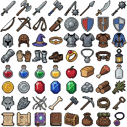
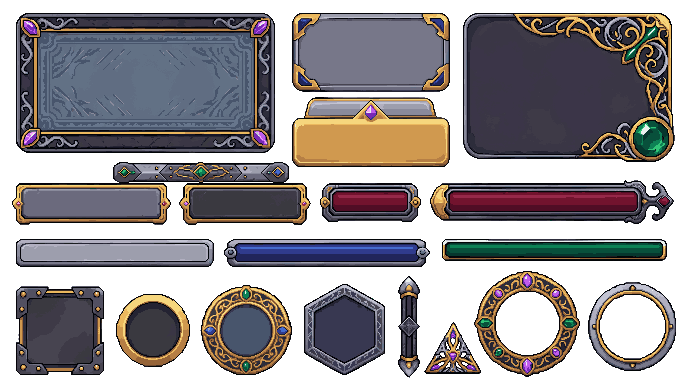

# Showcase

Last reviewed: 2026-06-29.

Real PixelLab Pip example workflows, including prompts, selected routes, outputs, and validation notes.

## Generated Assets

### Skill Icons

[](skill-icons.md)

```text
/pixellab-pip create a complete fantasy backgrounded skill icons. 32x32 icons only. consistent theme, illustrated backgrounds. all unique skill icons. each icon must be in a structured grid with no overlapping. no borders, no frames, no decorations, no corner radius.
```

### Inventory Item Icons

[](item-icons.md)

```text
/pixellab-pip create complete 32px materials inventory set for fantasy rpg. each item must be unique but consistent style. it must cover all the common items for an rpg game. no background, no border.
```

### Gameplay GUI

[](gameplay-gui.md)

```text
/pixellab-pip create a complete mmorpg gui asset that has fully modular and resizable components. high fantasy, high quality, high detail, 9-slice compatible, no text, no overlapping components, each component must be unique, no duplicate components. ready to use in any game engine.
```

### Pip Mascot

[](pip-mascot.md)

```text
pip create a 64px character based on .pip-mascot.md
```

## Showcase Format

Each showcase should include:

- The generated result first, including the lead image and the request that produced it.
- Source inputs or brief summaries.
- Final prompts or natural-language parameters sent to PixelLab.
- Route, PixelLab surface, tool, endpoint, and key controls.
- Reproducibility controls that were intentionally set, such as image size, transparency, palette, direction, frame count, and seed. Do not imply every PixelLab endpoint always returns a seed; record a seed when the request explicitly sent one.
- Stable showcase asset locations. Do not point showcase pages at temporary local run folders; copy the selected asset into `docs/showcase/...` first.
- Local processing notes for cropping, spritesheets, GIFs, or other assembled files.
- Validation notes that are useful to readers, such as image size, transparency, frame count, and display caveats.
- Do not mention PixelLab job IDs, UI asset IDs, managed asset IDs, result IDs, or other run-specific service identifiers. Showcase docs should be reproducible from prompts, request bodies, controls, and local output files without exposing transient service IDs.

Prefer direct prose that names the subject of each paragraph. Avoid starting explanatory paragraphs with placeholders such as "This example", "This pass", or "This result" when a concrete subject would be clearer.

For showcase pages with multiple related outputs, put the primary result first and make the `## Request` prompt subheaders match the order of the showcased images. Use descriptive headers such as `### Short MMO Prompt`, `### Mood-Only Prompt`, or `### Component-Specific Prompt (Follow-up)` instead of vague labels when prompts came from separate sessions or follow-ups.

Do not store PixelLab tokens, cookies, private account data, background job IDs, UI asset IDs, managed asset IDs, result IDs, or unpublished third-party assets here.
