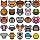

# Showcase

Last reviewed: 2026-07-15.

Real PixelLab Pip example workflows, including prompts, selected routes, outputs, and validation notes.

## Generated Assets

<table>
<tr>
<td width="50%" valign="top">
<h3><a href="item-icons.md">Inventory Item Icons</a></h3>

Prompt

<code>/pixellab-pip create complete 32px inventory item set for fantasy rpg. each item must be unique but consistent style. it must cover all the common items for an rpg game. no background, no border.</code>

</td>
<td width="50%" valign="top">
<h3><a href="skill-icons.md">Skill Icons</a></h3>

Prompt

<code>/pixellab-pip create a complete fantasy backgrounded skill icons. 32x32 icons only. consistent theme, illustrated backgrounds. all unique skill icons. each icon must be in a structured grid with no overlapping. no borders, no frames, no decorations, no corner radius.</code>

</td>
</tr>
<tr>
<td width="50%" valign="top">
<h3><a href="tiles.md">Tiles</a></h3>

Prompt

<code>/pixellab-pip create a grid of 16x16 minecraft-inspired tiles using image pro. every tile must be unique and textured.</code>

</td>
<td width="50%" valign="top">
<h3><a href="tilesets.md">Tilesets</a></h3>

Examples

Top-down grass, sidescroller grass, top-down 1-bit, and sidescroller 1-bit tilesets.

</td>
</tr>
<tr>
<td width="50%" valign="top">
<h3><a href="gameplay-gui.md">Gameplay GUI</a></h3>

Prompt

<code>/pixellab-pip create a complete mmorpg gui asset that has fully modular and resizable components. high fantasy, high quality, high detail, 9-slice compatible, no text, no overlapping components, each component must be unique, no duplicate components. ready to use in any game engine.</code>

</td>
<td width="50%" valign="top">
<h3><a href="visual-effects.md">Visual Effects</a></h3>

Prompt

<code>/pixellab-pip create 32px explosion visual effects. must be a variety of top down explosions that are all unique.</code>

</td>
</tr>
<tr>
<td width="50%" valign="top">
<h3><a href="gui-icons.md">GUI Icons</a></h3>

Prompt

<code>/pixellab-pip pixen create 25 unique 16x16 animal-face emojis in one shared flat style. each a different animal with its own vivid palette. simple geometry, flat shading, few colors, hard edges, transparent background. quantize each image to 8 colors and than create sprite sheet.</code>

</td>
<td width="50%" valign="top">
<h3><a href="pip-mascot.md">Pip Mascot</a></h3>

Prompt

<code>pip create a 64px character based on .pip-mascot.md</code>

</td>
</tr>
</table>

## Showcase Format

Each individual showcase page should include:

- All showcased images first, immediately after the title and review date, before prose or contents. Use an HTML table with columns chosen from the images' natural sizes; do not set `width` or `height` on individual page gallery images. Large sheets should be one image per row; smaller sheets should usually use two columns for consistency.
- The request that produced each result near its detailed section.
- Source inputs or brief summaries.
- Prompt-preparation notes: how the user's request became the final PixelLab parameters (the exact parameters themselves are recorded in the blueprint, below).
- Route, PixelLab surface, tool, endpoint, and key controls.
- The result's replayable `*.blueprint.json`, named after the showcased image it reproduces (`<image-basename>.blueprint.json`) and saved beside it. For new or materially updated showcases, record exact PixelLab request bodies plus structured `TASK` steps for material preparation, selection, local processing, assembly, or verification, per [../blueprint.md](../blueprint.md). Existing pre-`TASK` showcases may retain their route-only blueprint and separate local-processing notes until that showcase is materially updated. Show the blueprint inline in a fenced code block with a hyperlink instead of a separate raw request block. Use the bare ordered array shape from the guide—never a `bundle` wrapper or `label` keys. A derived composite that only rearranges an already-blueprinted generation can point to that generation's blueprint only when reproducing the composite is outside the showcase's claimed workflow.
- Reproducibility controls that were intentionally set, such as image size, transparency, palette, direction, frame count, and seed. Do not imply every PixelLab endpoint always returns a seed; record a seed when the request explicitly sent one.
- Stable showcase asset locations. Do not point showcase pages at temporary local run folders; copy the selected asset into `docs/showcase/...` first.
- Local processing notes for cropping, spritesheets, GIFs, or other assembled files.
- Validation notes that are useful to readers, such as image size, transparency, frame count, and display caveats.
- Do not mention PixelLab job IDs, UI asset IDs, managed asset IDs, result IDs, or other run-specific service identifiers. Showcase docs should be reproducible from prompts, request bodies, controls, and local output files without exposing transient service IDs.
- Do not add "Balance observation" or any account credit-balance figures (e.g. `before -> after` generation totals).

Prefer direct prose that names the subject of each paragraph. Avoid starting explanatory paragraphs with placeholders such as "This example", "This pass", or "This result" when a concrete subject would be clearer.

For showcase pages with multiple related outputs, put the primary result first and make the `## Request` prompt subheaders match the order of the showcased images. Use descriptive headers such as `### Short MMO Prompt`, `### Mood-Only Prompt`, or `### Component-Specific Prompt (Follow-up)` instead of vague labels when prompts came from separate sessions or follow-ups.

Do not store PixelLab tokens, cookies, private account data, background job IDs, UI asset IDs, managed asset IDs, result IDs, or unpublished third-party assets here.

## License

All showcase assets are free to use without restriction under [CC0 1.0 Universal](https://creativecommons.org/publicdomain/zero/1.0/). See [LICENSE.md](LICENSE.md) for the showcase asset license scope and legal text link.
