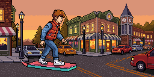

# Cinematic

Last reviewed: 2026-07-29.

<table>
  <tr>
    <td align="center"></td>
  </tr>
</table>

> **Rights notice.** The showcased cinematic depicts a copyrighted character and setting, described visually rather than named. The showcase's [CC0 dedication](LICENSE.md) waives only this repository's rights, not those of the rights holders. Treat it as a technique demonstration and clear your own rights before reusing it.

A cinematic is a scene longer than one animation job: PixelLab animates up to sixteen frames at a time, so a multi-second shot sequence is a chain of jobs, each continuing from the previous job's last frame. This page covers those. Single looping effects animated from one sprite live in [visual-effects.md](visual-effects.md); a single-character idle loop lives in [pip-mascot.md](pip-mascot.md).

The dusk hoverboard ride is the first showcased example and the page's clearest demonstration of the anchoring decision every chained cinematic has to make. Its six jobs alternate between beats anchored on a pre-generated keyframe and beats left to run free, because on a street receding toward a vanishing point a free-run job pulls the subject down the road and shrinks it — and wording alone does not reliably stop it.

## Contents

- [Primary Example: Dusk Town Square Hoverboard Ride](#primary-example-dusk-town-square-hoverboard-ride)
- [Findings](#findings)
- [Showcase Assets](#showcase-assets)
- [Validation Notes](#validation-notes)

## Primary Example: Dusk Town Square Hoverboard Ride


Original prompt:

```text
/pixellab-pip create a 10 second cinematic of Marty McFly (from back to the future) on a hoverboard. PixelLab probably wont understand the movie reference so please describe the character, hoveboard and scene
```

The request named a film character but asked for the character, the board, and the scene to be described visually instead, so no title, character name, or franchise wording ever reached PixelLab. The brief became pure description: a teenage boy with short auburn hair in a red padded sleeveless vest over a blue denim jacket, blue jeans, and white high-top sneakers, riding a flat pink hovering board with a teal underside and a small rear fin through a small-town square at dusk — two-storey storefronts with lit yellow windows, a clock tower, cast-iron lamp posts, parked cars, and a warm orange sky.

Keeping the name out of the prompt did not make the result original — the description reconstructs the character and setting closely enough that both stay recognizable, which is why the rights notice above applies.

Source inputs: text-only request. No reference images, style images, masks, or palette images were supplied.

Route: MCP `create_image_pixen` for an opening frame and three stage keyframes, then six chained MCP `animate_image` calls. Each animation job takes the previous job's final image as its `first_frame`; the three anchored beats additionally pass a keyframe as `last_frame`.

Canvas is `256x128`, a 2:1 widescreen frame. Under the v3 pixel budget (`width x height x frame_count <= 524288`) that is exactly the ceiling for sixteen frames per job, so every shot runs the maximum frame count the widescreen canvas allows. Cinematics generally read better wide than square, and the opening-frame image route accepts non-square canvases.

Prompt preparation: agent-optimized. The four stills share one seed and identical composition wording with only the pose clause changed. Every animation `action` restates the subject's identity, names the intended motion, and closes with an exclusion list — no other people, no glowing orbs, sparkles, magic glints, or lens flare — because free-run v3 tends to add glow effects to bright or energetic beats. After the first shot the exclusion list also forbids white puffs, clouds, smoke, and dust blobs.

That exclusion did not hold, and the run's own opening beat is why. Shot 1's `action` asks for `glowing dust streaming from the board's underside` while the same sentence forbids glowing orbs and sparkles — a self-contradicting prompt. The dust renders, and once it is in the handoff frame every later job re-renders it, so the accepted cut still carries white smoke blobs: a large one across the lower-left of the landing beat and smaller puffs flanking the board in the closing ride-off. Adding the puff exclusion from shot 2 onward did not clear what shot 1 had already put on screen.

The beat sheet, one job per beat:

| Shot | Beat | Anchor |
|---|---|---|
| 1 | Pushes off; the camera swings from side-on to behind him as he drops into a crouch | tween to keyframe A |
| 2 | Weaves between the parked cars at a held distance | free-run |
| 3 | Launches off the curb; the camera swings round to his side | tween to keyframe B |
| 4 | Sails through the apex, board flat underfoot | free-run |
| 5 | Drops, lands, and straightens into an upright stance | tween to keyframe C |
| 6 | Rides away down the street into the sunset | free-run |

Seed-locking the four stills held the square, the palette, and the costume across independent generations — but not the camera. The opening frame returned side-on while all three keyframes returned low and close on a street receding toward the clock tower. Rather than re-roll three otherwise usable keyframes onto one camera, the beat sheet was re-cut so shot 1 performs that camera change deliberately as a tween, which is also why the opening beat is anchored rather than free.

Generation details:

| Field | Value |
|---|---|
| Still route | MCP `create_image_pixen` |
| Animation route | MCP `animate_image` |
| Canvas | `256x128` for every still and every frame |
| Output structure | `Animation frames` |
| Frames per job | `16` requested; 17 returned including the echoed input frame |
| Animation jobs | `6` chained, three anchored with `last_frame` and three free-run |
| Detail / outline / view | `medium detail` / `selective outline` / `side` |
| Background | `no_background: false` — an opaque scene, not a sprite |
| Sent seeds | `738291` on the four stills and shot 1; omitted on shots 2-6 |
| Assembled cut | `97` frames, 100 ms per frame, ~9.7 s |
| Reported cost | `1` generation per still and `8` per `256x128` sixteen-frame animation job in this run; pricing and accounting may change |

Local processing: each animation job returns `frame_count + 1` images, the first being the supplied frame echoed back. Shot 1 contributes all seventeen of its images as the cut's opening; every later shot contributes images 1 through 16, and its image 0 is dropped as a duplicate of the handoff frame it was given. That echo is pixel-exact at all five chain seams — each dropped image 0 differs from the frame it duplicates by an absolute error of zero — but not for shot 1, whose echoed opening comes back requantized from 104 colors to 64. The cut therefore opens on PixelLab's returned frame rather than on the still as saved. Those frames were copied unchanged into a numbered sequence and encoded as the GIF with animation settings placed before the inputs. Concatenation and GIF encoding arranged and formatted pixels; neither repainted, resized, padded, nor letterboxed any frame. Every pixel is PixelLab-generated.

Three shots were re-rolled before acceptance. The weave free-ran into a continuous ride away from camera, shrinking the rider to a distant speck; rewriting the `action` to pin scale fixed it while keeping the beat free-run. The apex was first written with the rider reaching down to grab the board's edge, and the model rotated the board itself instead, swinging it up to vertical until it ended as a pink slab standing on end beside an untethered floating figure; dropping the grab and describing the board as staying flat and horizontal underfoot resolved it. The descent lost scale again despite carrying the same pinning wording that had worked for the weave, and converting it from free-run to a tween anchored on the landing keyframe was what actually held it.

Blueprint — replayable route and request bodies ([`hoverboard-dusk-cinematic.blueprint.json`](cinematic/hoverboard-dusk-cinematic.blueprint.json)). The four Pixen calls are identical except for the pose clause, and the six animation calls are identical in shape except for `action` and whether `last_frame_base64` is present. Shown verbatim: the preflight step, the opening still, shot 1 as an anchored beat, shot 6 as a free-run beat, and the assembly task. The three remaining stills, shots 2 through 5, and the per-shot download tasks are elided for readability:

```json
[
  {
    "_comment": "9.7s chained pixel-art cinematic: a teenage boy rides a hovering board through a small-town square at dusk, launches off a curb and lands, then rides away into the sunset. 256x128 widescreen, 6 chained animate_image jobs at 16 frames each, played at 100ms/frame. Two camera systems ended up in play rather than by plan: the opening still returned side-on while all three seed-locked keyframes returned low and close on a street receding toward the clock tower, so shot 1 was re-cut to perform that camera change deliberately as a tween. Free-run jobs drift scale badly on a receding street - the subject shrinks down the road no matter how the action is worded - so every beat that must hold scale is anchored with last_frame, and only the closing ride-off is left free-run because receding is the intended motion there. Wording a held object as 'grab the edge of the board' makes the model rotate the board itself to vertical; describe the board as staying flat underfoot instead. Known residual artifact: shot 1 asks for 'glowing dust streaming from the board's underside' and that dust persists down the chain as white smoke blobs, which every later beat's exclusion list fails to suppress - drop the glowing-dust request from shot 1 if a clean cut matters.",
    "_comment_prompt": "/pixellab-pip create a 10 second cinematic of Marty McFly (from back to the future) on a hoverboard. PixelLab probably wont understand the movie reference so please describe the character, hoveboard and scene",
    "_pixellab": {
      "paid_call_policy": "explicit_user_run_request_required",
      "output_directory": "pixellab-pip-generations/hoverboard-dusk-cinematic",
      "output_collision_policy": "create_unique",
      "mcp_server": {
        "name": "PixelLab",
        "url": "https://api.pixellab.ai/mcp",
        "transport": "http",
        "docs_url": "https://api.pixellab.ai/mcp/docs"
      }
    },
    "TASK": {
      "instruction": "Confirm the current user explicitly asked to run this blueprint and that the PixelLab MCP connection is authenticated, then create the empty output directory. This blueprint makes 4 paid Pixen calls and 6 paid animation calls; stop and ask if either condition is unmet.",
      "verify": "Run authority and connection are confirmed and the output directory exists and is empty."
    }
  },
  {
    "_comment": "Opening frame. The three keyframes that follow repeat this call verbatim except for the pose clause, sharing the same seed so the square, palette and costume hold across all four.",
    "MCP create_image_pixen": {
      "description": "side view, small-town square at dusk, row of two-storey storefronts with lit yellow windows, a clock tower, cast-iron lamp posts and parked cars along the street, warm orange sky; a teenage boy with short auburn hair in a red padded sleeveless vest over a blue denim jacket, blue jeans and white high-top sneakers, on a flat pink hovering board with a teal underside and a small rear fin floating a hand's width above the road, riding at the left of frame; flat pixel art, chunky low-resolution pixels, limited palette, hard edges",
      "width": 256,
      "height": 128,
      "no_background": false,
      "view": "side",
      "detail": "medium detail",
      "outline": "selective outline",
      "seed": 738291
    }
  },
  {
    "_comment": "Shot 1 - tween from the side-on opening into keyframe A. This is where the camera swings from side-on to over-the-shoulder; giving the turn its own anchored job stops it drifting mid-chain.",
    "MCP animate_image": {
      "first_frame_base64": "00_opening.png",
      "last_frame_base64": "key_A_crouch.png",
      "action": "The boy pushes off and accelerates away down the street as the camera swings in behind him; he crouches low over the pink hoverboard, arms out for balance, glowing dust streaming from the board's underside, the storefronts and parked cars sliding past on both sides. Steady rhythmic forward motion. No other people, no hands, no glowing orbs, sparkles, magic glints or lens flare.",
      "frame_count": 16,
      "seed": 738291
    }
  },
  {
    "_comment": "Shot 6 - the closing ride-off, deliberately left free-run: receding into the distance is the intended motion here, so the drift that had to be suppressed everywhere else is what sells the ending.",
    "MCP animate_image": {
      "first_frame_base64": "shot5_16.png",
      "action": "He rides on down the street away from the camera into the sunset, the pink board gliding steadily and level beneath his feet, his figure growing smaller as the distance opens up ahead of him, the storefronts and lamp posts sliding past on both sides toward the clock tower. Steady rhythmic forward motion. The board stays flat and horizontal under his feet and never tilts onto its edge or turns vertical. No white puffs, clouds, smoke or dust blobs. No other people, no glowing orbs, sparkles, magic glints or lens flare.",
      "frame_count": 16
    }
  },
  {
    "TASK": {
      "instruction": "Assemble the finished cut. Concatenate shot1_00 through shot1_16, then frames 01 through 16 only of shots 2, 3, 4, 5 and 6 in that order, dropping each later shot's frame 00 because it is a duplicate of the previous shot's handoff frame. Copy the frames unchanged into a numbered sequence, then build a looping GIF at 100ms per frame with animation settings placed before the inputs, and a spritesheet laid out as a 10 by 10 grid of cells matching the frame dimensions with any trailing empty cells left transparent. Do not resize, repaint, pad or letterbox any frame.",
      "outputs": ["hoverboard-dusk-cinematic.gif", "hoverboard-dusk-cinematic-spritesheet.png"],
      "verify": "The sequence is 97 frames, every frame has identical width and height with no border, the GIF reports 97 frames with a non-undefined disposal method, coalescing the GIF back to PNGs yields zero absolute-error difference against every source frame, and the spritesheet divides exactly into 100 cells of the frame's width and height."
    }
  }
]
```

## Findings

Chained `animate_image` is the route currently showcased for multi-second scenes, and the anchoring decision is the one that determines whether the chain holds together. Each job re-renders from the previous job's last frame, so error compounds: a beat that drifts hands its drift to every beat after it.

A `last_frame` keyframe is the dependable control for that drift. Wording is a supplement, not the mechanism — the same scale-pinning sentence held one beat and failed another in this run. Anchoring roughly every other beat pulled composition error back often enough to keep ninety-seven frames on-model without paying for a keyframe per shot.

Seed-locking the stills holds palette, setting, and costume across independent generations, but not camera angle — expect the opening frame and the stage keyframes to disagree on framing, and plan a beat that absorbs the difference rather than re-rolling. Free-run drift is likewise not always a defect: the closing shot keeps it deliberately, because a subject receding down a street is the intended ending.

Prompt language that helped:

- Restating the subject's identity, scale, and framing in every `action`, because long chains drift in size and palette as each job re-renders from the last.
- Naming the wrong reading and forbidding it — "a clean landing, NOT a crash", "a clean jump, NOT a fall" — for beats whose meaning could render either way.
- Describing an object's own orientation (flat, horizontal, never on edge) instead of the gesture that involves it. Describing a character interacting with a held object invites the model to transform the object rather than the character.

Prompt language that did not hold:

- An exclusion list does not remove what an earlier beat requested. Shot 1 asked for glowing dust and forbade glow in the same sentence; the dust rendered, entered the handoff frame, and every later beat's "no white puffs, clouds, smoke or dust blobs" failed to clear it. Audit the whole chain for contradictions before spending, because a chained artifact is fixed by re-rolling the beat that introduced it, not by forbidding it downstream.
- Scale-pinning wording proved unreliable on a scene with strong perspective — near-identical phrasing held the weave and failed the descent. Only an anchored `last_frame` fixed it.

Future cinematic showcases should live on this page when they cover other multi-shot or seamless-loop scenes, including seamless loops that return to their opening frame, cinematics started from a user-supplied frame, and scenes carrying a large lighting or palette shift.

## Showcase Assets

| Output | Stable showcase file |
|---|---|
| Dusk hoverboard cinematic | `docs/showcase/cinematic/hoverboard-dusk-cinematic.gif` |

## Validation Notes

- The GIF is exactly `256x128` with `97` frames at 100 ms each, looping forever with disposal `Previous`.
- Coalescing the GIF back to PNGs and comparing every frame against its source yielded an absolute error of `0` across all `97` frames.
- Every frame is exactly `256x128` with no border, padding, or letterboxing.
- It was generated as `6` chained animation jobs of 17 returned images each, with the duplicate handoff frame dropped at all `5` seams. Each dropped frame was confirmed pixel-identical to the frame it duplicated (absolute error `0`), so no seam loses or repeats a rendered frame.
- The accepted cut still contains white smoke blobs that the beats' exclusion lists were meant to prevent — a large one across the lower-left of the landing beat and smaller puffs beside the board in the closing ride-off. They trace back to shot 1's own request for glowing dust and were kept rather than repainted out; removing them means re-rolling shot 1 without that clause and re-running the chain.
- The cut is an evolving scene, not a seamless loop. The GIF is encoded to loop forever, so playback cuts from the distant closing frame back to the side-on opening.
- The scene is a backdrop rather than a sprite, so `no_background` is false throughout and no frame carries transparency. The GIF's 256-color-per-frame format introduces normal palette quantization; the source PNGs remain lossless.
- Three shots were re-rolled before acceptance, for scale drift, a rotated board, and scale drift again. The accepted wording is what the blueprint records.
- Local work was limited to frame concatenation and GIF encoding. No repainting, resizing, cleanup, or procedural visual fixes were applied to the showcased pixels.
