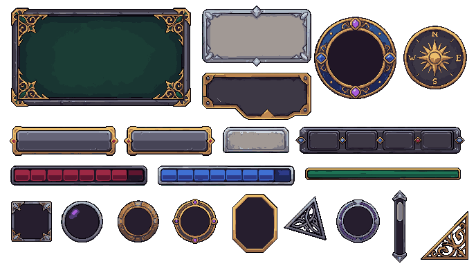
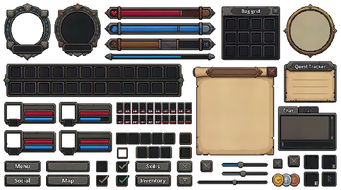

# Gameplay GUI

Last reviewed: 2026-06-28.







PixelLab Pip's UI generators can handle related gameplay GUI requests at different levels of specificity. The lead examples are the MCP-generated modular MMORPG sheets because they have stronger reusable component separation and 9-slice-compatible rectangular pieces. The older REST example remains below as a broader fantasy MMORPG HUD kit with portrait frames, health and mana bars, action bars, bag slots, minimap frame, quest tracker, chat panel, parchment window, controls, icon frames, and currency buttons.

## Contents

- [Request](#request)
- [Best Example: Textless Modular MMORPG GUI Sheet](#best-example-textless-modular-mmorpg-gui-sheet)
- [High-Value Candidate: Compass Modular MMORPG GUI Sheet](#high-value-candidate-compass-modular-mmorpg-gui-sheet)
- [Broad Example: Complete Fantasy MMORPG GUI](#broad-example-complete-fantasy-mmorpg-gui)
- [Bad Example: Mood-Only Prompt](#bad-example-mood-only-prompt)
- [Good Example: Component-Specific Prompt](#good-example-component-specific-prompt)
- [Outputs](#outputs)
- [Validation Notes](#validation-notes)

## Request

### Modular MMORPG GUI Prompt

```text
/pixellab-pip create a complete mmorpg gui asset that has fully modular and resizable components. high fantasy, high quality, high detail, 9-slice compatible, no text, no overlapping components, each component must be unique, no duplicate components. ready to use in any game engine.
```

### Short MMO Prompt

```text
pip create a complete world of warcraft gui
```

### Mood-Only Prompt

```text
pip, create deep charcoal slate, framed by cool iron and ignited by sharp hits of heath-fire orange game UI at 344x192 resolution
```

### Component-Specific Prompt (Follow-up)

```text
create a new generation for full gameplay GUI:
- avatar
- health bar
- window
- various buttons
- other useful elements
```

## Best Example: Textless Modular MMORPG GUI Sheet


The textless modular sheet is the strict final pass for a reusable game-engine UI kit. Pip routed this to PixelLab MCP `create_ui_asset` because the request emphasized modular components, 9-slice-compatible rectangular pieces, and a reusable GUI sheet with explicit component separation.

Route: PixelLab MCP `create_ui_asset`

Prompt preparation: agent-enhanced from the user prompt, then tightened after visual validation of the first candidate.

Generation details:

| Field | Value |
|---|---|
| Image size | `688x384` |
| Background | `no_background: true` |
| Returned seed | `902317` |
| Elements | `window`, `panel`, `button`, `icon_button`, `toolbar`, `tab`, `health_bar`, `avatar`, `hexagon` |
| Color palette | `dark iron, aged silver, polished gold, deep emerald, sapphire mana blue, crimson health red, amethyst crystal highlights` |
| Usage reported | `40` subscription generations |

Prompt before enhancement:

```text
/pixellab-pip create a complete mmorpg gui asset that has fully modular and resizable components. high fantasy, high quality, high detail, 9-slice compatible, no text, no overlapping components, each component must be unique, no duplicate components. ready to use in any game engine.
```

Enhanced prompt sent as `description`:

```text
Complete high fantasy MMORPG pixel-art GUI sprite sheet on transparent background, premium game-ready quality, high detail, ornate but readable. STRICTLY TEXTLESS: no letters, no numbers, no readable runes, no glyphs, no compass letters, no N E S W marks, no labels, no symbols that look like writing anywhere. All components are separate, non-overlapping, fully unique, with clear transparent gutters between them. Every rectangular component must be 9-slice compatible: continuous border, reinforced corners, flat reusable center fill, consistent edge thickness, crisp pixel edges, no baked shadows crossing outside the component. Style: enchanted dark iron, aged silver, polished gold trim, deep emerald accents, sapphire blue, crimson red, amethyst crystal highlights, carved filigree, high fantasy MMORPG inventory and HUD aesthetic. Include a complete modular set: large blank window frame, compact blank dialogue panel, ornate blank plaque panel, primary command button, secondary command button, raised tab, toolbar strip, health bar, mana bar, experience bar, hero portrait frame, blank circular minimap frame without any compass marks, ornate icon button with blank center, hex spell slot, inventory slot, gem socket, slim scrollbar, and standalone corner ornament. Each component must have a unique silhouette and unique ornamentation; no duplicate components, no overlapping components, no text of any kind.
```

Request body:

```json
{
  "name": "high_fantasy_mmorpg_modular_gui_sheet_textless_retry",
  "description": "Complete high fantasy MMORPG pixel-art GUI sprite sheet on transparent background, premium game-ready quality, high detail, ornate but readable. STRICTLY TEXTLESS: no letters, no numbers, no readable runes, no glyphs, no compass letters, no N E S W marks, no labels, no symbols that look like writing anywhere. All components are separate, non-overlapping, fully unique, with clear transparent gutters between them. Every rectangular component must be 9-slice compatible: continuous border, reinforced corners, flat reusable center fill, consistent edge thickness, crisp pixel edges, no baked shadows crossing outside the component. Style: enchanted dark iron, aged silver, polished gold trim, deep emerald accents, sapphire blue, crimson red, amethyst crystal highlights, carved filigree, high fantasy MMORPG inventory and HUD aesthetic. Include a complete modular set: large blank window frame, compact blank dialogue panel, ornate blank plaque panel, primary command button, secondary command button, raised tab, toolbar strip, health bar, mana bar, experience bar, hero portrait frame, blank circular minimap frame without any compass marks, ornate icon button with blank center, hex spell slot, inventory slot, gem socket, slim scrollbar, and standalone corner ornament. Each component must have a unique silhouette and unique ornamentation; no duplicate components, no overlapping components, no text of any kind.",
  "color_palette": "dark iron, aged silver, polished gold, deep emerald, sapphire mana blue, crimson health red, amethyst crystal highlights",
  "elements": [
    "window",
    "panel",
    "button",
    "icon_button",
    "toolbar",
    "tab",
    "health_bar",
    "avatar",
    "hexagon"
  ],
  "pieces": [
    { "id": "large_window_frame", "kind": "rounded_rect", "label": "large blank ornate 9-slice window frame", "x": 12, "y": 10, "w": 192, "h": 104, "radius": 10 },
    { "id": "dialog_tooltip_panel", "kind": "rounded_rect", "label": "compact blank 9-slice dialogue panel", "x": 218, "y": 10, "w": 116, "h": 58, "radius": 8 },
    { "id": "plaque_panel", "kind": "rounded_rect", "label": "asymmetric blank plaque 9-slice panel", "x": 218, "y": 78, "w": 116, "h": 46, "radius": 6 },
    { "id": "portrait_frame", "kind": "circle", "label": "round hero portrait frame with empty center", "x": 382, "y": 62, "r": 44 },
    { "id": "blank_minimap_frame", "kind": "circle", "label": "round blank minimap frame with empty center and no compass markings", "x": 468, "y": 62, "r": 34 },
    { "id": "primary_button", "kind": "rounded_rect", "label": "wide blank primary 9-slice command button", "x": 12, "y": 136, "w": 112, "h": 30, "radius": 7 },
    { "id": "secondary_button", "kind": "rounded_rect", "label": "narrow blank secondary 9-slice command button", "x": 136, "y": 136, "w": 92, "h": 30, "radius": 5 },
    { "id": "tab_component", "kind": "rounded_rect", "label": "single raised blank tab component", "x": 240, "y": 136, "w": 70, "h": 28, "radius": 7 },
    { "id": "toolbar_strip", "kind": "rounded_rect", "label": "ornate modular blank toolbar strip", "x": 322, "y": 136, "w": 174, "h": 28, "radius": 6 },
    { "id": "health_bar", "kind": "rounded_rect", "label": "crimson health bar frame and fill, no marks", "x": 12, "y": 178, "w": 146, "h": 20, "radius": 4 },
    { "id": "mana_bar", "kind": "rounded_rect", "label": "sapphire mana bar frame and fill, no marks", "x": 170, "y": 178, "w": 146, "h": 20, "radius": 4 },
    { "id": "experience_bar", "kind": "rounded_rect", "label": "thin emerald experience bar frame, no marks", "x": 328, "y": 178, "w": 168, "h": 16, "radius": 3 },
    { "id": "inventory_slot", "kind": "rounded_rect", "label": "single square inventory slot with unique corner metalwork", "x": 12, "y": 216, "w": 44, "h": 44, "radius": 5 },
    { "id": "gem_socket", "kind": "circle", "label": "round gem socket component with no glyphs", "x": 88, "y": 238, "r": 22 },
    { "id": "ornate_icon_button", "kind": "circle", "label": "round ornate icon button with blank center and no symbol", "x": 148, "y": 238, "r": 22 },
    { "id": "hex_spell_slot", "kind": "polygon", "label": "hexagonal spell slot frame with blank center", "x": 210, "y": 238, "r": 25, "sides": 6, "phase": 0.5236 },
    { "id": "slim_scrollbar", "kind": "rounded_rect", "label": "slim vertical scrollbar with fantasy cap ends and no marks", "x": 266, "y": 208, "w": 22, "h": 62, "radius": 6 },
    { "id": "corner_ornament", "kind": "polygon", "label": "standalone triangular corner ornament with abstract filigree only", "x": 332, "y": 238, "r": 28, "sides": 3, "phase": 0.7854 }
  ],
  "width": 688,
  "height": 384,
  "no_background": true,
  "seed": 902317
}
```

## High-Value Candidate: Compass Modular MMORPG GUI Sheet


The compass candidate is a high-value modular sheet with strong reusable parts, but it was not accepted as the strict final pass because the compass/minimap component includes tiny letters. It remains useful as a showcase of how explicit structured pieces produce highly reusable, separated components, and as a validation example for catching text-like marks when the request forbids text.

Route: PixelLab MCP `create_ui_asset`

Prompt preparation: agent-enhanced directly from the user prompt.

Generation details:

| Field | Value |
|---|---|
| Image size | `688x384` |
| Background | `no_background: true` |
| Returned seed | `421973` |
| Elements | `window`, `panel`, `button`, `icon_button`, `toolbar`, `tab`, `health_bar`, `avatar`, `hexagon` |
| Color palette | `dark iron, aged silver, polished gold, deep emerald, sapphire mana blue, crimson health red, amethyst crystal highlights` |
| Usage reported | `40` subscription generations |

Prompt before enhancement:

```text
/pixellab-pip create a complete mmorpg gui asset that has fully modular and resizable components. high fantasy, high quality, high detail, 9-slice compatible, no text, no overlapping components, each component must be unique, no duplicate components. ready to use in any game engine.
```

Enhanced prompt sent as `description`:

```text
Complete high fantasy MMORPG pixel-art GUI sprite sheet on transparent background, premium game-ready quality, high detail, ornate but readable. No text, no letters, no numbers, no readable runes, no labels. All components are separate, non-overlapping, fully unique, with transparent gutters between them. Make every rectangular component 9-slice compatible: clean continuous borders, reinforced corners, flat reusable center fill, consistent edge thickness, crisp pixel edges, no baked shadows crossing outside each component. Style: enchanted dark iron, aged silver, polished gold trim, deep emerald accents, subtle crystal highlights, carved filigree, fantasy RPG inventory and HUD aesthetic. Include a complete modular set: large window frame, compact dialogue/tooltip panel, quest plaque, primary button, secondary button, tab, toolbar strip, health bar, mana bar, experience bar, portrait frame, minimap frame, ornate icon button, hex spell slot, inventory slot, gem socket, slim scrollbar, and corner ornament. Each component must be visually distinct with different silhouette/ornamentation; no duplicate components, no overlapping components, no text.
```

Request body:

```json
{
  "name": "high_fantasy_mmorpg_modular_gui_sheet",
  "description": "Complete high fantasy MMORPG pixel-art GUI sprite sheet on transparent background, premium game-ready quality, high detail, ornate but readable. No text, no letters, no numbers, no readable runes, no labels. All components are separate, non-overlapping, fully unique, with transparent gutters between them. Make every rectangular component 9-slice compatible: clean continuous borders, reinforced corners, flat reusable center fill, consistent edge thickness, crisp pixel edges, no baked shadows crossing outside each component. Style: enchanted dark iron, aged silver, polished gold trim, deep emerald accents, subtle crystal highlights, carved filigree, fantasy RPG inventory and HUD aesthetic. Include a complete modular set: large window frame, compact dialogue/tooltip panel, quest plaque, primary button, secondary button, tab, toolbar strip, health bar, mana bar, experience bar, portrait frame, minimap frame, ornate icon button, hex spell slot, inventory slot, gem socket, slim scrollbar, and corner ornament. Each component must be visually distinct with different silhouette/ornamentation; no duplicate components, no overlapping components, no text.",
  "color_palette": "dark iron, aged silver, polished gold, deep emerald, sapphire mana blue, crimson health red, amethyst crystal highlights",
  "elements": [
    "window",
    "panel",
    "button",
    "icon_button",
    "toolbar",
    "tab",
    "health_bar",
    "avatar",
    "hexagon"
  ],
  "pieces": [
    { "id": "large_window_frame", "kind": "rounded_rect", "label": "large ornate 9-slice window frame", "x": 12, "y": 10, "w": 192, "h": 104, "radius": 10 },
    { "id": "dialog_tooltip_panel", "kind": "rounded_rect", "label": "compact 9-slice tooltip dialogue panel", "x": 218, "y": 10, "w": 116, "h": 58, "radius": 8 },
    { "id": "quest_plaque_panel", "kind": "rounded_rect", "label": "asymmetric quest plaque 9-slice panel", "x": 218, "y": 78, "w": 116, "h": 46, "radius": 6 },
    { "id": "portrait_frame", "kind": "circle", "label": "round hero portrait frame", "x": 382, "y": 62, "r": 44 },
    { "id": "minimap_frame", "kind": "circle", "label": "distinct compass minimap frame", "x": 468, "y": 62, "r": 34 },
    { "id": "primary_button", "kind": "rounded_rect", "label": "wide primary 9-slice command button", "x": 12, "y": 136, "w": 112, "h": 30, "radius": 7 },
    { "id": "secondary_button", "kind": "rounded_rect", "label": "narrow secondary 9-slice command button", "x": 136, "y": 136, "w": 92, "h": 30, "radius": 5 },
    { "id": "tab_component", "kind": "rounded_rect", "label": "single raised tab component", "x": 240, "y": 136, "w": 70, "h": 28, "radius": 7 },
    { "id": "toolbar_strip", "kind": "rounded_rect", "label": "ornate modular toolbar strip", "x": 322, "y": 136, "w": 174, "h": 28, "radius": 6 },
    { "id": "health_bar", "kind": "rounded_rect", "label": "crimson health bar frame and fill", "x": 12, "y": 178, "w": 146, "h": 20, "radius": 4 },
    { "id": "mana_bar", "kind": "rounded_rect", "label": "sapphire mana bar frame and fill", "x": 170, "y": 178, "w": 146, "h": 20, "radius": 4 },
    { "id": "experience_bar", "kind": "rounded_rect", "label": "thin emerald experience bar frame", "x": 328, "y": 178, "w": 168, "h": 16, "radius": 3 },
    { "id": "inventory_slot", "kind": "rounded_rect", "label": "single square inventory slot with unique corner metalwork", "x": 12, "y": 216, "w": 44, "h": 44, "radius": 5 },
    { "id": "gem_socket", "kind": "circle", "label": "round gem socket component", "x": 88, "y": 238, "r": 22 },
    { "id": "ornate_icon_button", "kind": "circle", "label": "round ornate icon button with blank center", "x": 148, "y": 238, "r": 22 },
    { "id": "hex_spell_slot", "kind": "polygon", "label": "hexagonal spell slot frame", "x": 210, "y": 238, "r": 25, "sides": 6, "phase": 0.5236 },
    { "id": "slim_scrollbar", "kind": "rounded_rect", "label": "slim vertical scrollbar with fantasy cap ends", "x": 266, "y": 208, "w": 22, "h": 62, "radius": 6 },
    { "id": "corner_ornament", "kind": "polygon", "label": "standalone triangular corner ornament for frames", "x": 332, "y": 238, "r": 28, "sides": 3, "phase": 0.7854 }
  ],
  "width": 688,
  "height": 384,
  "no_background": true,
  "seed": 421973
}
```

## Broad Example: Complete Fantasy MMORPG GUI


The standalone short MMO prompt is a broader fantasy MMORPG HUD kit example. Pip interpreted the named game as a broad high-fantasy MMORPG interface reference and routed the work to PixelLab REST v2 `generate-ui-v2`, while avoiding a direct copy of an existing game's protected interface.

Route: PixelLab REST v2 `generate-ui-v2`

Generation details:

| Field | Value |
|---|---|
| Image size | `688x384` |
| Background | `no_background: true` |
| Returned seed | `250625` |
| Color palette | `dark iron, weathered stone, aged brass, leather brown, parchment tan, crimson health red, arcane blue, emerald green highlights` |
| Usage reported | `40` subscription generations |

Enhanced prompt sent as `description`:

```text
Complete original fantasy MMORPG pixel-art GUI kit, inspired by classic high-fantasy raid interfaces but not copying any existing game: ornate carved stone and dark iron frames with aged brass trim, glowing blue mana accents, red health accents, emerald quest accents, leather straps, small runic details, readable modular components arranged on one transparent sprite sheet. Include: player portrait frame, target portrait frame, health bar, mana bar, rage/energy resource bar, experience bar, action bar with twelve square spell slots, secondary action bar row, bag/inventory slot grid, minimap circular frame, quest tracker panel, parchment dialogue window, chat panel, tooltip frame, party member frames, raid-group compact frames, buff/debuff icon frames, menu buttons, checkboxes, sliders, tab headers, close buttons, gold/silver/copper currency icons, empty spell icon placeholders, decorative corners and separators. Clean game-ready UI assets, crisp 2D pixel art, consistent MMO HUD style, high contrast edges, no logos, no copyrighted symbols, no text labels, transparent background.
```

Request body:

```json
{
  "description": "Complete original fantasy MMORPG pixel-art GUI kit, inspired by classic high-fantasy raid interfaces but not copying any existing game: ornate carved stone and dark iron frames with aged brass trim, glowing blue mana accents, red health accents, emerald quest accents, leather straps, small runic details, readable modular components arranged on one transparent sprite sheet. Include: player portrait frame, target portrait frame, health bar, mana bar, rage/energy resource bar, experience bar, action bar with twelve square spell slots, secondary action bar row, bag/inventory slot grid, minimap circular frame, quest tracker panel, parchment dialogue window, chat panel, tooltip frame, party member frames, raid-group compact frames, buff/debuff icon frames, menu buttons, checkboxes, sliders, tab headers, close buttons, gold/silver/copper currency icons, empty spell icon placeholders, decorative corners and separators. Clean game-ready UI assets, crisp 2D pixel art, consistent MMO HUD style, high contrast edges, no logos, no copyrighted symbols, no text labels, transparent background.",
  "image_size": {
    "width": 688,
    "height": 384
  },
  "no_background": true,
  "color_palette": "dark iron, weathered stone, aged brass, leather brown, parchment tan, crimson health red, arcane blue, emerald green highlights",
  "seed": 250625
}
```

## Bad Example: Mood-Only Prompt


The mood-only prompt matched the desired palette and material mood, but it did not specify the gameplay elements that should appear. The output is a small UI sheet with a panel, a smaller frame, and a bar, rather than a full gameplay GUI kit.

Route: PixelLab REST v2 `generate-ui-v2`

Generation details:

| Field | Value |
|---|---|
| Image size | `344x192` |
| Background | `no_background: true` |
| Color palette | `deep charcoal slate, cool iron gray, dark gunmetal, small sharp heath-fire orange glow accents` |
| Usage reported | `20` subscription generations |

Initial prompt:

```text
pip, create deep charcoal slate, framed by cool iron and ignited by sharp hits of heath-fire orange game UI at 344x192 resolution
```

Enhanced prompt sent as `description`:

```text
Pixel art game UI panel frame, 344x192 canvas, deep charcoal slate central panel, beveled cool iron border and corner brackets, sharp heath-fire orange glowing accents on rivets, notches, and thin trim lines, readable RPG HUD/menu frame, crisp hard pixel edges, high contrast, transparent outside the frame, no text, no characters, no background scene.
```

Request body:

```json
{
  "description": "Pixel art game UI panel frame, 344x192 canvas, deep charcoal slate central panel, beveled cool iron border and corner brackets, sharp heath-fire orange glowing accents on rivets, notches, and thin trim lines, readable RPG HUD/menu frame, crisp hard pixel edges, high contrast, transparent outside the frame, no text, no characters, no background scene.",
  "image_size": {
    "width": 344,
    "height": 192
  },
  "no_background": true,
  "color_palette": "deep charcoal slate, cool iron gray, dark gunmetal, small sharp heath-fire orange glow accents"
}
```

## Good Example: Component-Specific Prompt


Route: PixelLab REST v2 `generate-ui-v2`

Generation details:

| Field | Value |
|---|---|
| Image size | `688x384` |
| Background | `no_background: true` |
| Color palette | `deep charcoal slate, cool iron gray, dark gunmetal, blackened steel, sharp heath-fire orange ember accents` |
| Usage reported | `40` subscription generations |

Initial prompt:

```text
create a new generation for full gameplay GUI:
- avatar
- health bar
- window
- various buttons
- other useful elements
```

Enhanced prompt sent as `description`:

```text
Complete pixel art gameplay GUI kit sheet on a 688x384 canvas, deep charcoal slate and cool iron fantasy interface with sharp heath-fire orange accent lights. Include a square avatar portrait frame, horizontal health bar, mana or stamina bar, large ornate window/dialogue panel, inventory slot frame, minimap frame, quest/objective panel, several reusable buttons in different sizes, icon button frames, tabs, dividers, corner brackets, scroll arrows, and small useful HUD elements. Cohesive RPG action game UI, crisp hard pixel edges, beveled iron trim, dark slate surfaces, bright orange ember highlights, organized as separate usable elements on transparent background, no readable text, no characters, no scene background.
```

Request body:

```json
{
  "description": "Complete pixel art gameplay GUI kit sheet on a 688x384 canvas, deep charcoal slate and cool iron fantasy interface with sharp heath-fire orange accent lights. Include a square avatar portrait frame, horizontal health bar, mana or stamina bar, large ornate window/dialogue panel, inventory slot frame, minimap frame, quest/objective panel, several reusable buttons in different sizes, icon button frames, tabs, dividers, corner brackets, scroll arrows, and small useful HUD elements. Cohesive RPG action game UI, crisp hard pixel edges, beveled iron trim, dark slate surfaces, bright orange ember highlights, organized as separate usable elements on transparent background, no readable text, no characters, no scene background.",
  "image_size": {
    "width": 688,
    "height": 384
  },
  "no_background": true,
  "color_palette": "deep charcoal slate, cool iron gray, dark gunmetal, blackened steel, sharp heath-fire orange ember accents"
}
```

## Outputs

| File | Purpose |
|---|---|
| [`gameplay-gui/modular-mmorpg-gui-textless-688x384.png`](gameplay-gui/modular-mmorpg-gui-textless-688x384.png) | Primary strict textless transparent modular MMORPG GUI sheet with 9-slice-friendly components. |
| [`gameplay-gui/modular-mmorpg-gui-compass-688x384.png`](gameplay-gui/modular-mmorpg-gui-compass-688x384.png) | High-value modular MMORPG GUI candidate with tiny compass letters; useful as a validation example and reusable component reference. |
| [`gameplay-gui/gameplay-gui-fantasy-mmo-688x384.png`](gameplay-gui/gameplay-gui-fantasy-mmo-688x384.png) | Broader transparent fantasy MMORPG GUI kit sheet. |
| [`gameplay-gui/gameplay-gui-mood-only-344x192.png`](gameplay-gui/gameplay-gui-mood-only-344x192.png) | First-pass mood-focused UI sheet. Useful as a bad example for underspecified gameplay GUI requests. |
| [`gameplay-gui/gameplay-gui-component-specific-688x384.png`](gameplay-gui/gameplay-gui-component-specific-688x384.png) | Earlier transparent full gameplay GUI kit sheet. |

## Validation Notes

Final verification:

- PNG dimensions: `688x384px`.
- Pixel format: `Format32bppArgb`.
- Primary textless modular output has transparent background, separate non-overlapping components, no visible text, and rectangular components with border/center structure suitable for 9-slice slicing.
- Modular compass candidate has transparent background and strong reusable component separation, but the compass/minimap includes tiny letters, so it is not a strict match for no-text requests.
- Broad fantasy MMO output has transparent background and includes portrait frames, status bars, action bars, bag grid, minimap frame, quest tracker, chat panel, parchment panel, controls, icon frames, and currency buttons.
