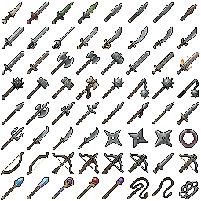
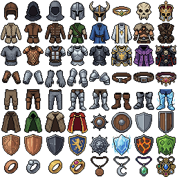
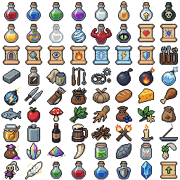
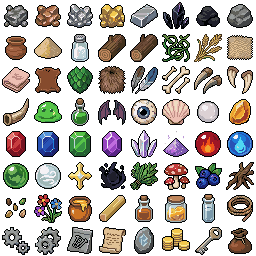
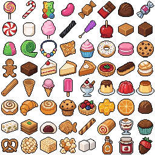
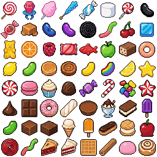

# Item Icons

Last reviewed: 2026-06-29.














PixelLab Pip's strongest item-icon route is REST `generate-image-v2` for complete 8 by 8 sheets. The showcased winner is the general inventory sheet after PixelLab background removal because it covers the broadest RPG inventory surface while keeping readable 32px items, transparent background, and no slot/frame treatment. The weapon, armor, consumable, and material sheets show the same route holding a consistent style across more specialized inventory categories.

## Contents

- [Best Example: General Inventory Background-Removed Sheet](#best-example-general-inventory-background-removed-sheet)
- [Weapon Sheet](#weapon-sheet)
- [Armor Sheet](#armor-sheet)
- [Consumable Sheet](#consumable-sheet)
- [Material Sheet](#material-sheet)
- [Candy Sweets and Treats Sheet](#candy-sweets-and-treats-sheet)
- [Glossy Candy Sweets and Treats Sheet](#glossy-candy-sweets-and-treats-sheet)
- [Findings](#findings)
- [Showcase Assets](#showcase-assets)
- [Validation Notes](#validation-notes)

## Best Example: General Inventory Background-Removed Sheet


Original prompt:

```text
/pixellab-pip create complete 32px inventory item set for fantasy rpg. each item must be unique but consistent style. it must cover all the common items for an rpg game. no background, no border.
```

The general inventory sheet is the recommended showcase winner. It covers the most complete cross-section of RPG inventory categories: weapons, armor, jewelry, potions, scrolls, books, maps, food, coins, gems, crafting materials, monster parts, tools, keys, containers, travel gear, bombs, arrows, elemental items, holy items, and cursed charms. The final showcased file is the PixelLab background-removed version requested by the user.

Route: PixelLab REST v2 `generate-image-v2`, then PixelLab background removal with `remove_simple_background`.

Prompt preparation: agent-optimized from the user's broad inventory request.

Generation details:

| Field | Value |
|---|---|
| Image size | `256x256` |
| Icon grid | `8x8`, intended `32x32` icons |
| Background | PixelLab background removal after generation |
| Returned seed | `316504359` |
| Usage reported | `20` generations |
| Reported generation cost | `$0.095` |

Request body:

```json
{
  "description": "Complete 8 by 8 sheet of 64 unique fantasy RPG inventory item icons, 8 columns and 8 rows, each cell a readable 32x32 item, perfectly aligned with no spacing, overlap, cropped items, dividers, or drawn grid. Pixel art with clear centered object silhouettes, crisp hard edges, low visual noise, limited palette, consistent high-fantasy inventory style. Include varied common RPG inventory categories: melee weapons, ranged weapons, shields, armor, helmets, boots, gloves, jewelry, potions, scrolls, books, maps, food, coins, gems, ores, wood, herbs, monster parts, bottles, light sources, tools, keys, chests, bags, bedrolls, bombs, arrows, elemental items, holy items, and cursed charms. No text, letters, words, numbers, labels, captions, handwriting, fake writing, runes, glyphs, UI slots, buttons, borders, frames, rounded corners, watermark, terrain tiles, map tiles, skill icons, decorative grid lines, or checkerboard.",
  "image_size": {
    "width": 256,
    "height": 256
  }
}
```

Findings:

- Best single sheet for a broad fantasy RPG inventory.
- Background removal preserved the original 256x256 sheet dimensions and 32px cell math.
- Visual coverage is broader than the focused weapon, armor, consumable, and material sheets.
- The transparent output is better suited for direct inventory UI use than the original simple-background sheet.

## Weapon Sheet


Original prompt:

```text
/pixellab-pip create complete 32px weapon item set for fantasy rpg. each item must be unique but consistent style. it must cover all the common items for an rpg game. no background, no border.
```

The weapon sheet demonstrates that `generate-image-v2` can keep a tight category while still varying silhouettes. The prompt covers one-handed, two-handed, ranged, thrown, magical, holy, cursed, elemental, crystal, bone, and legendary weapon variants without introducing armor, potions, food, coins, or UI slot framing.

Route: PixelLab REST v2 `generate-image-v2`

Prompt preparation: agent-optimized category sheet prompt.

Generation details:

| Field | Value |
|---|---|
| Image size | `256x256` |
| Icon grid | `8x8`, intended `32x32` icons |
| Background | `no_background: true` |
| Returned seed | `968116202` |
| Usage reported | `20` generations |
| Reported cost | `$0.095` |

Request body:

```json
{
  "description": "Complete 8 by 8 sheet of 64 unique fantasy RPG weapon inventory icons, 8 columns and 8 rows, each cell a readable 32x32 weapon, perfectly aligned with no spacing, overlap, cropped items, dividers, or drawn grid. Pixel art with clear centered weapon silhouettes, crisp hard edges, limited palette, consistent high-fantasy forged metal, wood, leather, crystal, bone, and enchanted-gem style. Cover common RPG weapon families and variants: daggers, short swords, longswords, greatswords, curved blades, rapiers, axes, battleaxes, greataxes, maces, flails, clubs, warhammers, mauls, spears, lances, halberds, glaives, tridents, scythes, bows, longbows, crossbows, slings, throwing knives, shuriken, chakrams, boomerangs, whips, claws, knuckles, staves, wands, scepters, rods, tomes-as-weapons, holy weapons, cursed weapons, fire, ice, lightning, poison, nature, bone, crystal, and legendary variants. Weapons only. No armor, shields, potions, food, coins, terrain tiles, map tiles, text, letters, numbers, labels, captions, handwriting, fake writing, UI slots, buttons, borders, frames, rounded corners, watermark, checkerboard, decorative grid lines, or background art.",
  "image_size": {
    "width": 256,
    "height": 256
  },
  "no_background": true
}
```

Findings:

- Strongest specialized sheet for weapon silhouettes.
- The prompt's `Weapons only` negative constraint helped keep the category narrow.
- Thin and diagonal weapons remain readable at 32px because the sheet uses clear centered silhouettes.

## Armor Sheet


Original prompt:

```text
/pixellab-pip create complete 32px armor item set for fantasy rpg. each item must be unique but consistent style. it must cover all the common items for an rpg game. no background, no border.
```

The armor sheet uses the same transparent item-icon strategy for defensive equipment. It covers helmets, circlets, masks, torso pieces, robes, tunics, pauldrons, gloves, belts, legwear, boots, shields, jewelry, and elemental or legendary variants while excluding weapons and consumables.

Route: PixelLab REST v2 `generate-image-v2`

Prompt preparation: agent-optimized category sheet prompt.

Generation details:

| Field | Value |
|---|---|
| Image size | `256x256` |
| Icon grid | `8x8`, intended `32x32` icons |
| Background | `no_background: true` |
| Returned seed | `532909434` |
| Usage reported | `20` generations |
| Reported cost | `$0.095` |

Request body:

```json
{
  "description": "Complete 8 by 8 sheet of 64 unique fantasy RPG armor and defensive equipment inventory icons, 8 columns and 8 rows, each cell a readable 32x32 armor item, perfectly aligned with no spacing, overlap, cropped items, dividers, or drawn grid. Pixel art with clear centered item silhouettes, crisp hard edges, low visual noise, limited palette, consistent high-fantasy inventory style using forged steel, bronze, dark iron, leather, chainmail, scale, cloth, fur, crystal, bone, and enchanted gems. Cover common RPG armor slots, materials, and tiers: cloth hoods, leather caps, mail coifs, plate helmets, horned helms, circlets, masks, chestplates, cuirasses, chain shirts, scale mail, leather armor, mage robes, ranger tunics, priest vestments, pauldrons, gauntlets, gloves, bracers, belts, sashes, greaves, leggings, boots, sabatons, cloaks, capes, bucklers, round shields, kite shields, tower shields, amulets, rings, fire, ice, lightning, poison, nature, holy, cursed, bone, crystal, royal, and legendary variants. Armor and defensive gear only. No weapons, potions, food, coins, terrain tiles, map tiles, text, letters, numbers, labels, captions, handwriting, fake writing, UI slots, buttons, borders, frames, rounded corners, watermark, checkerboard, decorative grid lines, or background art.",
  "image_size": {
    "width": 256,
    "height": 256
  },
  "no_background": true
}
```

Findings:

- Best specialized sheet for armor and defensive inventory.
- Material and tier wording helped create variety without leaving the armor category.
- Shields and jewelry fit naturally when framed as defensive equipment.

## Consumable Sheet


Original prompt:

```text
create complete 32px consumable inventory items for fantasy rpg. each item must be unique but consistent style. it must cover all the common items for an rpg game. no background, no border.
```

The consumable sheet is an exact 64-icon crop set generated from one PixelLab sheet. The retained manifest lists targeted consumables across potions, antidotes, holy water, poisons, scrolls, repair supplies, bombs, ammo, food, drink, camping supplies, magic materials, and monster ingredients.

Route: PixelLab REST v2 `generate-image-v2`

Prompt preparation: agent-optimized from the user's consumable inventory request.

Generation details:

| Field | Value |
|---|---|
| Image size | `256x256` |
| Icon grid | `8x8`, intended `32x32` icons |
| Background | transparent output |
| Returned seed | `1970483769` |
| Usage reported | `20` generations |
| Reported cost | `$0.095` |

Source summary:

```text
One complete 8 by 8 fantasy RPG consumables inventory sheet targeting 64 transparent 32px icons. The retained manifest names healing and mana potions, antidotes, revive and resistance vials, scrolls, repair supplies, bombs, ammunition, food, drink, light sources, magic dust, crystal shards, gem powder, monster fang, slime vial, dragon scale, and resurrection feather.
```

Findings:

- Strong proof that exact named-item coverage can work when the category is narrow.
- The manifest confirms all 64 cropped cells have visible pixels and unique RGBA hashes.
- Some thin scroll and vial shapes touch the cell edge, but the sheet remains readable at 32px.

## Material Sheet


Original prompt:

```text
/pixellab-pip create complete 32px materials inventory set for fantasy rpg. each item must be unique but consistent style. it must cover all the common items for an rpg game. no background, no border.
```

The material sheet is the most focused crafting-resource set. It covers ores, minerals, woods, cloth, leather, monster parts, gems, crystals, elemental essences, herbs, mushrooms, roots, seeds, flowers, honey, wax, oil, resin, vials, rope, gears, nails, parchment, rune stone, coins, key blank, and a small treasure pouch.

Route: PixelLab REST v2 `generate-image-v2`

Prompt preparation: agent-optimized from the user's material inventory request.

Generation details:

| Field | Value |
|---|---|
| Image size | `256x256` |
| Icon grid | `8x8`, intended `32x32` icons |
| Background | `no_background: true` |
| Returned seed | `747867093` |
| Usage reported | `20` generations |
| Reported cost | `$0.095` |

Request body:

```json
{
  "description": "Complete 8 by 8 sheet of 64 unique fantasy RPG crafting material inventory icons, 8 columns and 8 rows, each cell a readable centered 32x32 item, perfectly aligned with no spacing, overlap, cropped items, dividers, or drawn grid. Consistent high-fantasy pixel art style with crisp hard edges, low visual noise, limited palette, clear silhouettes, tiny highlights, and readable material shapes. Cover common RPG materials: iron, copper, silver, gold, mythril, obsidian, coal, stone, clay, sand, salt, oak wood, elderwood, vines, flax, cloth, silk, leather, scales, fur, feathers, bones, claws, fangs, horns, slime, venom, bat wing, eyeball, shell, pearl, amber, ruby, sapphire, emerald, amethyst, crystal shard, magic dust, fire essence, water essence, earth essence, air essence, holy relic fragment, shadow residue, herbs, mushrooms, berries, roots, seeds, flowers, honey, wax, oil, resin, glass vial, rope, gears, nails, parchment scrap, rune stone, coin stack, key blank, and small treasure pouch. No text, letters, words, numbers, labels, captions, handwriting, fake writing, runes, glyphs, UI slots, buttons, borders, frames, rounded corners, watermark, terrain tiles, map tiles, skill icons, decorative grid lines, or baked checkerboard.",
  "image_size": {
    "width": 256,
    "height": 256
  },
  "no_background": true
}
```

Findings:

- Best specialized sheet for crafting materials and loot-resource inventories.
- Category breadth is high while still avoiding equipment, skills, terrain, and UI slots.
- The direct transparent generation did not need local visual repair.

## Candy Sweets and Treats Sheet


Original prompt:

```text
pip create 32px icon set in 8 by 8 sheet that is candy themed with sweets and treats. they must all be individually unique foods. no text, no borders, no backgrounds
```

The candy sweets and treats sheet demonstrates the item-icon route for a non-RPG-food category. It stays within edible candy and dessert subjects, including lollipops, candy cane, gummy bear, jelly bean, chocolates, peppermint, marshmallow, cotton candy, licorice, candy apple, cakes, pastries, ice cream, pudding, honeycomb, fruit, jam, and other treats while preserving transparent background and no slot/frame treatment.

Route: PixelLab REST v2 `generate-image-v2`

Prompt preparation: agent-optimized from the user's candy icon set request.

Generation details:

| Field | Value |
|---|---|
| Image size | `256x256` |
| Icon grid | `8x8`, intended `32x32` icons |
| Background | `no_background: true` |
| Returned seed | `1660277576` |
| Usage reported | `20` generations |
| Reported cost | `$0.095` |

Request body:

```json
{
  "description": "Complete 8 by 8 sheet of 64 individually unique candy, sweets, and dessert food item icons, 8 columns and 8 rows, each cell a readable centered 32x32 edible treat, perfectly aligned with no spacing, overlap, cropped items, dividers, or drawn grid. Pixel art with crisp hard edges, clear silhouettes, low visual noise, limited bright candy palette, consistent cute game inventory style. Include distinct foods such as lollipop, candy cane, gummy bear, jelly bean, wrapped caramel, chocolate bar, chocolate truffle, bonbon, peppermint swirl, marshmallow, cotton candy, licorice twist, rock candy, candy apple, toffee square, fudge cube, gumdrop, sour belt, candy necklace, peanut brittle, cupcake, frosted donut, macaron, cookie, gingerbread cookie, brownie, cake slice, cheesecake slice, pie slice, tart, eclair, cream puff, churro, waffle cone, ice cream cone, popsicle, sundae, pudding cup, jelly dessert, flan, cinnamon roll, croissant, sweet bun, muffin, fruit tartlet, honeycomb, candied orange, praline, nougat, baklava, mochi, taiyaki, wafer roll, jelly roll, trifle cup, cupcake liner treat, frosted pretzel, popcorn ball, rice crispy treat, caramel popcorn, sugar cube, syrup bottle, jam jar, chocolate dipped strawberry. No text, letters, words, numbers, labels, captions, fake writing, runes, glyphs, UI slots, buttons, borders, frames, rounded corners, watermark, checkerboard, decorative grid lines, plates, bowls, napkins, scenery, shadows cast onto a background, or non-food objects.",
  "image_size": {
    "width": 256,
    "height": 256
  },
  "no_background": true
}
```

Findings:

- Strongest candy-food sheet for broad sweets and dessert coverage.
- The direct transparent generation preserved exact 256x256 sheet dimensions and 32px cell math.
- All 64 cropped cells had unique RGBA hashes, and visual review confirmed the icons read as distinct edible treats.
- No local repainting, quantization, cleanup, or procedural visual fixes were applied to the showcase copy.

## Glossy Candy Sweets and Treats Sheet


Original prompt:

```text
pip, create 32px icon set in 8 by 8 sheet that is candy themed with sweets and treats. saturated, shiny, glossy and tasty looking. they must all be individually unique foods. no text, no borders, no backgrounds
```

The glossy candy sweets and treats sheet uses the same route with stronger style constraints for saturated color and shiny highlights. The output leans harder into candy-store surfaces and includes varied candy, fruit-flavored sweets, pastries, chocolate, ice cream, and dessert shapes without adding text, borders, backgrounds, or UI slots.

Route: PixelLab REST v2 `generate-image-v2`

Prompt preparation: agent-optimized from the user's glossy candy icon set request.

Generation details:

| Field | Value |
|---|---|
| Image size | `256x256` |
| Icon grid | `8x8`, intended `32x32` icons |
| Background | `no_background: true` |
| Returned seed | `1641624740` |
| Usage reported | `20` generations |
| Reported cost | `$0.095` |

Request body:

```json
{
  "description": "Complete 8 by 8 sheet of 64 individually unique candy, sweet, and dessert food item icons, 8 columns and 8 rows, each readable as one centered 32x32 food item, perfectly aligned with no spacing, overlap, cropped items, dividers, or drawn grid. Pixel art with saturated candy-store colors, shiny glossy highlights, tasty edible surfaces, crisp hard edges, clear silhouettes, low visual noise, cohesive cute fantasy inventory style. Include varied treats such as lollipops, hard candies, gummies, jelly beans, chocolate pieces, bonbons, truffles, fudge, peppermint, candy cane, caramel, taffy, marshmallow, cotton candy, licorice, macarons, cupcakes, donuts, cookies, cake slices, pie slices, ice cream, popsicles, churros, waffles, pastries, eclairs, cream puffs, pudding, flan, fruit tart, candied apple, brittle, nougat, praline, honeycomb, mochi, and sweet buns. No repeated food concepts, no text, letters, words, numbers, labels, captions, handwriting, fake writing, packaging logos, watermarks, UI slots, buttons, borders, frames, rounded corners, plates, utensils, scenery, shadows as backdrops, terrain tiles, map tiles, or decorative grid lines.",
  "image_size": {
    "width": 256,
    "height": 256
  },
  "no_background": true
}
```

Findings:

- Best candy-food sheet for saturated, glossy, high-highlight styling.
- The style prompt changed the feel without changing the stable route or sheet math.
- All 64 cropped cells had unique RGBA hashes, and visual review confirmed broad candy and dessert variety.
- No local repainting, quantization, cleanup, or procedural visual fixes were applied to the showcase copy.

## Findings

REST `generate-image-v2` is the best route currently showcased for complete fantasy RPG item-icon sheets. It handled broad and narrow item categories, transparent backgrounds, 8 by 8 composition, and readable 32px silhouettes better than object-style generation would for this use case.

The candy and glossy candy sheets show the same route is useful outside fantasy RPG equipment and materials when the user needs food-themed inventory or pickup icons. Strong subject constraints such as `individually unique foods`, exact candy and dessert category lists, and negative constraints against plates, utensils, packaging, scenery, borders, and text helped keep the sheets focused on standalone edible icons.

Prompt language that helped:

- `Complete 8 by 8 sheet of 64 unique ... inventory icons` anchors the model on a sheet, not a single 32px image.
- `Each cell a readable 32x32 item` communicates per-icon scale.
- Category lists produce better coverage than asking for `all common items` alone.
- Strong negative constraints against text, labels, UI slots, borders, frames, terrain tiles, map tiles, skill icons, checkerboards, and grid lines help keep the output game-inventory-ready.

The general inventory sheet is the best hero image because it demonstrates the broadest inventory coverage. The specialized sheets are better examples for targeted packs when a game needs narrower equipment, consumable, or crafting categories.

## Showcase Assets

| Output | Stable showcase file |
|---|---|
| General inventory background-removed winner | `docs/showcase/item-icons/fantasy-rpg-inventory-bgremoved-8x8-32px.png` |
| Weapon inventory sheet | `docs/showcase/item-icons/fantasy-rpg-weapons-8x8-32px.png` |
| Armor inventory sheet | `docs/showcase/item-icons/fantasy-rpg-armor-8x8-32px.png` |
| Consumable inventory sheet | `docs/showcase/item-icons/fantasy-rpg-consumables-8x8-32px.png` |
| Material inventory sheet | `docs/showcase/item-icons/fantasy-rpg-materials-8x8-32px.png` |
| Candy sweets and treats sheet | `docs/showcase/item-icons/candy-sweets-treats-8x8-32px.png` |
| Glossy candy sweets and treats sheet | `docs/showcase/item-icons/candy-sweets-treats-glossy-8x8-32px.png` |

## Validation Notes

- All seven showcased images are `256x256`.
- All seven divide exactly into `8x8` grids of `32x32` cells.
- All seven have alpha transparency with `alpha_min=0` and `alpha_max=255`.
- All seven produced `64/64` pixel-hash-unique cropped `32x32` cells. Pixel-hash uniqueness does not prove semantic uniqueness; visual review is still required.
- The selected general inventory sheet is a PixelLab background-removed derivative of the original PixelLab sheet.
- The retained generation responses reported seeds for these runs, but the retained request bodies do not show seed values being intentionally sent.
- The weapon, armor, consumable, material, candy, and glossy candy showcase files were copied from saved PixelLab sheet outputs into stable showcase locations.
- No local repainting, quantization, cleanup, or procedural visual fixes were applied to the showcase copies.
