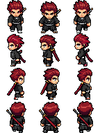
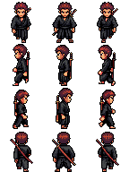
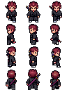
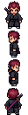

# RPG Maker Characters

Last reviewed: 2026-07-30.

<table>
  <tr>
    <td></td>
    <td></td>
  </tr>
  <tr>
    <td></td>
    <td></td>
  </tr>
  <tr>
    <td></td>
    <td></td>
  </tr>
</table>

The same character brief — a red-haired swordsman in a black kimono with a single katana on his back — was run three times through the `rpg-maker-character` blueprint, once each for RPG Maker MZ, MV, and VX Ace. Each run produced a drop-in single-character walk sheet in that engine's own cell geometry, plus a looping playback GIF built from the finished sheet columns so the gait can be checked before the file ever reaches the editor.

The three runs are separate generations, not one sprite resized. MZ and MV share identical 48x48 export cells, and they are both shown here on purpose: the v3 character model interpreted the same words differently each time, so the MZ run reads as a taller, sharper-spiked figure that fills its cell, while the MV run reads as a more compact chibi build inside the same 48x48 box. VX Ace ran at the smaller 32px character size and packs into 32x32 cells.

## Request

Every run invoked the shipped blueprint and supplied the RPG Maker version inline, so the recipe never had to stop and ask which engine to target.

### RPG Maker MZ Prompt

```text
@rpg-maker-character.blueprint.json mz, male with spiky red hair, brown eyes. wearing black kimono with only one katana attached to his back.
```

### RPG Maker MV Prompt

```text
@rpg-maker-character.blueprint.json mv, male with spiky red hair, brown eyes. wearing black kimono with only one katana attached to his back.
```

### RPG Maker VX Ace Prompt

```text
@rpg-maker-character.blueprint.json vx ace, male with spiky red hair, brown eyes. wearing black kimono with only one katana attached to his back.
```

## Prompt Preparation

The blueprint splits each request into two independent values before any paid call runs.

The RPG Maker version is resolved case-insensitively, an optional `RPG Maker` prefix is stripped, `VXAce` normalizes to `VX Ace`, and only XP, VX, VX Ace, MV, and MZ are accepted. The version never reaches PixelLab; it only selects the request size and the export geometry. Because all three prompts named a version, none of the runs hit the blueprint's "ask the user once" branch.

The character wording keeps only the words the user wrote. Request framing and the version phrase are removed, and nothing is added — no style, age, anatomy, clothing, or equipment enhancement. All three runs therefore sent the identical `description`:

```text
male with spiky red hair, brown eyes. wearing black kimono with only one katana attached to his back
```

The trailing sentence period from each prompt is framing punctuation and is not part of the description.

## Character Generation

Route: PixelLab MCP `create_character`

| Field | MZ | MV | VX Ace |
|---|---|---|---|
| Mode | `v3` | `v3` | `v3` |
| Body type | `humanoid` | `humanoid` | `humanoid` |
| Size | `48` | `48` | `32` |
| View | `low top-down` | `low top-down` | `low top-down` |
| Detail | `high detail` | `high detail` | `high detail` |
| Returned canvas | `92x92px` | `92x92px` | `64x64px` |

Size is derived from the version alone (`XP` and `MV`/`MZ` map to `48`, `VX` and `VX Ace` map to `32`), so the recipe never asks for a technical pixel value. PixelLab returns a canvas roughly 40% larger than the requested character size to leave animation room, which is why a `48` request comes back on a `92x92` canvas.

`v3` always returns eight rotations. Directions are mapped only from explicit trimmed, case-insensitive direction labels — never from array or response order — and this four-direction recipe keeps south, west, east, and north while ignoring the four labeled diagonals. All three runs were approved from their first candidate; no regeneration was needed.

## Walk Animation

Route: PixelLab MCP `animate_character`

| Field | Value |
|---|---|
| Mode | `template` |
| Template animation | `walking-4-frames` |
| Directions | `south`, `west`, `east`, `north` |
| AI freedom | `0` |

Template mode at `ai_freedom: 0` follows the skeleton pose rigidly, which is what keeps four separately generated directions on a shared gait. Each direction returns four frames, saved unchanged and in returned order.

## Engine Packaging

RPG Maker's single-character sheets are three columns wide and four rows tall. Rows are fixed as Down, Left, Right, Up (south, west, east, north) and columns run movement, standing, movement, so the engine plays column 2 → 1 → 2 → 3.

| Profile | MZ | MV | VX Ace |
|---|---|---|---|
| Cell | `48x48` | `48x48` | `32x32` |
| Sheet | `144x192` | `144x192` | `96x128` |
| Grid | `3x4` | `3x4` | `3x4` |
| Filename prefix | `$` | `$` | `$` |

The standing column reuses the reviewed static rotation. The two movement columns use walk frames 02 and 04 — the chronologically ordered pair of distinct opposing strides — verified per direction rather than assumed: each pair differs by several hundred pixels, and the foot centroid crosses to the opposite side between the two frames, so neither column is a duplicate or a near-repeat of standing.

Poses are normalized only after selection. Each delivered pose is cropped to its `alpha > 0` bounds, the cropped poses in a row are aligned to one bottom-center origin, and a single nearest-neighbor scale of `min(1, cell / maxW, cell / maxH)` is applied across every delivered pose so the rows stay consistent with each other. In all three runs the largest row union fit inside the cell (`32x48` for MZ, `28x47` for MV, `21x31` for VX Ace), so the scale resolved to `1.0` and no pixels were resampled at all.

The `$` prefix is what tells RPG Maker a sheet holds one character rather than a block of eight. The showcase copies here drop the prefix so the filenames stay portable across shells and web paths; rename a sheet to `$name.png` before dropping it into the engine's `img/characters` folder.

## Blueprints

Three replayable blueprints, one per engine:

- [`rpg-maker-mz-character.blueprint.json`](rpg-maker-characters/rpg-maker-mz-character.blueprint.json)
- [`rpg-maker-mv-character.blueprint.json`](rpg-maker-characters/rpg-maker-mv-character.blueprint.json)
- [`rpg-maker-vx-ace-character.blueprint.json`](rpg-maker-characters/rpg-maker-vx-ace-character.blueprint.json)

Each is the shipped `rpg-maker-character` recipe with the version pinned, so the version-selection prompt and the other engines' packaging branches are already resolved away. The three files differ only in the pinned version name, the `create_character` size, and the cell and sheet geometry in the packaging step. Blueprint excerpt — the two PixelLab calls from the MZ file, which the complete workflow surrounds with review, approval, inspection, and assembly `TASK` steps:

```json
[
  {
    "MCP create_character": {
      "body_type": "humanoid",
      "description": "male with spiky red hair, brown eyes. wearing black kimono with only one katana attached to his back",
      "detail": "high detail",
      "mode": "v3",
      "size": 48,
      "view": "low top-down"
    }
  },
  {
    "MCP animate_character": {
      "character_id": "<id returned by create_character for the approved candidate>",
      "mode": "template",
      "template_animation_id": "walking-4-frames",
      "animation_name": "four-direction walk",
      "directions": ["south", "west", "east", "north"],
      "ai_freedom": 0
    }
  }
]
```

## Reproducibility Controls

| Control | Setting |
|---|---|
| Character mode | `v3`, eight rotations, four kept |
| Character size | `48` for MZ and MV, `32` for VX Ace |
| View | `low top-down` |
| Detail | `high detail` |
| Animation | `walking-4-frames` template, `ai_freedom: 0` |
| Frames per direction | `4` |
| Transparency | preserved end to end; sheets and GIFs are transparent |
| Scaling | nearest-neighbor only, and unused in all three runs |
| GIF timing | 12 centiseconds per frame, infinite loop, explicit disposal |

No seed was sent, so the three characters are independent draws rather than variations of one seeded result.

## Local Processing

Sheet assembly, playback GIF encoding, and the inspection grid are local steps recorded as `TASK` entries in each blueprint; PixelLab returns individual frames, not engine sheets.

The playback GIF is cut from the finished sheet, not from the raw frames. Each GIF frame is one unscaled full-height sheet column — 48 or 32 pixels wide by the full sheet height — carrying all four direction cells stacked Down/Left/Right/Up, played in engine order 2 → 1 → 2 → 3. Building it this way means the GIF cannot drift from the PNG: it is the same pixels, re-ordered.

Each run also writes an inspection grid beside the sheet, an unscaled copy at identical pixel dimensions with contrasting one-pixel lines drawn only on interior cell boundaries. It is a review aid for confirming that every pose sits inside its cell on a shared baseline; the delivered sheet is never modified.

## Validation

- Sheet dimensions match each engine profile exactly: `144x192` with `48x48` cells for MZ and MV, `96x128` with `32x32` cells for VX Ace.
- All twelve cells in each sheet are occupied; no empty pose passed through.
- Every source column uses strictly binary alpha (`0` or `255`) and stays within the GIF palette limit (118, 80, and 67 opaque colors), so each playback GIF is genuinely pixel-exact rather than a visual approximation. All four coalesced frames of all three GIFs compare identically to their source sheet columns, with zero mismatched pixels.
- GIF timing decodes as 12 centiseconds per frame with infinite looping in all three files.
- Every walk frame was inspected against the approved rotations before packaging. The MV run failed that gate on the first attempt: the north walk dropped the katana in three of its four frames, which cannot be directional occlusion since a back-mounted sword is most visible from behind. Packaging stopped, the north direction alone was deleted and regenerated with the same template call, and the replacement frames carry the sword throughout. The other three directions were untouched. The blueprint forbids repairing frames by hand or packaging a failed animation, so the sheet on this page is the post-retry result.
- Two wording mismatches survive in all three runs and were reported rather than papered over: the hair is red but reads tousled rather than sharply spiky, and eye color is not resolvable at 48px or below, so "brown eyes" can be neither confirmed nor denied at these sizes.

## Showcase Assets

| Asset | Path |
|---|---|
| MZ sheet | `docs/showcase/rpg-maker-characters/rpg-maker-mz-character.png` |
| MZ playback | `docs/showcase/rpg-maker-characters/rpg-maker-mz-character.gif` |
| MV sheet | `docs/showcase/rpg-maker-characters/rpg-maker-mv-character.png` |
| MV playback | `docs/showcase/rpg-maker-characters/rpg-maker-mv-character.gif` |
| VX Ace sheet | `docs/showcase/rpg-maker-characters/rpg-maker-vx-ace-character.png` |
| VX Ace playback | `docs/showcase/rpg-maker-characters/rpg-maker-vx-ace-character.gif` |
| Blueprints | `docs/showcase/rpg-maker-characters/*.blueprint.json` |
