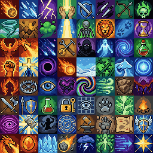
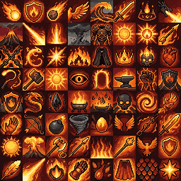
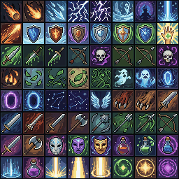
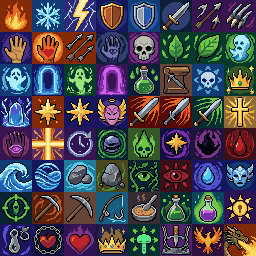
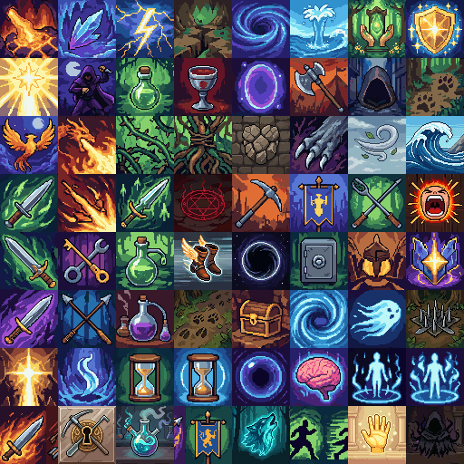
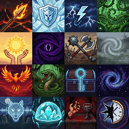

# Skill Icons

Last reviewed: 2026-07-02.

<table>
  <tr>
    <td></td>
    <td></td>
  </tr>
  <tr>
    <td></td>
    <td></td>
  </tr>
  <tr>
    <td colspan="2" align="center"></td>
  </tr>
  <tr>
    <td colspan="2" align="center"></td>
  </tr>
</table>

PixelLab Pip's strongest skill-icon route is REST `generate-image-v2`, surfaced in the product as Create Image Pro / Create S-XL Image Pro. The best showcased output is the rich-background prompt because it better follows the requested no-border/no-frame constraints while keeping strong readable symbols and colorful illustrated backgrounds. The original strict-grid output is very close and may be prettier for some game UI use cases, but it bakes in a faint card/slot edge.

## Contents

- [Request](#request)
- [Best Example: Rich-Background Create Image Pro Sheet](#best-example-rich-background-create-image-pro-sheet)
- [Themed Follow-up: Fire Magic Complete Sheet](#themed-follow-up-fire-magic-complete-sheet)
- [Close Co-Best: Original Strict-Grid Create Image Pro Sheet](#close-co-best-original-strict-grid-create-image-pro-sheet)
- [Learning Example: Borderless Mosaic Create Image Pro Sheet](#learning-example-borderless-mosaic-create-image-pro-sheet)
- [Curated 64px Fantasy Skill Atlas](#curated-64px-fantasy-skill-atlas)
- [Individual 64px Fantasy Skill Icons](#individual-64px-fantasy-skill-icons)
- [Findings](#findings)
- [Showcase Assets](#showcase-assets)
- [Validation Notes](#validation-notes)

## Request

```text
/pixellab-pip create a complete fantasy backgrounded skill icons. 32x32 icons only. consistent theme, illustrated backgrounds. all unique skill icons. each icon must be in a structured grid with no overlapping. no borders, no frames, no decorations, no corner radius.
```

## Best Example: Rich-Background Create Image Pro Sheet


The rich-background prompt is the recommended showcase winner. It keeps `skill icons` and `game UI` because those terms help PixelLab produce a real RPG icon-sheet feel, but it removes stronger slot-triggering wording such as `spritesheet`, `strict grid`, and `cell`. It also adds explicit background-quality guidance so the result keeps gradients and magical lighting instead of flattening into plain color fills.

Route: PixelLab REST v2 `generate-image-v2`

Prompt preparation: agent-optimized from iterative visual review.

Generation details:

| Field | Value |
|---|---|
| Image size | `256x256` |
| Output structure | `Atlas image` |
| Icon grid | `8x8`, intended `32x32` icons |
| Background | `no_background: false` |
| Returned seed | `24062808` |
| Usage reported | `20` generations |

Blueprint — replayable route and request body ([`create-image-pro-rich-background-8x8-32px.blueprint.json`](skill-icons/create-image-pro-rich-background-8x8-32px.blueprint.json)):

```json
{
  "_comment_prompt": "/pixellab-pip create a complete fantasy backgrounded skill icons. 32x32 icons only. consistent theme, illustrated backgrounds. all unique skill icons. each icon must be in a structured grid with no overlapping. no borders, no frames, no decorations, no corner radius.",
  "_comment": "Showcase winner. Removes slot-triggering words (spritesheet, strict grid, cell) and adds background-quality guidance.",
  "POST /v2/generate-image-v2": {
    "description": "A complete 8 by 8 sheet of 64 unique fantasy RPG skill icons for game UI. Exact canvas 256x256 pixels. 8 columns and 8 rows, each icon exactly one 32x32 square, perfectly aligned, edge-to-edge, no spacing, no overlap, no cropped icons. Pixel art, cohesive high fantasy theme, readable at 32x32.\n\nEach icon is a finished opaque square with a rich full-bleed illustrated miniature background behind the skill symbol. Backgrounds should be high quality: luminous gradients, painterly pixel texture, depth, magical light, atmospheric color variation, not flat solid color. Background art touches all four edges and corners. Every pixel painted; no transparent pixels, no alpha, no blank corners, no padding.\n\nPictorial symbols only. Use clear centered pictures and silhouettes: flames, ice shards, lightning bolts, shields, hands, daggers, arrows, skulls, leaves, spirits, portals, stars, wings, claws, weapons, masks, potions, celestial beams, aura effects. Do not use runes or glyphs. No text-like marks, letters, words, numbers, labels, captions, handwriting, decorative script, fake writing, or alphabet-like shapes.\n\nUnique varied abilities: elemental magic, weapon attacks, healing, protection, stealth, curses, nature magic, summoning, movement, utility, crafting, survival, resurrection, treasure sense, mind, time, gravity, poison, holy, shadow, blood, mana, rage, tracking, alchemy, lockpicking, leadership, taunt, cleanse, traps, phoenix, dragon breath. No terrain tiles, map tiles, or inventory item sheet. No borders, frames, UI slots, rounded corners, dividers, watermark, black outlines around icon square edges, or separating lines. Palette: sapphire blue, ember orange, moonlit violet, emerald green, gold highlights.",
    "image_size": {
      "width": 256,
      "height": 256
    },
    "no_background": false,
    "seed": 24062808
  }
}
```

Findings:

- Best match to the full user requirement among the top outputs.
- Recovers rich background and gradient quality after the over-optimized borderless attempt became too flat.
- Preserves readable foreground symbols and a coherent high-fantasy palette.
- Still uses dark foreground outlines for readability, but does not look as hard-framed as the original strict-grid output.
- Human ranking: effectively tied with the original strict-grid prompt, but selected as the showcase winner because it better respects the no-border/no-frame instruction.

## Themed Follow-up: Fire Magic Complete Sheet


Original prompt:

```text
/pixellab-pip create a complete fantasy fire-based backgrounded skill icons. 32x32 icons only. consistent fire magic theme, illustrated backgrounds. all unique skill icons. no overlapping icons, no borders, no frames, no decorations, no corner radius.
```

The fire-magic follow-up confirmed that composition strategy matters more than the theme. A previous batch asked for standalone `32x32` generated icons and produced crisp symbols, but several icons looked like simple silhouettes, inventory items, or rune-like marks on flatter backgrounds. The stronger run kept the same `generate-image-v2` route but asked for one complete `256x256` sheet with `8x8` adjacent `32x32` squares, rich full-bleed backgrounds, background art touching neighboring cells directly, and an invisible grid.

Route: PixelLab REST v2 `generate-image-v2`

Prompt preparation: agent-optimized complete-sheet prompt from the user's fire-magic request.

Generation details:

| Field | Value |
|---|---|
| Image size | `256x256` |
| Output structure | `Atlas image` |
| Icon grid | `8x8`, intended `32x32` icons |
| Background | `no_background: false` |
| Returned seed | `20260629` |
| Usage reported | `20` generations |
| Reported cost | `$0.095` |
| Description length | `1994` characters |

Blueprint — replayable route and request body ([`create-image-pro-fire-magic-sheet-8x8-32px.blueprint.json`](skill-icons/create-image-pro-fire-magic-sheet-8x8-32px.blueprint.json)):

```json
{
  "_comment_prompt": "/pixellab-pip create a complete fantasy fire-based backgrounded skill icons. 32x32 icons only. consistent fire magic theme, illustrated backgrounds. all unique skill icons. no overlapping icons, no borders, no frames, no decorations, no corner radius.",
  "POST /v2/generate-image-v2": {
    "description": "A complete 8 by 8 sheet of 64 unique fantasy RPG fire magic skill icons. Exact canvas 256x256 pixels. 8 columns and 8 rows, each icon exactly one 32x32 square, perfectly aligned edge-to-edge, no spacing, no overlap, no cropped icons. Pixel art, consistent fire magic theme, readable at 32x32.\n\nEach icon is a finished Fully opaque square with a rich full-bleed illustrated miniature background behind the skill symbol. Backgrounds: luminous gradients, painterly pixel texture, depth, magical light, atmospheric color variation, not flat solid color. Background artwork touches neighboring artwork directly and touches all four edges and corners. Every pixel painted. No transparent pixels, no alpha, no blank corners, no padding.\n\nPictorial symbols only. Use clear centered pictures and silhouettes. Make all 64 abilities unique, including fireball, flame shield, meteor, phoenix wing, lava wave, burning sword, ember trap, dragon breath, volcano, scorch beam, flame pillar, ash storm, magma armor, solar flare, fire nova, blazing arrow, molten chains, salamander spirit, ignite spark, wildfire, cinder cloak, fire crown, burning skull, furnace heart, flame whip, lava hammer, sun spear, ember eye, fire portal, forge anvil, magma fist, volcanic shield, flame serpent, obsidian shard, ember rain, brazier, lava skull, firestorm spiral, pyromancer hand, flame bow, cinder bomb, smoke vortex, phoenix egg, ember wings, searing chain, heat blade, molten gauntlet, solar disk, volcanic plume.\n\nDo not use runes or glyphs. No text-like marks, letters, words, numbers, labels, captions, handwriting, decorative script, fake writing, or alphabet-like shapes. No terrain tiles, map tiles, inventory item sheet, UI slots, buttons, borders, frames, rounded corners, corner radius, dividers, watermark, decorations, black outlines around icon square edges, or separating lines. Invisible grid only. Palette: ember orange, molten gold, crimson red, charcoal smoke, blackened obsidian, hot white highlights.",
    "image_size": {
      "width": 256,
      "height": 256
    },
    "no_background": false,
    "seed": 20260629
  }
}
```

Findings:

- The full-sheet composition produced a more cohesive painted game-skill-sheet look than standalone 32x32 generation.
- `Background artwork touches neighboring artwork directly` and `Invisible grid only` helped avoid gutters while preserving a clean sheet.
- A dense themed ability list improved variety inside a single fire-magic palette.
- The prompt landed just under the observed `generate-image-v2` description limit, so themed prompts need concise ability names and careful trimming.

## Close Co-Best: Original Strict-Grid Create Image Pro Sheet


The original strict-grid prompt produced the most appealing classic RPG hotbar/icon-sheet look. The stricter `spritesheet`, `strict grid`, `cell`, and `game UI skill icons` phrasing likely pushed PixelLab toward real game UI icon priors: punchier contrast, darker edge treatment, and very clean silhouettes. The same priors also caused the main flaw: a faint baked-in card/slot edge around many icons.

Route: PixelLab REST v2 `generate-image-v2`

Prompt preparation: agent-optimized no-text/pictorial prompt.

Generation details:

| Field | Value |
|---|---|
| Image size | `256x256` |
| Output structure | `Atlas image` |
| Icon grid | `8x8`, intended `32x32` icons |
| Background | `no_background: false` |
| Returned seed | `24062805` |
| Usage reported | `20` generations |

Blueprint — replayable route and request body ([`create-image-pro-original-strict-grid-8x8-32px.blueprint.json`](skill-icons/create-image-pro-original-strict-grid-8x8-32px.blueprint.json)):

```json
{
  "_comment_prompt": "/pixellab-pip create a complete fantasy backgrounded skill icons. 32x32 icons only. consistent theme, illustrated backgrounds. all unique skill icons. each icon must be in a structured grid with no overlapping. no borders, no frames, no decorations, no corner radius.",
  "_comment": "Co-best; strict-grid/cell/spritesheet wording gives punchy game-UI look but bakes a faint card/slot edge.",
  "POST /v2/generate-image-v2": {
    "description": "A complete 8 by 8 spritesheet of 64 unique fantasy RPG ability icons. Exact canvas 256x256 pixels. Strict grid: 8 columns, 8 rows, each cell exactly 32x32 pixels, no spacing, no overlap, no cropped cells. Pixel art game UI skill icons, cohesive high fantasy theme, readable at 32px.\n\nEach cell is a finished opaque square icon with a full-bleed illustrated fantasy background touching all four edges and all four corners. Every pixel must be painted. No transparent pixels, no alpha, no blank corners, no padding.\n\nPictorial symbols only. Use clear centered pictures and silhouettes: flames, ice shards, lightning bolts, shields, hands, daggers, arrows, skulls, leaves, spirits, portals, stars, wings, claws, weapons, masks, potions, celestial beams, aura effects. Do not use runes or glyphs. No text-like marks. No letters, no words, no numbers, no labels, no captions, no handwriting, no decorative script, no fake writing, no alphabet-like shapes.\n\nUnique varied abilities: elemental magic, weapon attacks, healing, protection, stealth, curses, nature magic, summoning, movement, utility, crafting, survival, resurrection, treasure sense. No terrain tiles, no map tiles, no inventory item sheet. No borders, no frames, no UI slots, no rounded corners, no decorative dividers, no watermark. Palette: sapphire blue, ember orange, moonlit violet, emerald green, gold highlights.",
    "image_size": {
      "width": 256,
      "height": 256
    },
    "no_background": false,
    "seed": 24062805
  }
}
```

Findings:

- Strongest classic game-icon feel: punchy contrast, dark readability edges, and clear symbol silhouettes.
- Beautiful colors and strong consistency across the sheet.
- Better visual punch than the rich-background winner, but less faithful to the requested no-border/no-frame constraint.
- No obvious readable labels were visible during review.
- Repeats visual categories such as shields, weapons, potions, portals, and elemental effects.
- Final human review ranked Create Image Pro as the clear best approach overall, ahead of tiles-pro for this finished 8x8 skill-icon target.

## Learning Example: Borderless Mosaic Create Image Pro Sheet


The borderless mosaic prompt intentionally attacked the card/slot-border problem by reframing the sheet as an invisible-grid mosaic. It reduced the hard grid/slot feeling, but the stronger anti-border wording also flattened the backgrounds and made the output less visually rich. This is a useful negative/learning example: over-optimizing for no borders can damage the fantasy icon art direction.

Route: PixelLab REST v2 `generate-image-v2`

Prompt preparation: agent-optimized border-reduction prompt.

Generation details:

| Field | Value |
|---|---|
| Image size | `256x256` |
| Output structure | `Atlas image` |
| Icon grid | `8x8`, intended `32x32` icons |
| Background | `no_background: false` |
| Returned seed | `24062806` |
| Usage reported | `20` generations |

Blueprint — replayable route and request body ([`create-image-pro-borderless-mosaic-8x8-32px.blueprint.json`](skill-icons/create-image-pro-borderless-mosaic-8x8-32px.blueprint.json)):

```json
{
  "_comment_prompt": "/pixellab-pip create a complete fantasy backgrounded skill icons. 32x32 icons only. consistent theme, illustrated backgrounds. all unique skill icons. each icon must be in a structured grid with no overlapping. no borders, no frames, no decorations, no corner radius.",
  "_comment": "Learning example: over-optimizing for no borders flattened the backgrounds.",
  "POST /v2/generate-image-v2": {
    "description": "Complete borderless 8x8 pixel-art spritesheet mosaic of 64 unique fantasy RPG ability pictograms. Exact canvas 256x256. Invisible grid only: 8 columns, 8 rows, each adjacent square area exactly 32x32, packed edge-to-edge, no spacing, no gaps, no overlap, no cropped art.\n\nEach 32x32 area is a full-bleed opaque miniature fantasy painting with a large clear centered ability symbol. The painted background must reach all four edges and all four corners and touch neighboring artwork directly. Do not draw the grid. Do not draw separator lines, seams, perimeter strokes, boxes, card edges, icon slots, frames, borders, outlines around square areas, or dark edge pixels along the 32x32 boundaries. Square fully painted corners, never rounded.\n\nPictorial symbols only: flames, ice, lightning, shields, hands, daggers, arrows, skulls, leaves, spirits, portals, stars, wings, claws, weapons, masks, potions, beams, aura effects, waves, stones, vines, eyes, chains, hearts, crowns, hammers, hooks, moons, suns. Large readable symbols, integrated into the background, not enclosed in UI.\n\nNo text, letters, words, numbers, labels, captions, handwriting, decorative script, fake writing, runes, glyphs, alphabet-like marks, watermark, transparent pixels, alpha, blank pixels. Varied abilities: elements, healing, protection, stealth, curses, nature, summoning, movement, crafting, survival, resurrection, treasure sense, weapon attacks, mind, time, gravity, poison, holy, shadow, blood, mana, rage, tracking, mining, fishing, cooking, alchemy, lockpicking, leadership, taunt, cleanse, traps, phoenix, dragon breath. Palette: sapphire blue, ember orange, moonlit violet, emerald green, gold highlights.",
    "image_size": {
      "width": 256,
      "height": 256
    },
    "no_background": false,
    "seed": 24062806
  }
}
```

Findings:

- Reduced the hard 1px card-grid border compared with the original strict-grid output.
- Confirmed that `No borders` alone is not enough; grid and game UI vocabulary can still encourage slot/card edges.
- Boundary pixels stayed darker than average, and many symbols still used dark outlines.
- Backgrounds looked flatter and less premium than the original and rich-background prompts.
- Not the recommended final prompt, but useful as evidence for the border/art-quality tradeoff.

## Curated 64px Fantasy Skill Atlas


Original prompt:

```text
/pixellab-pip do the following simultaneously:
...
2. create a complete set of 64x64 skill icons.
...
each task must consist of unique variations, no duplicates.
```

The curated 64px skill atlas combines the best no-caption PixelLab cells from a full-atlas attempt and separate-image batches. The first atlas had repeated motifs, and a stricter retry added visible captions, so the final showcase sheet was locally assembled from PixelLab-origin cells without repainting, resizing, quantization, or procedural fixes.

Source inputs: text-only request. No reference images, style images, masks, or palette images were supplied.

Route: PixelLab REST v2 `generate-image-v2`, surfaced in product language as Create Image Pro.

Prompt preparation: agent-optimized from the user's simultaneous complete-set request.

Generation details:

| Field | Value |
|---|---|
| Final sheet | `512x512` |
| Output structure | Mixed source: `Atlas image` plus `Separate images`; final sheet assembled locally |
| Icon grid | `8x8`, intended `64x64` icons |
| Background | fully opaque |
| Base atlas seed | `2003365359` |
| Usage reported | `40` generations for the base atlas, then `20` generations per separate-image batch |

Blueprint — replayable route and request body ([`fantasy-rpg-skill-64px-8x8-curated.blueprint.json`](skill-icons/fantasy-rpg-skill-64px-8x8-curated.blueprint.json)):

```json
{
  "_comment": "From a multi-task 'do the following simultaneously' batch; see skill-icons.md. This is the base 512x512 atlas request; the final showcase sheet was locally curated from atlas + separate-image cells.",
  "POST /v2/generate-image-v2": {
    "description": "Complete 8 by 8 sheet of 64 unique fantasy RPG skill icons for game UI, 8 columns and 8 rows, each cell a readable 64x64 icon, perfectly aligned edge-to-edge with zero spacing, no overlap, no cropped icons, no dividers, no drawn grid. Rich full-bleed illustrated miniature backgrounds behind clear centered pictorial symbols, luminous pixel texture, depth, magical light, atmospheric color variation. Varied abilities across fire, ice, lightning, earth, wind, water, healing, shields, holy light, shadow strike, poison, blood magic, mana burst, rage, stealth, tracking, traps, lockpicking, alchemy, crafting, survival, leadership, taunt, cleanse, curse, summoning, portals, teleport, time, gravity, mind control, spirit, phoenix, dragon breath, nature thorns, roots, claws, arrows, daggers, hammers, banners, treasure sense, resurrection, aura buffs, debuffs, and movement. Pictorial symbols only. No text, letters, words, numbers, labels, captions, handwriting, decorative script, fake writing, runes, glyphs, alphabet-like shapes, terrain tiles, map tiles, inventory items, borders, frames, UI slots, rounded corners, watermark, black square-edge outlines, or separating lines. Palette: sapphire blue, ember orange, moonlit violet, emerald green, gold highlights.",
    "image_size": {
      "width": 512,
      "height": 512
    },
    "no_background": false
  }
}
```

Findings:

- The final atlas is best for the strict no-duplicates 64px request because it curates away repeated motifs and captioned retry cells.
- The compiled sheet preserves PixelLab-generated pixels; local processing only cropped and arranged cells.
- All final cropped `64x64` cells had unique pixel hashes, and visual review found no visible text labels.

## Individual 64px Fantasy Skill Icons


Original prompt:

```text
/pixellab-pip do the following simultaneously:
...
2. create 64x64 skill icons.
...
each task must consist of named unique variations, no duplicates.
```

The 64px fantasy skill icon batch shows Create Image Pro's native small-image batch behavior for ability icons. The request asked for named unique variations, so the route produced separate `64x64` PNGs rather than one packed sheet. The no-margin showcase grid above was locally assembled from the original PixelLab PNGs for browsing.

Source inputs: text-only request. No reference images, style images, masks, or palette images were supplied.

Route: PixelLab REST v2 `generate-image-v2`.

Prompt preparation: agent-optimized from the user's simultaneous batch request.

Generation details:

| Field | Value |
|---|---|
| Image size | `64x64` per generated skill icon |
| Output structure | `Separate images` |
| Returned image count | `16` separate PNGs |
| Showcase grid | `4x4`, `256x256`, assembled from original `64x64` PNGs |
| Background | `no_background: false` |
| Usage reported | `20` generations |
| Reported cost | `$0.095` |

Blueprint — replayable route and request body ([`fantasy-rpg-skill-64px-4x4.blueprint.json`](skill-icons/fantasy-rpg-skill-64px-4x4.blueprint.json)):

```json
{
  "_comment": "From a multi-task 'do the following simultaneously' batch; see skill-icons.md. no_background false 64x64 returns separate PNGs arranged locally.",
  "POST /v2/generate-image-v2": {
    "description": "Sixteen unique fantasy RPG skill icons as separate 64x64 generated images: Ember Lance, Glacier Guard, Storm Step, Vine Snare, Solar Mend, Void Mark, Iron Barrage, Mist Veil, Phoenix Rise, Serpent Venom, Arcane Lockpick, Gravity Well, Spirit Howl, Crystal Barrier, Blood Pact, and Time Shear. Each icon has a distinct centered pictorial symbol with a rich full-bleed miniature painted background, luminous effects, crisp pixel texture, readable game UI composition, and no duplicate ability concepts. No text, letters, words, numbers, labels, captions, fake writing, runes, glyphs, UI button frames, rounded corners, borders, separating lines, inventory items, terrain tiles, watermark, or black square-edge outlines.",
    "image_size": {
      "width": 64,
      "height": 64
    },
    "no_background": false
  }
}
```

Generated skill names:

```text
ember_lance, glacier_guard, storm_step, vine_snare,
solar_mend, void_mark, iron_barrage, mist_veil,
phoenix_rise, serpent_venom, arcane_lockpick, gravity_well,
spirit_howl, crystal_barrier, blood_pact, time_shear
```

Findings:

- Native `64x64` generation is useful for named ability variations and direct per-icon files.
- The returned skill PNGs are fully opaque and have unique pixel hashes.
- The no-margin showcase grid is only an arrangement of the original PixelLab outputs for documentation.

## Findings

Create Image Pro / REST `generate-image-v2` is the best approach discovered in this spike for fantasy skill icons. It is the only route tested that consistently combined a full `8x8` output, opaque backgrounds, readable symbols, cohesive style, and strong visual quality.

Prompt language has tradeoffs:

- `game UI`, `spritesheet`, `strict grid`, and `cell` improve the classic RPG icon-sheet feel but increase baked-in slot/card edges.
- Rich background language such as `luminous gradients`, `painterly pixel texture`, `depth`, `magical light`, and `not flat solid color` improves background quality.
- Borderless/invisible-grid language can reduce hard frames, but too much of it can flatten the art direction.
- `Pictorial symbols only` plus explicit bans on text, letters, numbers, runes, glyphs, fake writing, and labels is essential.

Routes that did not win:

- REST `generate-ui-v2` had the right colors and idea, but looked noisy/downscaled, had lower 32px clarity, showed rounded/button-like background behavior, and produced small amounts of text-like or glyph-like noise.
- MCP `create_ui_asset` with 64 pieces improved layout and semantic targeting, but strongly created framed UI buttons/slots and poor pure-icon consistency.
- MCP `create_tiles_pro` produced interesting icon-like 4x4 batches, but it was not the best finished 8x8 skill icon route.

## Showcase Assets

| Output | Stable showcase file |
|---|---|
| Rich-background winner | `docs/showcase/skill-icons/create-image-pro-rich-background-8x8-32px.png` |
| Fire magic themed follow-up | `docs/showcase/skill-icons/create-image-pro-fire-magic-sheet-8x8-32px.png` |
| Original strict-grid co-best | `docs/showcase/skill-icons/create-image-pro-original-strict-grid-8x8-32px.png` |
| Borderless mosaic learning example | `docs/showcase/skill-icons/create-image-pro-borderless-mosaic-8x8-32px.png` |
| Curated 64px fantasy skill atlas | `docs/showcase/skill-icons/fantasy-rpg-skill-64px-8x8-curated.png` |
| 64px fantasy skill icon grid | `docs/showcase/skill-icons/fantasy-rpg-skill-64px-4x4.png` |

## Validation Notes

- The four 32px sheet examples are `256x256`.
- All four are fully opaque with 8-bit `alpha_min=255`, `alpha_max=255`, and `transparent_pixels=0`.
- All four produced `64/64` pixel-hash-unique cropped `32x32` cells. Pixel-hash uniqueness does not prove semantic uniqueness; visual review is still required.
- The 64px fantasy skill batch was generated as `16` original `64x64` PNGs before showcase assembly.
- The 64px fantasy skill grid is exactly `256x256` and divides exactly into a `4x4` grid of `64x64` cells.
- All 16 64px fantasy skill originals have unique pixel hashes and are fully opaque.
- The curated 64px fantasy skill atlas is exactly `512x512` and divides exactly into an `8x8` grid of `64x64` cells.
- The curated 64px fantasy skill atlas has `64/64` pixel-hash-unique cropped cells and is fully opaque.
- The curated 64px fantasy skill atlas is assembled from PixelLab-origin atlas cells and separate-image cells after rejecting repeated-motif and captioned candidates.
- No local repainting or procedural visual fixes were applied. Assembled showcase files preserve PixelLab-generated pixels.
