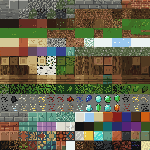
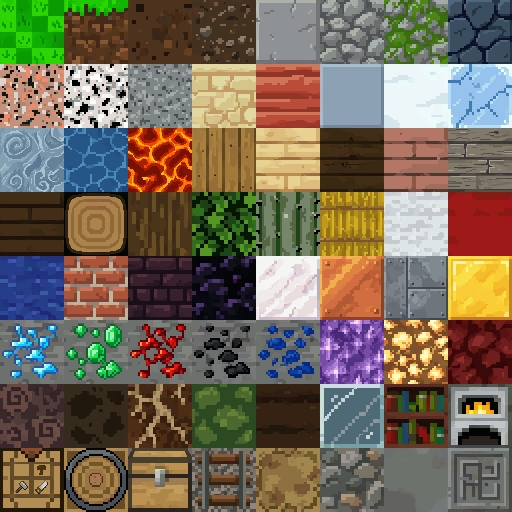
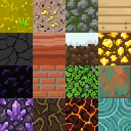

# Tiles

Last reviewed: 2026-07-02.

<table>
  <tr>
    <td></td>
    <td></td>
  </tr>
  <tr>
    <td colspan="2" align="center"></td>
  </tr>
  <tr>
    <td colspan="2" align="center"></td>
  </tr>
</table>

PixelLab Pip can showcase tile workflows from several surfaces: Create Image Pro texture sheets, `create_tiles_pro` tile variants, top-down Wang tilesets, sidescroller tilesets, and isometric tiles. The primary Create Image Pro example is a proper `256x256` atlas that mechanically slices into a `16x16` grid of `16x16` Minecraft-inspired tiles. It is useful as a first-pass atlas showcase, with one important caveat: strict uniqueness did not fully pass.

## Contents

- [Primary Example: Minecraft-Inspired 16x16 Atlas](#primary-example-minecraft-inspired-16x16-atlas)
- [Follow-Up Example: Minecraft Mod 32px Terrain Pack](#follow-up-example-minecraft-mod-32px-terrain-pack)
- [Compiled 64px Minecraft-Inspired Block Face Atlas](#compiled-64px-minecraft-inspired-block-face-atlas)
- [Individual 64px Minecraft-Inspired Block Face Textures](#individual-64px-minecraft-inspired-block-face-textures)
- [Findings](#findings)
- [Showcase Assets](#showcase-assets)
- [Validation Notes](#validation-notes)

## Primary Example: Minecraft-Inspired 16x16 Atlas


Original prompt:

```text
/pixellab-pip create a grid of 16x16 minecraft-inspired tiles using image pro. every tile must be unique and textured.
```

The Minecraft-inspired atlas is the lead tile showcase because it is a valid `256x256` image that can be sliced into a `16x16` grid of `16x16` cells. It demonstrates that Create Image Pro can produce a mechanically correct atlas at Minecraft's native texture size. Verification found `251 / 256` exact-unique cells, so this is a strong first-pass atlas rather than a strict all-unique final pack.

Route: PixelLab REST v2 `generate-image-v2`, surfaced in product language as Create Image Pro.

Prompt preparation: agent-optimized from the user's Minecraft-style 16px atlas request.

Generation details:

| Field | Value |
|---|---|
| Image size | `256x256` |
| Output structure | `Atlas image` |
| Atlas grid | `16x16` |
| Tile size | `16x16` |
| Background | `no_background: false` |
| Usage reported | `20` generations |
| Exact-unique cells | `251 / 256` |

Blueprint — replayable route and request body ([`minecraft-inspired-generate-image-v2-16x16-atlas.blueprint.json`](tiles/minecraft-inspired-generate-image-v2-16x16-atlas.blueprint.json)):

```json
{
  "_comment_prompt": "/pixellab-pip create a grid of 16x16 minecraft-inspired tiles using image pro. every tile must be unique and textured.",
  "POST /v2/generate-image-v2": {
    "description": "A 256-file packed atlas of original voxel sandbox block-game terrain texture files, arranged as 16 columns by 16 rows. Each file occupies exactly one 16 by 16 pixel cell inside a 256 by 256 image. Cells touch edge-to-edge with zero pixels between cells. No margins, gutters, padding, spacing, separator pixels, blank pixels, outlines, frames, guide lines, or drawn grid. Every cell is completely filled edge-to-edge including corner pixels. Each of the 256 cells is unique, highly textured, and readable as a small square block face: stone, dirt, grass top, grass side, sand, gravel, clay, snow, ice, moss, bark, planks, leaves, ores, bricks, cobble, mud, lava rock, nether-like stone, fantasy minerals, farmland, hay, glass, wool, metal, decorative tiles, and rare variants. No large strips, connected terrain rows, scenery, UI, labels, text, icons, characters, tools, shadows spanning cells, highlights spanning cells, ore veins crossing cells, planks crossing cells, or texture detail continuing into neighboring cells. Crunchy 16-bit pixel-art texture, crisp square pixels, high material variety, original designs inspired by block-building survival games.",
    "image_size": {
      "width": 256,
      "height": 256
    },
    "no_background": false
  }
}
```

Findings:

- The atlas passes canvas size and mechanical 16px slicing.
- The output is appropriate for a Minecraft-inspired `16x16` texture atlas showcase.
- Strict uniqueness did not fully pass: verification found `5` duplicate exact cells.
- Visual review found several repeated or similar material rows, so semantic uniqueness is weaker than the mechanical grid result.
- The best next strict-uniqueness route is to generate batches of native `16x16` Image Pro outputs, then assemble 256 PixelLab-origin tiles into one atlas.

## Follow-Up Example: Minecraft Mod 32px Terrain Pack


Original prompt:

```text
pip create a grid of 32x32 tiles using create image pro. they must be various tiles for a minecraft mod
```

The Minecraft mod terrain pack demonstrates a cleaner uniqueness workflow at `32x32`: generate `64` original PixelLab images at native tile size, then locally arrange those original tiles into an exact `8x8` sheet. The assembled sheet is a stable showcase artifact with auditable 32px cell boundaries.

Route: PixelLab REST v2 `generate-image-v2`, surfaced in product language as Create Image Pro.

Prompt preparation: agent-optimized from the user's Minecraft tile-pack request.

Local processing: 64 original PixelLab `32x32` PNGs were arranged into an `8x8` sheet without repainting, resizing, quantization, or procedural visual fixes.

Generation details:

| Field | Value |
|---|---|
| Image size | `32x32` per generated tile |
| Output structure | `Separate images` |
| Tile count | `64` |
| Final sheet | `8x8`, `256x256` |
| Background | `no_background: false` |
| Seed | `1323610680` |
| Usage reported | `20` generations |

Natural-language generation input:

```text
Varied Minecraft mod terrain block top-face textures, seamless 32x32 orthographic voxel-inspired tiles, no text/icons/borders/perspective.
```

Blueprint — replayable route and request body ([`minecraft-mod-generate-image-v2-8x8-32px-sheet.blueprint.json`](tiles/minecraft-mod-generate-image-v2-8x8-32px-sheet.blueprint.json)):

```json
[
  {
    "_comment": "64 native 32x32 tiles generated as separate images, then arranged locally into the 8x8 sheet.",
    "_comment_prompt": "pip create a grid of 32x32 tiles using create image pro. they must be various tiles for a minecraft mod",
    "POST /v2/generate-image-v2": {
      "description": "Varied Minecraft mod terrain block top-face textures, seamless 32x32 orthographic voxel-inspired tiles, no text/icons/borders/perspective.",
      "image_size": {
        "width": 32,
        "height": 32
      },
      "no_background": false,
      "seed": 1323610680
    }
  },
  {
    "TASK": {
      "instruction": "Use all 64 images returned by the immediately preceding PixelLab call in returned order. Arrange them row-major into an 8 by 8 sheet with no margins, spacing, resizing, repainting, quantization, or other visual changes.",
      "outputs": ["minecraft-mod-generate-image-v2-8x8-32px-sheet.png"],
      "verify": "The sheet is exactly 256x256 with sixty-four edge-to-edge 32x32 cells, and every cell is pixel-identical to its corresponding returned tile."
    }
  }
]
```

Findings:

- Generating original `32x32` tiles and assembling them locally produced a reliable sheet layout.
- The final spritesheet is exactly `256x256` and divides cleanly into `8x8` cells of `32x32`.
- Every tile was generated by PixelLab; local work only arranged original outputs into a sheet.
- The generated set is well suited to a Minecraft-inspired terrain pack because each source tile has the intended native size.
- This is still a texture-pack workflow, not a Wang/autotile terrain-transition workflow.

## Compiled 64px Minecraft-Inspired Block Face Atlas


Original prompt:

```text
/pixellab-pip do the following simultaneously:
...
3. use create image pro to create atlas of 64x64 minecraft tile textures.
each task must consist of unique variations, no duplicates.
```

The compiled 64px block-face atlas uses native `64x64` PixelLab outputs assembled into a final `512x512` sheet. Two full-atlas attempts were rejected because the generated materials visually continued across cell boundaries, so the final showcase uses separate-image batches for clean independent tiles.

Source inputs: text-only request. No reference images, style images, masks, or palette images were supplied.

Route: PixelLab REST v2 `generate-image-v2`, surfaced in product language as Create Image Pro.

Prompt preparation: agent-optimized from the user's Create Image Pro atlas request.

Generation details:

| Field | Value |
|---|---|
| Final sheet | `512x512` |
| Output structure | `Separate images`; final sheet assembled locally |
| Tile grid | `8x8`, intended `64x64` textures |
| Background | fully opaque |
| Batch usage reported | `20` generations per separate-image batch |
| Retry note | One separate-image material batch failed and was rerun with the same input |

Blueprint — replayable route and request body ([`minecraft-block-face-64px-8x8-atlas.blueprint.json`](tiles/minecraft-block-face-64px-8x8-atlas.blueprint.json)):

```json
{
  "_comment": "From a multi-task 'do the following simultaneously' batch; see tiles.md. Final 512x512 sheet assembled locally from separate 64x64 outputs (full-atlas attempts bled across cells).",
  "POST /v2/generate-image-v2": {
    "description": "A 512x512 atlas of 64 unique Minecraft-inspired voxel sandbox block-face tile textures, arranged as 8 columns and 8 rows. Each tile occupies exactly one independent 64 by 64 pixel cell, cells touch edge-to-edge with zero pixels between cells. Every cell is filled completely edge-to-edge including edge and corner pixels. Include varied block materials: grass top, dirt, stone, cobblestone, mossy cobble, deepslate, granite, diorite, andesite, sandstone, red sand, clay, snow, ice, packed ice, water, lava, oak planks, birch planks, spruce planks, jungle planks, acacia planks, dark oak planks, stripped logs, bark, leaves, cactus, hay bale, wool colors, brick, nether brick, obsidian, quartz, copper, iron, gold, diamond ore, emerald ore, redstone ore, coal ore, lapis ore, amethyst, glowstone, netherrack, soul sand, mud, roots, moss, tilled soil, glass, bookshelves, furnace front, crafting table, barrel top, chest top, rails, path, gravel, concrete, terracotta, and decorative carved stone. No margins, gutters, padding, spacing, separator pixels, blank pixels, outlines, frames, guide lines, drawn grid, labels, numbers, letters, watermark, connected terrain rows, wide textures, planks or veins continuing into neighboring cells, repeated duplicates, or copied vanilla game textures.",
    "image_size": {
      "width": 512,
      "height": 512
    },
    "no_background": false
  }
}
```

Findings:

- Separate-image generation was the reliable route for independent `64x64` block-face textures.
- The compiled sheet preserves PixelLab-generated pixels; local processing only arranged original `64x64` outputs.
- All final cropped `64x64` cells had unique pixel hashes, and visual review found independent cell boundaries.

## Individual 64px Minecraft-Inspired Block Face Textures


Original prompt:

```text
/pixellab-pip do the following simultaneously:
...
3. use create image pro to create 64x64 minecraft tile textures.
each task must consist of named unique variations, no duplicates.
```

The 64px block-face batch demonstrates Create Image Pro producing separate terrain texture files at native `64x64` size. This route is appropriate when the target is a set of independent block-face textures rather than a Wang/autotile terrain-transition sheet. The no-margin showcase grid above was locally assembled from the original PixelLab PNGs for browsing.

Source inputs: text-only request. No reference images, style images, masks, or palette images were supplied.

Route: PixelLab REST v2 `generate-image-v2`, surfaced in product language as Create Image Pro.

Prompt preparation: agent-optimized from the user's simultaneous batch request. A first longer texture prompt timed out, so the showcased request is the shorter successful retry.

Generation details:

| Field | Value |
|---|---|
| Image size | `64x64` per generated block face |
| Output structure | `Separate images` |
| Returned image count | `16` separate PNGs |
| Showcase grid | `4x4`, `256x256`, assembled from original `64x64` PNGs |
| Background | `no_background: false` |
| Usage reported | `20` generations |
| Reported cost | `$0.095` |

Blueprint — replayable route and request body ([`minecraft-block-face-64px-4x4.blueprint.json`](tiles/minecraft-block-face-64px-4x4.blueprint.json)):

```json
[
  {
    "_comment": "From a multi-task 'do the following simultaneously' batch; see tiles.md. Separate 64x64 textures arranged locally into the showcase grid.",
    "POST /v2/generate-image-v2": {
      "description": "Sixteen unique 64x64 voxel sandbox block face tile textures as separate generated images: sunlit grass, granite ore fleck, mossy cobblestone, birch planks, deep slate crack, red sandstone cut, snowy dirt, glowstone cluster, obsidian sheen, clay bricks, jungle leaves, oxidized copper, amethyst stone, muddy roots, ember nether rock, and prismarine wave stone. Each image is one seamless square block face, edge-to-edge filled, chunky pixel art, crisp 64px texture detail, clear distinct material identity, no duplicate materials. No items, icons, characters, text, labels, UI, borders, frames, perspective scene, transparent background, or connected multi-image panorama.",
      "image_size": {
        "width": 64,
        "height": 64
      },
      "no_background": false
    }
  },
  {
    "TASK": {
      "instruction": "Use all 16 images returned by the immediately preceding PixelLab call in returned order. Arrange them row-major into a 4 by 4 sheet with no margins, spacing, resizing, repainting, quantization, or other visual changes.",
      "outputs": ["minecraft-block-face-64px-4x4.png"],
      "verify": "The sheet is exactly 256x256 with sixteen edge-to-edge 64x64 cells, and every cell is pixel-identical to its corresponding returned texture."
    }
  }
]
```

Generated texture names:

```text
sunlit_grass_block, granite_ore_fleck, mossy_cobblestone, birch_plank_face,
deep_slate_crack, red_sandstone_cut, snowy_dirt_cap, glowstone_cluster,
obsidian_sheen, clay_brick_square, jungle_leaf_block, copper_oxidized,
amethyst_cluster_stone, muddy_root_block, nether_ember_rock, prismarine_wave
```

Findings:

- Native `64x64` generation is useful for independent block-face texture variations and direct per-texture files.
- The returned block-face PNGs are fully opaque and have unique pixel hashes.
- The no-margin showcase grid is only an arrangement of the original PixelLab outputs for documentation.
- This is a texture-pack workflow, not an autotile or transition-aware tileset workflow.

## Findings

Create Image Pro / REST `generate-image-v2` can produce mechanically valid atlas images when the whole atlas is generated at once, as shown by the `16x16` Minecraft-inspired atlas. Exact semantic uniqueness is still a separate verification step; a correct grid can contain repeated or visually similar cells.

For stricter uniqueness, generating tiles at native size and assembling PixelLab-origin outputs locally gives a clearer audit path. That approach worked well for the `32x32` terrain pack and is the recommended next pass for a fully unique `16x16` atlas, though it costs more generations.

Future tile showcases should live on this page when they cover different tile surfaces, including:

- Top-down Wang/autotile terrain from REST `create-tileset` or MCP `create_topdown_tileset`.
- Sidescroller/platformer terrain from REST `create-tileset-sidescroller` or MCP `create_sidescroller_tileset`.
- Individual tile variants from REST `create-tiles-pro` or MCP `create_tiles_pro`.
- Single isometric tiles from REST `create-isometric-tile` or MCP `create_isometric_tile`.

Prompt language that helped:

- `16 columns by 16 rows` and `each file occupies exactly one 16 by 16 pixel cell` anchored the atlas layout.
- `No margins, gutters, padding, spacing, separator pixels, blank pixels, outlines, frames, guide lines, or drawn grid` helped preserve mechanical slicing.
- Broad terrain-material lists improved coverage.
- `No large strips`, `no connected terrain rows`, and no cross-cell detail wording reduced but did not eliminate repeated or similar cells.

## Showcase Assets

| Output | Stable showcase file |
|---|---|
| Minecraft-inspired 16x16 atlas | `docs/showcase/tiles/minecraft-inspired-generate-image-v2-16x16-atlas.png` |
| Minecraft mod 32px terrain spritesheet | `docs/showcase/tiles/minecraft-mod-generate-image-v2-8x8-32px-sheet.png` |
| Compiled 64px Minecraft-inspired block-face atlas | `docs/showcase/tiles/minecraft-block-face-64px-8x8-atlas.png` |
| 64px Minecraft-inspired block-face grid | `docs/showcase/tiles/minecraft-block-face-64px-4x4.png` |

## Validation Notes

- The 16px atlas is exactly `256x256`.
- The 16px atlas divides exactly into a `16x16` grid of `16x16` cells.
- The 16px atlas passed canvas size and mechanical slicing checks.
- The 16px atlas failed strict exact uniqueness with `251 / 256` unique cells.
- The 16px atlas has visible repeated or similar material rows.
- The 32px pack retained `64` generated tiles.
- Each generated 32px tile is exactly `32x32`.
- The assembled 32px sheet is exactly `256x256` and divides exactly into an `8x8` grid.
- All `64` 32px tiles have unique PNG hashes and full-square opaque coverage.
- The 64px block-face batch was generated as `16` original `64x64` PNGs before showcase assembly.
- The 64px block-face grid is exactly `256x256` and divides exactly into a `4x4` grid of `64x64` cells.
- All 16 64px block-face originals have unique pixel hashes and are fully opaque.
- The compiled 64px block-face atlas is exactly `512x512` and divides exactly into an `8x8` grid of `64x64` cells.
- The compiled 64px block-face atlas has `64/64` pixel-hash-unique cropped cells and is fully opaque.
- No local repainting, resizing, quantization, cleanup, or procedural visual fixes were applied to the showcased tile pixels.
