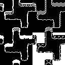

# Tilesets

Last reviewed: 2026-07-02.

<table>
  <tr>
    <td></td>
  </tr>
</table>

PixelLab Pip can route top-down terrain/autotile requests through PixelLab's managed tileset tooling, then preserve accepted PixelLab structure while documenting any local palette work separately. The showcased asset pairs the accepted strict black-and-white copy with the requested gameplay-green copy in one side-by-side composition.

## Contents

- [Primary Example: 1-Bit Black And Green Top-Down Tileset](#primary-example-1-bit-black-and-green-top-down-tileset)
- [Findings](#findings)
- [Showcase Assets](#showcase-assets)
- [Validation Notes](#validation-notes)

## Primary Example: 1-Bit Black And Green Top-Down Tileset


Original prompt:

```text
/pixellab-pip create 1-bit tileset with black upper, black lower, and black transition with horizontal white stripes. after done, create a copy with gameplay 1 bit green colors.
```

The 1-bit tileset example demonstrates a top-down Wang/autotile workflow with an important palette caveat. PixelLab generated the terrain-transition structure, but the raw PixelLab output contained near-black, cream, blue, and gray-ish colors rather than strict 1-bit black and white. The accepted final assets were local palette-clamped copies made from that PixelLab output: one exact black-and-white version and one exact gameplay-green recolor.

Source inputs: text-only request. No reference images, style images, masks, or palette images were supplied for the selected source generation.

Route: PixelLab MCP `create_topdown_tileset`.

Prompt preparation: agent-optimized from the user's 1-bit tileset request.

Local processing: the accepted black-and-white copy was palette-clamped to `#000000` and `#FFFFFF`; the gameplay-green copy was palette-clamped to `#0F380F` and `#9BBC0F`; the showcase image was locally assembled by placing those two accepted copies side by side and scaling them with nearest-neighbor for browsing. No local shape edits were made.

Generation details:

| Field | Value |
|---|---|
| Output structure | Top-down Wang/autotile tileset |
| Source sheet | PixelLab MCP generated tileset |
| Source sheet size | `64x64` |
| Tile size | `16x16` |
| Final showcase image | `512x256`, nearest-neighbor scaled side-by-side composition |
| View | `high top-down` |
| Detail | `low detail` |
| Shading | `flat shading` |
| Outline | `lineless` |
| Transition size | `0.5` |
| Usage reported | Not exposed by MCP for the selected source generation |

MCP generation parameters:

```json
{
  "lower_description": "solid black 1-bit terrain, pure black fill, flat untextured surface, no gray tones",
  "upper_description": "solid black 1-bit terrain, pure black fill, flat untextured surface, no gray tones",
  "transition_description": "solid black transition bands with crisp horizontal pure white stripes, high contrast black and white only, no gray tones",
  "transition_size": 0.5,
  "detail": "low detail",
  "shading": "flat shading",
  "outline": "lineless",
  "mode": "standard",
  "tile_size": {
    "width": 16,
    "height": 16
  },
  "view": "high top-down",
  "text_guidance_scale": 12
}
```

Findings:

- The generated top-down tileset structure was usable for the requested compact black terrain transition.
- The raw PixelLab output did not natively pass strict 1-bit palette validation.
- Palette clamping produced exact two-color variants without changing tile shapes.
- The gameplay-green copy is a recolor of the accepted black-and-white copy, not a separate PixelLab generation.
- A later palette-controlled REST tileset attempt produced stricter black output but lost the visible stripe detail, so it was not selected for the showcase.

## Findings

Top-down tileset generation is appropriate for terrain-transition requests that mention upper terrain, lower terrain, and transitions. For strict 1-bit palette requirements, current top-down generation should be verified against exact visible colors before being called final. Palette-constrained local derivatives should be documented separately from the raw PixelLab output.

Prompt language that helped:

- `solid black 1-bit terrain` anchored both terrain sides.
- `horizontal pure white stripes` and `high contrast black and white only` helped push the transition toward readable stripe detail.
- `low detail`, `flat shading`, and `lineless` reduced extra rendering complexity.

Prompt language that remained soft:

- `1-bit`, `pure black`, and `no gray tones` did not fully constrain the raw PixelLab palette.
- The horizontal stripe request influenced the transition but did not produce perfectly uniform scanlines across every transition tile.

## Showcase Assets

| Output | Stable showcase file |
|---|---|
| One-bit 16px top-down tilesets example | `docs/showcase/tilesets/one-bit-16px-top-down-tilesets.png` |
| Black-and-white plus gameplay-green tileset composition | `docs/showcase/tilesets/one-bit-black-green-topdown-tileset.png` |

## Validation Notes

- The showcased composition is exactly `512x256`.
- The showcased composition contains only `#000000`, `#FFFFFF`, `#0F380F`, and `#9BBC0F` as visible colors.
- The black-and-white half uses only `#000000` and `#FFFFFF`.
- The gameplay-green half uses only `#0F380F` and `#9BBC0F`.
- The showcase composition is scaled for browsing; the accepted source copies were `64x64`.
- Local processing changed palette colors and assembled the two accepted copies into one showcase image.
