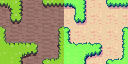
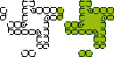
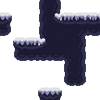
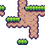

# Tilesets

Last reviewed: 2026-07-06.

<table>
  <tr>
    <th>32px sidescroller tilesets</th>
  </tr>
  <tr>
    <td align="center"></td>
  </tr>
  <tr>
    <th>16px top-down tilesets</th>
  </tr>
  <tr>
    <td align="center"></td>
  </tr>
  <tr>
    <th>16px sidescroller tilesets</th>
  </tr>
  <tr>
    <td align="center"></td>
  </tr>
</table>

PixelLab Pip can route top-down terrain/autotile and sidescroller/platformer requests through PixelLab's managed tileset tooling, then preserve accepted PixelLab structure while documenting any local palette work separately. The overview atlases above are local native-size compositions of selected showcase assets: 32px sidescroller first, 16px top-down second, and 16px sidescroller last. Some examples are raw PixelLab outputs, while the strict 1-bit examples document palette-clamped derivatives separately.

## Contents

- [Primary Example: 1-Bit Black And Green Top-Down Tileset](#primary-example-1-bit-black-and-green-top-down-tileset)
- [Top-Down Example: Low Detail Dirt Grass Lineless And Single Color Outline](#top-down-example-low-detail-dirt-grass-lineless-and-single-color-outline)
- [Sidescroller Example: 1-Bit Black And Game Boy Green Platform Tileset](#sidescroller-example-1-bit-black-and-game-boy-green-platform-tileset)
- [Sidescroller Example: Icy Cap Black-And-White And Game Boy Green](#sidescroller-example-icy-cap-black-and-white-and-game-boy-green)
- [Sidescroller Example: Sparse Scuffs And Nicks](#sidescroller-example-sparse-scuffs-and-nicks)
- [Sidescroller Example: Organic Dirt Grass Selective Outline](#sidescroller-example-organic-dirt-grass-selective-outline)
- [Sidescroller Example: Medium Dirt Grass Single Color Outline](#sidescroller-example-medium-dirt-grass-single-color-outline)
- [Findings](#findings)
- [Showcase Assets](#showcase-assets)
- [Validation Notes](#validation-notes)

## Primary Example: 1-Bit Black And Green Top-Down Tileset


Original prompt:

```text
/pixellab-pip create 1-bit tileset with black upper, black lower, and black transition with horizontal white stripes. after done, create a copy with gameplay 1 bit green colors.
```

The 1-bit tileset example demonstrates a top-down Wang/autotile workflow with an important palette caveat. PixelLab generated the terrain-transition structure, but the raw PixelLab output contained near-black, cream, blue, and gray-ish colors rather than strict 1-bit black and white. The accepted final assets were local palette-clamped copies made from that PixelLab output: one exact black-and-white version and one exact gameplay-green recolor.

Source inputs: text-only request. No reference images, style images, masks, or palette images were supplied for the selected source generation.

Route: PixelLab MCP `create_topdown_tileset`.

Prompt preparation: agent-optimized from the user's 1-bit tileset request.

Local processing: the accepted black-and-white copy was palette-clamped to `#000000` and `#FFFFFF`; the gameplay-green copy was palette-clamped to `#0F380F` and `#9BBC0F`; the showcase image was locally assembled by placing those two accepted copies side by side at native size. No local shape edits or scaling were made.

Generation details:

| Field | Value |
|---|---|
| Output structure | Top-down Wang/autotile tileset |
| Source sheet | PixelLab MCP generated tileset |
| Source sheet size | `64x64` |
| Tile size | `16x16` |
| Final showcase image | `128x64`, native-size side-by-side composition |
| View | `high top-down` |
| Detail | `low detail` |
| Shading | `flat shading` |
| Outline | `lineless` |
| Transition size | `0.5` |
| Usage reported | Not exposed by MCP for the selected source generation |

Blueprint — replayable route and request body ([`one-bit-black-green-topdown-tileset.blueprint.json`](tilesets/one-bit-black-green-topdown-tileset.blueprint.json)):

```json
{
  "_comment_prompt": "/pixellab-pip create 1-bit tileset with black upper, black lower, and black transition with horizontal white stripes. after done, create a copy with gameplay 1 bit green colors.",
  "_comment": "PixelLab generated the tileset structure. The strict black/white (#000000/#FFFFFF) and gameplay-green (#0F380F/#9BBC0F) copies were produced LOCALLY by Aseprite palette-clamping, not by PixelLab, so they are not blueprint steps.",
  "MCP create_topdown_tileset": {
    "lower_description": "solid black 1-bit terrain, pure black fill, flat untextured surface, no gray tones",
    "upper_description": "solid black 1-bit terrain, pure black fill, flat untextured surface, no gray tones",
    "transition_description": "solid black transition bands with crisp horizontal pure white stripes, high contrast black and white only, no gray tones",
    "transition_size": 0.5,
    "detail": "low detail",
    "shading": "flat shading",
    "outline": "lineless",
    "mode": "standard",
    "tile_size": {
      "width": 16,
      "height": 16
    },
    "view": "high top-down",
    "text_guidance_scale": 12
  }
}
```

Findings:

- The generated top-down tileset structure was usable for the requested compact black terrain transition.
- The raw PixelLab output did not natively pass strict 1-bit palette validation.
- Palette clamping produced exact two-color variants without changing tile shapes.
- The gameplay-green copy is a recolor of the accepted black-and-white copy, not a separate PixelLab generation.
- A later REST tileset attempt with a palette reference produced stricter black output but lost the visible stripe detail, so it was not selected for the showcase.

## Top-Down Example: Low Detail Dirt Grass Lineless And Single Color Outline



The top-down dirt/grass comparison shows two raw PixelLab outputs from the same generic terrain matrix request: `lineless` on the left and `single color outline` on the right. The paired image keeps the comparison local to one section because the useful lesson is the difference between style controls, not either image in isolation.

Source inputs: text-only request. No reference images, style images, masks, or palette images were supplied.

Route: PixelLab MCP `create_topdown_tileset`.

Local processing: the two raw `64x64` PixelLab outputs were assembled side by side at native size. No pixels were repainted, scaled, palette-clamped, or otherwise changed.

Generation details:

| Field | Left Value | Right Value |
|---|---|---|
| Output structure | Top-down Wang/autotile tileset | Top-down Wang/autotile tileset |
| Source sheet size | `64x64` | `64x64` |
| Final showcase image | `128x64`, native-size side-by-side composition | `128x64`, native-size side-by-side composition |
| Tile size | `16x16` | `16x16` |
| Lower description | `dirt` | `dirt` |
| Upper description | `grass` | `grass` |
| Transition description | `grass to dirt` | `grass to dirt` |
| Detail | `low detail` | `low detail` |
| Shading | Omitted | Omitted |
| Outline | `lineless` | `single color outline` |
| Transition size | `0.25` | `0.25` |
| Seed | Requested, but MCP rejected `seed`; omitted for this top-down matrix | Requested, but MCP rejected `seed`; omitted for this top-down matrix |

Blueprint — replayable routes and request bodies ([`topdown-dirt-grass-low-lineless-and-single-color-outline.blueprint.json`](tilesets/topdown-dirt-grass-low-lineless-and-single-color-outline.blueprint.json)):

```json
[
  {
    "_comment": "PixelLab generated both source tilesets. The showcased PNG is a local native-size side-by-side composition: lineless on the left, single color outline on the right. The MCP tool rejected seed for this top-down matrix run, so no seed is recorded.",
    "_comment_prompt": "Generic top-down terrain matrix request for dirt lower terrain, grass upper terrain, and a grass-to-dirt transition. The showcased image compares low-detail lineless and low-detail single-color-outline outputs.",
    "MCP create_topdown_tileset": {
      "lower_description": "dirt",
      "upper_description": "grass",
      "transition_description": "grass to dirt",
      "transition_size": 0.25,
      "detail": "low detail",
      "outline": "lineless",
      "tile_size": {
        "width": 16,
        "height": 16
      }
    }
  },
  {
    "_comment": "Second source tileset for the right half of the local comparison image.",
    "MCP create_topdown_tileset": {
      "lower_description": "dirt",
      "upper_description": "grass",
      "transition_description": "grass to dirt",
      "transition_size": 0.25,
      "detail": "low detail",
      "outline": "single color outline",
      "tile_size": {
        "width": 16,
        "height": 16
      }
    }
  }
]
```

Findings:

- Both outputs are better examples for normal terrain/material generation than for strict palette work.
- `lineless` still produces readable terrain boundaries because connected tilesets need visible transitions.
- `single color outline` gives a stronger graphic boundary than the low-detail lineless candidate.
- Because the top-down matrix did not accept `seed`, this comparison should be treated as a visual example, not a seed-stable control result.

## Sidescroller Example: 1-Bit Black And Game Boy Green Platform Tileset



Original prompt:

```text
/pixellab-pip create 1-bit sidescroller tileset with black center with white outline, and sparse white top. after done, create a copy with gameboy 1 bit green colors.
```

This example demonstrates a sidescroller/platformer workflow where the generated structure was accepted, but the raw PixelLab palette drifted away from strict 1-bit colors. The raw output contained 13 dark bluish-gray visible colors. The accepted final assets were local palette-clamped copies made from that PixelLab output: one exact black-and-white version and one exact Game Boy green recolor.

Source inputs: text-only request. No reference images, style images, masks, or palette images were supplied for the selected source generation.

Route: PixelLab MCP `create_sidescroller_tileset`.

Prompt preparation: agent-optimized from the user's sidescroller request.

Local processing: the accepted black-and-white copy was palette-clamped to `#000000` and `#FFFFFF`; the Game Boy green copy was palette-clamped to `#0F380F` and `#9BBC0F`; the showcase image was locally assembled by placing those two accepted copies side by side at native size, with the Game Boy green copy on the right. No local shape edits or scaling were made.

Generation details:

| Field | Value |
|---|---|
| Output structure | Sidescroller/platformer tileset |
| Source sheet | PixelLab MCP generated tileset |
| Source sheet size | `64x64` |
| Tile size | `16x16` |
| Tile count | `16` |
| Final showcase image | `128x64`, native-size side-by-side composition |
| View | Side-view platformer |
| Detail | `low detail` |
| Shading | `flat shading` |
| Outline | `single color outline` |
| Transition size | `0.25` |
| Usage observed | Balance moved from `440` to `437` generations remaining |

Blueprint — replayable route and request body ([`one-bit-black-gameboy-green-sidescroller-tileset.blueprint.json`](tilesets/one-bit-black-gameboy-green-sidescroller-tileset.blueprint.json)):

```json
{
  "_comment_prompt": "/pixellab-pip create 1-bit sidescroller tileset with black center with white outline, and sparse white top. after done, create a copy with gameboy 1 bit green colors.",
  "_comment": "PixelLab generated the tileset structure. The strict black/white and Game Boy green (#0F380F/#9BBC0F) copies were produced LOCALLY by Aseprite palette-clamping, not by PixelLab.",
  "MCP create_sidescroller_tileset": {
    "lower_description": "strict 1-bit monochrome platform tile center: solid black terrain body, black fill in the middle, crisp white single-pixel outer outline, no gray, no anti-aliasing, simple high-contrast bitmap shapes",
    "transition_description": "sparse white pixels only along the top surface, minimal broken white dust or snow-like speckles, mostly black underneath, no gray, no anti-aliasing",
    "transition_size": 0.25,
    "detail": "low detail",
    "shading": "flat shading",
    "outline": "single color outline",
    "tile_size": {
      "width": 16,
      "height": 16
    }
  }
}
```

Findings:

- The generated sidescroller tileset structure was usable for the requested black center, white outline, and sparse white top.
- The raw PixelLab output did not natively pass strict 1-bit palette validation.
- Palette clamping produced exact black-and-white and Game Boy green variants while preserving the generated PixelLab shapes.
- The Game Boy green copy is a recolor of the accepted black-and-white copy, not a separate PixelLab generation.
- This is a good example for documenting strict-palette verification because the raw art looked close but contained 13 visible colors.

## Sidescroller Example: Icy Cap Black-And-White And Game Boy Green


Original prompt:

```text
/pixellab-pip create 1-bit sidescroller tileset: pure black platform center, jagged white icy top cap, transparent outside. use Aseprite FX Outline: inside, 4 sides, #FFFFFF; then 1-bit clamp to #000000/#FFFFFF. Create a copy that uses Game Boy 1-bit green colors #0F380F/#9BBC0F.
```

The icy cap sidescroller example demonstrates a themed 32px platform prompt where the accepted showcase is a derived side-by-side composition: black-and-white on the left, Game Boy green on the right. The raw PixelLab output is not shown in the showcase image.

Source inputs: text-only request. No reference images, style images, masks, or palette images were supplied.

Route: PixelLab MCP `create_sidescroller_tileset`.

Prompt preparation: agent-optimized from the user's prompt into separate lower/platform and transition/top-cap descriptions.

Local processing: Aseprite FX Outline equivalent was applied with `place=inside`, four-side matrix `170`, color `#FFFFFF`, and transparent background; the outlined result was palette-clamped to `#000000`/`#FFFFFF`; the Game Boy copy was remapped from the black-and-white derivative to `#0F380F`/`#9BBC0F`; the showcase image was locally assembled by placing those two derivatives side by side at native size. No local shape edits or scaling were made.

Generation details:

| Field | Value |
|---|---|
| Output structure | Sidescroller/platformer tileset |
| Source sheet | PixelLab MCP generated tileset |
| Source sheet size | `128x128` |
| Tile size | `32x32` |
| Tile count | `16` |
| Final showcase image | `256x128`, native-size side-by-side composition |
| Lower description | `pure solid black platform center, clean 1-bit silhouette, opaque black platform body, no texture, no gray, transparent outside the platform` |
| Transition description | `jagged icy top cap, sharp irregular white ice teeth and snow crust along only the upper edge, clean 1-bit white, no gray, transparent outside the platform` |
| Detail | `low detail` |
| Shading | `flat shading` |
| Outline | `lineless` |
| Transition size | `0.5` |
| Text guidance scale | `10` |
| Tile strength | `0.8` |
| Tileset adherence | `0.8` |
| Tileset adherence freedom | `0.2` |
| Seed | Not exposed |
| Usage reported | Not recorded in the saved manifest |

Blueprint — replayable route and request body ([`one-bit-sidescroller-icy-cap-bw-gameboy.blueprint.json`](tilesets/one-bit-sidescroller-icy-cap-bw-gameboy.blueprint.json)):

```json
{
  "_comment_prompt": "/pixellab-pip create 1-bit sidescroller tileset: pure black platform center, jagged white icy top cap, transparent outside. use Aseprite FX Outline: inside, 4 sides, #FFFFFF; then 1-bit clamp to #000000/#FFFFFF. Create a copy that uses Game Boy 1-bit green colors #0F380F/#9BBC0F.",
  "_comment": "PixelLab generated the raw tileset. The showcased image is a local side-by-side composition of the black/white Aseprite derivative on the left and the Game Boy green derivative on the right. Local post-processing and side-by-side assembly are documented in the showcase page, not replayed as PixelLab blueprint steps.",
  "MCP create_sidescroller_tileset": {
    "tile_size": {
      "width": 32,
      "height": 32
    },
    "lower_description": "pure solid black platform center, clean 1-bit silhouette, opaque black platform body, no texture, no gray, transparent outside the platform",
    "transition_description": "jagged icy top cap, sharp irregular white ice teeth and snow crust along only the upper edge, clean 1-bit white, no gray, transparent outside the platform",
    "transition_size": 0.5,
    "detail": "low detail",
    "shading": "flat shading",
    "outline": "lineless",
    "text_guidance_scale": 10,
    "tile_strength": 0.8,
    "tileset_adherence": 0.8,
    "tileset_adherence_freedom": 0.2
  }
}
```

Findings:

- The jagged icy cap is one of the stronger themed 1-bit sidescroller variants from the chooser set.
- The strict black-and-white and Game Boy green copies are local derivatives, not untouched PixelLab outputs.
- Transparency was preserved, and both visible palettes validated as exact two-color outputs.

## Sidescroller Example: Sparse Scuffs And Nicks



Original prompt:

```text
/pixellab-pip create 1-bit 32x32 sidescroller tileset: black-filled platform center with sparse short white scuff marks and tiny single-pixel nicks inside the center body, very low density, thin white eroded platform top edge, transparent outside. use Aseprite FX Outline: inside, 4 sides, #FFFFFF; then 1-bit clamp to #000000/#FFFFFF. Create a copy that uses Game Boy 1-bit green colors #0F380F/#9BBC0F.
```

The raw PixelLab output was selected from attempt 29 in the 30-attempt 1-bit sidescroller chooser. The useful part of the earlier "bone chips" direction was sparse, low-density light marks inside a mostly dark platform body. The showcase intentionally uses only the original PixelLab output, not the Aseprite outlined, black-and-white clamped, or Game Boy green derivatives.

Source inputs: text-only request. No reference images, style images, masks, or palette images were supplied.

Route: PixelLab MCP `create_sidescroller_tileset`.

Prompt preparation: agent-optimized from the user's prompt into separate lower/platform and transition/top-edge descriptions. The saved chooser summary used shorter descriptions, but the generation manifest recorded the fuller MCP input shown below.

Local processing: none for the showcased image. The PNG is copied from the raw PixelLab generation output. Aseprite outline and palette-clamp derivatives exist for this attempt, but they are not shown here.

Generation details:

| Field | Value |
|---|---|
| Output structure | Sidescroller/platformer tileset |
| Source sheet | PixelLab MCP generated tileset |
| Source sheet size | `128x128` |
| Tile size | `32x32` |
| Tile count | `16` |
| Final showcase image | `128x128`, raw PixelLab output |
| Lower description | `black-filled platform center body; sparse short white scuff marks and tiny single-pixel white nicks embedded inside the black center material; very low density; hard 1-bit silhouette feel; transparent outside the platform` |
| Transition description | `thin white eroded platform top edge; narrow chipped white pixel rim along the top surface; sparse tiny breaks and nicks; no thick grass or decorative layer` |
| Detail | `low detail` |
| Shading | `flat shading` |
| Outline | `lineless` |
| Transition size | `0.25` |
| Text guidance scale | `12` |
| Seed | Not exposed |
| Usage observed | `15` subscription generations; credits unchanged in the saved manifest |

Blueprint — replayable route and request body ([`one-bit-sidescroller-scuffs-nicks-original.blueprint.json`](tilesets/one-bit-sidescroller-scuffs-nicks-original.blueprint.json)):

```json
{
  "_comment_prompt": "/pixellab-pip create 1-bit 32x32 sidescroller tileset: black-filled platform center with sparse short white scuff marks and tiny single-pixel nicks inside the center body, very low density, thin white eroded platform top edge, transparent outside. use Aseprite FX Outline: inside, 4 sides, #FFFFFF; then 1-bit clamp to #000000/#FFFFFF. Create a copy that uses Game Boy 1-bit green colors #0F380F/#9BBC0F.",
  "_comment": "PixelLab generated the showcased raw tileset. Aseprite outline and palette-clamp derivatives were produced later but are not part of this showcased image.",
  "MCP create_sidescroller_tileset": {
    "lower_description": "black-filled platform center body; sparse short white scuff marks and tiny single-pixel white nicks embedded inside the black center material; very low density; hard 1-bit silhouette feel; transparent outside the platform",
    "transition_description": "thin white eroded platform top edge; narrow chipped white pixel rim along the top surface; sparse tiny breaks and nicks; no thick grass or decorative layer",
    "transition_size": 0.25,
    "detail": "low detail",
    "shading": "flat shading",
    "outline": "lineless",
    "text_guidance_scale": 12,
    "tile_size": {
      "width": 32,
      "height": 32
    }
  }
}
```

Findings:

- Sparse scuffs and nicks are a useful prompt direction for platform-body detail without making the center pure flat black.
- The result is 1-bit inspired, but the raw PixelLab output is not strict black-and-white.
- For strict palette output, use an explicit post-process path and keep the raw PixelLab output documented separately.

## Sidescroller Example: Organic Dirt Grass Selective Outline



The raw PixelLab output was selected from a controlled sidescroller outline test. The input was generic `monochromatic dirt` plus `monochromatic grass`, and only the `outline` value changed across the test. The `selective outline` candidate reads as a smoother, more organic dirt mass than the blockier single-color-outline version.

Source inputs: text-only request. No reference images, style images, masks, or palette images were supplied.

Route: PixelLab MCP `create_sidescroller_tileset`.

Local processing: none for the showcased image. The PNG is copied from the raw PixelLab generation output.

Generation details:

| Field | Value |
|---|---|
| Output structure | Sidescroller/platformer tileset |
| Source sheet size | `64x64` |
| Tile size | `16x16` |
| Lower description | `monochromatic dirt` |
| Transition description | `monochromatic grass` |
| Detail | `low detail` |
| Shading | `flat shading` |
| Outline | `selective outline` |
| Transition size | `0.25` |
| Seed | `730731` |

Blueprint — replayable route and request body ([`sidescroller-dirt-grass-selective-outline.blueprint.json`](tilesets/sidescroller-dirt-grass-selective-outline.blueprint.json)):

```json
{
  "_comment_prompt": "Controlled sidescroller outline test using monochromatic dirt and monochromatic grass. Only outline changed across the test.",
  "MCP create_sidescroller_tileset": {
    "lower_description": "monochromatic dirt",
    "transition_description": "monochromatic grass",
    "transition_size": 0.25,
    "detail": "low detail",
    "shading": "flat shading",
    "outline": "selective outline",
    "seed": 730731,
    "tile_size": {
      "width": 16,
      "height": 16
    }
  }
}
```

Findings:

- Selective outline is a useful example when the desired sidescroller platform should feel organic rather than brick-like.
- The paired `flat shading` candidate from the later shading test was not added separately because it is visually redundant with this same dirt/grass style family.

## Sidescroller Example: Medium Dirt Grass Single Color Outline


The raw PixelLab output was selected from the generic sidescroller dirt/grass detail-and-outline matrix. It shows the more aggressive, stylized look produced by `single color outline` with `medium detail` on a common terrain/material prompt.

Source inputs: text-only request. No reference images, style images, masks, or palette images were supplied.

Route: PixelLab MCP `create_sidescroller_tileset`.

Local processing: none for the showcased image. The PNG is copied from the raw PixelLab generation output.

Generation details:

| Field | Value |
|---|---|
| Output structure | Sidescroller/platformer tileset |
| Source sheet size | `64x64` |
| Tile size | `16x16` |
| Lower description | `dirt` |
| Transition description | `grass` |
| Detail | `medium detail` |
| Shading | Omitted |
| Outline | `single color outline` |
| Transition size | `0.25` |
| Seed | `731311` |

Blueprint — replayable route and request body ([`sidescroller-dirt-grass-medium-single-color-outline.blueprint.json`](tilesets/sidescroller-dirt-grass-medium-single-color-outline.blueprint.json)):

```json
{
  "_comment_prompt": "Generic sidescroller terrain matrix request for dirt lower terrain and grass transition.",
  "MCP create_sidescroller_tileset": {
    "lower_description": "dirt",
    "transition_description": "grass",
    "transition_size": 0.25,
    "detail": "medium detail",
    "outline": "single color outline",
    "seed": 731311,
    "tile_size": {
      "width": 16,
      "height": 16
    }
  }
}
```

Findings:

- The selected output is a good showcase for normal dirt/grass sidescroller prompts where stronger internal structure is acceptable.
- It should not be interpreted as proof that `single color outline` deterministically places exact border pixels.

## Findings

Top-down tileset generation is appropriate for terrain-transition requests that mention upper terrain, lower terrain, and transitions. For strict 1-bit palette requirements, current top-down generation should be verified against exact visible colors before being called final. Palette-constrained local derivatives should be documented separately from the raw PixelLab output.

Sidescroller tileset generation is appropriate for compact side-view platform requests with a lower platform material and a top transition layer. For strict 1-bit sidescroller requests, the same caveat applies: MCP prompt wording can produce a usable structure but may not enforce exact two-color output without verification and palette-clamped derivatives.

Prompt language that helped:

- `solid black 1-bit terrain` anchored both terrain sides.
- `horizontal pure white stripes` and `high contrast black and white only` helped push the transition toward readable stripe detail.
- `low detail`, `flat shading`, and `lineless` reduced extra rendering complexity.

Prompt language that remained soft:

- `1-bit`, `pure black`, and `no gray tones` did not fully constrain the raw PixelLab palette.
- The horizontal stripe request influenced the transition but did not produce perfectly uniform scanlines across every transition tile.

Practical notes from follow-up trials:

- Palette reference images can improve strict black-and-white output, but may reduce the transition texture that made the selected example readable. For this showcase, local palette clamping preserved the preferred PixelLab structure and texture better than selecting a palette-referenced generation.
- Transition reference images are most useful when authored in single-tile context, such as `16x16` for a `16x16` tileset. For `transition_size: 0.5`, the transition pattern belongs in the relevant half-tile band inside that tile context, not in a full `4x4` output-sheet-sized reference.
- Higher text guidance and stricter palette wording did not reliably improve the artistic result. Verification should check both structure readability and exact palette, because improving one can hurt the other.

## Showcase Assets

| Output | Stable showcase file |
|---|---|
| 32px sidescroller overview atlas | `docs/showcase/tilesets/tileset-showcase-32px-sidescroller-atlas.png` |
| 16px top-down overview atlas | `docs/showcase/tilesets/tileset-showcase-16px-topdown-atlas.png` |
| 16px sidescroller overview atlas | `docs/showcase/tilesets/tileset-showcase-16px-sidescroller-atlas.png` |
| Black-and-white plus Game Boy green one-bit 16px top-down tilesets example | `docs/showcase/tilesets/one-bit-16px-top-down-tilesets.png` |
| Black-and-white plus gameplay-green tileset composition | `docs/showcase/tilesets/one-bit-black-green-topdown-tileset.png` |
| Top-down low detail dirt/grass lineless and single-color-outline comparison | `docs/showcase/tilesets/topdown-dirt-grass-low-lineless-and-single-color-outline.png` |
| Black-and-white plus Game Boy green sidescroller tileset composition | `docs/showcase/tilesets/one-bit-black-gameboy-green-sidescroller-tileset.png` |
| Black-and-white plus Game Boy green icy-cap sidescroller composition | `docs/showcase/tilesets/one-bit-sidescroller-icy-cap-bw-gameboy.png` |
| Sidescroller sparse scuffs/nicks raw PixelLab output | `docs/showcase/tilesets/one-bit-sidescroller-scuffs-nicks-original.png` |
| Sidescroller dirt/grass selective-outline raw PixelLab output | `docs/showcase/tilesets/sidescroller-dirt-grass-selective-outline.png` |
| Sidescroller medium detail dirt/grass single-color-outline raw PixelLab output | `docs/showcase/tilesets/sidescroller-dirt-grass-medium-single-color-outline.png` |

## Validation Notes

- The 32px sidescroller overview atlas is exactly `384x128` and preserves the source assets at native size.
- The 16px top-down overview atlas is exactly `256x192` and preserves the source assets at native size.
- The 16px sidescroller overview atlas is exactly `256x64` and preserves the source assets at native size.
- The one-bit 16px top-down tilesets example is exactly `256x128`.
- The one-bit 16px top-down tilesets example contains only `#000000`, `#FFFFFF`, `#0F380F`, and `#9BBC0F` as visible colors.
- The one-bit 16px top-down tilesets example preserves the original black-and-white copy on the left and adds the Game Boy green copy on the right.
- The showcased composition is exactly `128x64`.
- The showcased composition contains only `#000000`, `#FFFFFF`, `#0F380F`, and `#9BBC0F` as visible colors.
- The black-and-white half uses only `#000000` and `#FFFFFF`.
- The gameplay-green half uses only `#0F380F` and `#9BBC0F`.
- The showcase composition preserves the accepted source copies at native `64x64` size.
- Local processing changed palette colors and assembled the two accepted copies into one showcase image.
- The sidescroller showcase composition is exactly `128x64`.
- The sidescroller showcase composition contains only `#000000`, `#FFFFFF`, `#0F380F`, and `#9BBC0F` as visible colors.
- The sidescroller black-and-white half uses only `#000000` and `#FFFFFF`.
- The sidescroller Game Boy green half uses only `#0F380F` and `#9BBC0F`.
- The sidescroller showcase composition preserves the accepted source copies at native `64x64` size.
- The icy-cap sidescroller composition is exactly `256x128`, with the black-and-white derivative on the left and the Game Boy green derivative on the right.
- The icy-cap sidescroller composition contains only `#000000`, `#FFFFFF`, `#0F380F`, and `#9BBC0F` as visible colors.
- The raw scuffs/nicks sidescroller showcase image is exactly `128x128` and preserves the original PixelLab output.
- The raw dirt/grass sidescroller showcase images are exactly `64x64` and preserve their original PixelLab outputs.
- The raw dirt/grass top-down comparison is exactly `128x64` and preserves two original `64x64` PixelLab outputs side by side.
