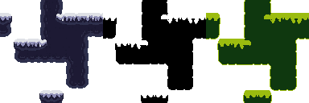
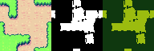
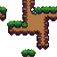
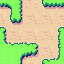
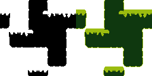

# Tilesets

Last reviewed: 2026-07-06.

<table>
  <tr>
    <th>32px sidescroller tilesets</th>
  </tr>
  <tr>
    <td align="center"></td>
  </tr>
  <tr>
    <th>16px top-down tilesets</th>
  </tr>
  <tr>
    <td align="center"></td>
  </tr>
  <tr>
    <th>16px sidescroller tilesets</th>
  </tr>
  <tr>
    <td align="center"></td>
  </tr>
</table>

PixelLab Pip can route top-down terrain/autotile and sidescroller/platformer requests through PixelLab's managed tileset tooling. The overview atlases above are local native-size compositions. The detailed examples below are intentionally limited to four canonical cases where the visible result best matches the request: top-down grass, sidescroller grass, top-down 1-bit, and sidescroller 1-bit.

## Contents

- [Top-Down Grass Tileset](#top-down-grass-tileset)
- [Sidescroller Grass Tileset](#sidescroller-grass-tileset)
- [Top-Down 1-Bit Tileset](#top-down-1-bit-tileset)
- [Sidescroller 1-Bit Tileset](#sidescroller-1-bit-tileset)
- [Findings](#findings)
- [Showcase Assets](#showcase-assets)
- [Validation Notes](#validation-notes)

## Top-Down Grass Tileset



Request intent: create a simple top-down terrain tileset with dirt lower terrain, grass upper terrain, and a grass-to-dirt transition.

Source inputs: text-only request. No reference images, style images, masks, or palette images were supplied.

Route: PixelLab MCP `create_topdown_tileset`.

Local processing: none for the showcased image. The PNG is copied from the raw PixelLab generation output.

Generation details:

| Field | Value |
|---|---|
| Output structure | Top-down Wang/autotile tileset |
| Source sheet size | `64x64` |
| Tile size | `16x16` |
| Lower description | `dirt` |
| Upper description | `grass` |
| Transition description | `grass to dirt` |
| Detail | `low detail` |
| Shading | Omitted |
| Outline | `single color outline` |
| Transition size | `0.25` |
| Seed | MCP rejected `seed` for this top-down matrix run; omitted |

Blueprint - replayable route and request body ([`topdown-dirt-grass-low-single-color-outline.blueprint.json`](tilesets/topdown-dirt-grass-low-single-color-outline.blueprint.json)):

```json
{
  "_comment_prompt": "Generic top-down terrain matrix request for dirt lower terrain, grass upper terrain, and a grass-to-dirt transition.",
  "MCP create_topdown_tileset": {
    "lower_description": "dirt",
    "upper_description": "grass",
    "transition_description": "grass to dirt",
    "transition_size": 0.25,
    "detail": "low detail",
    "outline": "single color outline",
    "tile_size": {
      "width": 16,
      "height": 16
    }
  }
}
```

Findings:

- The output visibly matches the simple dirt/grass terrain intent.
- `single color outline` gives the transition a stronger graphic boundary, but should not be treated as exact border-pixel control.
- This is the cleanest raw PixelLab example in the tileset showcase because it does not depend on local palette work.

## Sidescroller Grass Tileset


Request intent: create a side-view platformer tileset with a dirt platform body and grass top layer.

Source inputs: text-only request. No reference images, style images, masks, or palette images were supplied.

Route: PixelLab MCP `create_sidescroller_tileset`.

Local processing: none for the showcased image. The PNG is copied from the raw PixelLab generation output.

Generation details:

| Field | Value |
|---|---|
| Output structure | Sidescroller/platformer tileset |
| Source sheet size | `64x64` |
| Tile size | `16x16` |
| Lower description | `dirt` |
| Transition description | `grass` |
| Detail | `medium detail` |
| Shading | Omitted |
| Outline | `single color outline` |
| Transition size | `0.25` |
| Seed | `731311` |

Blueprint - replayable route and request body ([`sidescroller-dirt-grass-medium-single-color-outline.blueprint.json`](tilesets/sidescroller-dirt-grass-medium-single-color-outline.blueprint.json)):

```json
{
  "_comment_prompt": "Generic sidescroller terrain matrix request for dirt lower terrain and grass transition.",
  "MCP create_sidescroller_tileset": {
    "lower_description": "dirt",
    "transition_description": "grass",
    "transition_size": 0.25,
    "detail": "medium detail",
    "outline": "single color outline",
    "seed": 731311,
    "tile_size": {
      "width": 16,
      "height": 16
    }
  }
}
```

Findings:

- The output reads as dirt body plus grass top, which matches the simple sidescroller terrain intent.
- The result is a normal raw PixelLab tileset example, not a strict palette or exact outline example.

## Top-Down 1-Bit Tileset


Original prompt:

```text
/pixellab-pip create 1-bit tileset with black upper, black lower, and black transition with horizontal white stripes. after done, create a copy with gameplay 1 bit green colors.
```

The top-down 1-bit example demonstrates a strict-palette workflow. PixelLab generated the terrain-transition structure, but the raw PixelLab output was not exact 1-bit. The accepted final assets were local palette-clamped copies made from that PixelLab output: one exact black-and-white version and one gameplay-green recolor.

Source inputs: text-only request. No reference images, style images, masks, or palette images were supplied.

Route: PixelLab MCP `create_topdown_tileset`.

Local processing: the accepted black-and-white copy was palette-clamped to `#000000` and `#FFFFFF`; the gameplay-green copy was palette-clamped to `#0F380F` and `#9BBC0F`; the showcase image was locally assembled by placing those two accepted copies side by side at native size. No local shape edits or scaling were made.

Generation details:

| Field | Value |
|---|---|
| Output structure | Top-down Wang/autotile tileset |
| Source sheet | PixelLab MCP generated tileset |
| Source sheet size | `64x64` |
| Tile size | `16x16` |
| Final showcase image | `128x64`, native-size side-by-side composition |
| View | `high top-down` |
| Detail | `low detail` |
| Shading | `flat shading` |
| Outline | `lineless` |
| Transition size | `0.5` |
| Usage reported | Not exposed by MCP for the selected source generation |

Blueprint - replayable route and request body ([`one-bit-black-green-topdown-tileset.blueprint.json`](tilesets/one-bit-black-green-topdown-tileset.blueprint.json)):

```json
[
  {
    "_comment": "PixelLab generated the tileset structure; local palette clamping creates the strict black/white and gameplay-green halves of the showcase image.",
    "_comment_prompt": "/pixellab-pip create 1-bit tileset with black upper, black lower, and black transition with horizontal white stripes. after done, create a copy with gameplay 1 bit green colors.",
    "MCP create_topdown_tileset": {
      "lower_description": "solid black 1-bit terrain, pure black fill, flat untextured surface, no gray tones",
      "upper_description": "solid black 1-bit terrain, pure black fill, flat untextured surface, no gray tones",
      "transition_description": "solid black transition bands with crisp horizontal pure white stripes, high contrast black and white only, no gray tones",
      "transition_size": 0.5,
      "detail": "low detail",
      "shading": "flat shading",
      "outline": "lineless",
      "mode": "standard",
      "tile_size": {
        "width": 16,
        "height": 16
      },
      "view": "high top-down",
      "text_guidance_scale": 12
    }
  },
  {
    "TASK": {
      "instruction": "Use the 64x64 tileset image returned by the immediately preceding PixelLab call. Palette-clamp one native-size copy to exactly #000000 and #FFFFFF. Remap that accepted black/white copy to a second native-size copy using #0F380F for black and #9BBC0F for white. Place the black/white copy on the left and the gameplay-green copy on the right without scaling or shape edits.",
      "outputs": ["one-bit-black-green-topdown-tileset.png"],
      "verify": "The output is exactly 128x64; each half is 64x64 and shape/alpha-identical; the left uses only #000000/#FFFFFF and the right uses only #0F380F/#9BBC0F for opaque pixels."
    }
  }
]
```

Findings:

- The final documented image matches the 1-bit and gameplay-green user intent because palette clamping was explicitly part of the workflow.
- The raw PixelLab output did not natively pass strict 1-bit palette validation.
- The gameplay-green copy is a recolor of the accepted black-and-white copy, not a separate PixelLab generation.

## Sidescroller 1-Bit Tileset



Original prompt:

```text
/pixellab-pip create 1-bit sidescroller tileset: pure black platform center, jagged white icy top cap, transparent outside. use Aseprite FX Outline: inside, 4 sides, #FFFFFF; then 1-bit clamp to #000000/#FFFFFF. Create a copy that uses Game Boy 1-bit green colors #0F380F/#9BBC0F.
```

The sidescroller 1-bit example demonstrates a 32px platform prompt where the accepted showcase is a derived side-by-side composition: black-and-white on the left, Game Boy green on the right. The raw PixelLab output is not shown in the detailed example.

Source inputs: text-only request. No reference images, style images, masks, or palette images were supplied.

Route: PixelLab MCP `create_sidescroller_tileset`.

Local processing: Aseprite FX Outline equivalent was applied with `place=inside`, four-side matrix `170`, color `#FFFFFF`, and transparent background; the outlined result was palette-clamped to `#000000`/`#FFFFFF`; the Game Boy copy was remapped from the black-and-white derivative to `#0F380F`/`#9BBC0F`; the showcase image was locally assembled by placing those two derivatives side by side at native size. No local shape edits or scaling were made.

Generation details:

| Field | Value |
|---|---|
| Output structure | Sidescroller/platformer tileset |
| Source sheet | PixelLab MCP generated tileset |
| Source sheet size | `128x128` |
| Tile size | `32x32` |
| Tile count | `16` |
| Final showcase image | `256x128`, native-size side-by-side composition |
| Lower description | `pure solid black platform center, clean 1-bit silhouette, opaque black platform body, no texture, no gray, transparent outside the platform` |
| Transition description | `jagged icy top cap, sharp irregular white ice teeth and snow crust along only the upper edge, clean 1-bit white, no gray, transparent outside the platform` |
| Detail | `low detail` |
| Shading | `flat shading` |
| Outline | `lineless` |
| Transition size | `0.5` |
| Text guidance scale | `10` |
| Tile strength | `0.8` |
| Tileset adherence | `0.8` |
| Tileset adherence freedom | `0.2` |
| Seed | Not exposed |
| Usage reported | Not recorded in the saved manifest |

Blueprint - replayable route and request body ([`one-bit-sidescroller-icy-cap-bw-gameboy.blueprint.json`](tilesets/one-bit-sidescroller-icy-cap-bw-gameboy.blueprint.json)):

```json
[
  {
    "_comment": "PixelLab generated the raw tileset; the showcase image combines a locally outlined and palette-clamped black/white derivative with its Game Boy green remap.",
    "_comment_prompt": "/pixellab-pip create 1-bit sidescroller tileset: pure black platform center, jagged white icy top cap, transparent outside. use Aseprite FX Outline: inside, 4 sides, #FFFFFF; then 1-bit clamp to #000000/#FFFFFF. Create a copy that uses Game Boy 1-bit green colors #0F380F/#9BBC0F.",
    "MCP create_sidescroller_tileset": {
      "tile_size": {
        "width": 32,
        "height": 32
      },
      "lower_description": "pure solid black platform center, clean 1-bit silhouette, opaque black platform body, no texture, no gray, transparent outside the platform",
      "transition_description": "jagged icy top cap, sharp irregular white ice teeth and snow crust along only the upper edge, clean 1-bit white, no gray, transparent outside the platform",
      "transition_size": 0.5,
      "detail": "low detail",
      "shading": "flat shading",
      "outline": "lineless",
      "text_guidance_scale": 10,
      "tile_strength": 0.8,
      "tileset_adherence": 0.8,
      "tileset_adherence_freedom": 0.2
    }
  },
  {
    "TASK": {
      "instruction": "Use the 128x128 tileset image returned by the immediately preceding PixelLab call. In Aseprite, apply FX Outline with place=inside, four-side matrix 170, color #FFFFFF, and transparent background. Palette-clamp the outlined result to exactly #000000/#FFFFFF, remap a copy to #0F380F/#9BBC0F, then place the black/white derivative on the left and the Game Boy green derivative on the right at native size without other shape edits.",
      "outputs": ["one-bit-sidescroller-icy-cap-bw-gameboy.png"],
      "verify": "The output is exactly 256x128; each half is 128x128 and shape/alpha-identical; the left uses only #000000/#FFFFFF and the right uses only #0F380F/#9BBC0F for opaque pixels, with transparency preserved outside the platform."
    }
  }
]
```

Findings:

- The final documented image matches the black platform, jagged icy top, black-and-white derivative, and Game Boy green derivative requested by the workflow.
- Strict palette and outline quality come from the documented Aseprite/local processing step, not from raw PixelLab output alone.

## Findings

Top-down and sidescroller tileset tools work best when the request describes broad terrain materials and transition layers. Exact palette, exact single-pixel outlines, and exact color placement are soft constraints in PixelLab generation and should be verified before being called final.

Strict 1-bit examples should be documented as workflows when local palette clamping or Aseprite outline processing is part of the accepted result. The PixelLab output provides the shape and tileset structure; local processing provides exact two-color variants.

`outline`, `shading`, and `detail` are useful style controls, but they are not deterministic placement controls. For material placement, tune `lower_description`, `upper_description`, `transition_description`, and `transition_size` first.

## Showcase Assets

| Output | Stable showcase file |
|---|---|
| 32px sidescroller overview atlas | `docs/showcase/tilesets/tileset-showcase-32px-sidescroller-atlas.png` |
| 16px top-down overview atlas | `docs/showcase/tilesets/tileset-showcase-16px-topdown-atlas.png` |
| 16px sidescroller overview atlas | `docs/showcase/tilesets/tileset-showcase-16px-sidescroller-atlas.png` |
| Top-down grass tileset | `docs/showcase/tilesets/topdown-dirt-grass-low-single-color-outline.png` |
| Sidescroller grass tileset | `docs/showcase/tilesets/sidescroller-dirt-grass-medium-single-color-outline.png` |
| Top-down 1-bit tileset | `docs/showcase/tilesets/one-bit-black-green-topdown-tileset.png` |
| Sidescroller 1-bit tileset | `docs/showcase/tilesets/one-bit-sidescroller-icy-cap-bw-gameboy.png` |

## Validation Notes

- The 32px sidescroller overview atlas is exactly `384x128` and preserves its source assets at native size.
- The 16px top-down overview atlas is exactly `256x192` and preserves its source assets at native size.
- The 16px sidescroller overview atlas is exactly `256x64` and preserves its source assets at native size.
- The top-down grass tileset is exactly `64x64` and preserves the raw PixelLab output.
- The sidescroller grass tileset is exactly `64x64` and preserves the raw PixelLab output.
- The top-down 1-bit showcase is exactly `128x64`, with the black-and-white derivative on the left and the gameplay-green derivative on the right.
- The top-down 1-bit showcase contains only `#000000`, `#FFFFFF`, `#0F380F`, and `#9BBC0F` as visible colors.
- The sidescroller 1-bit showcase is exactly `256x128`, with the black-and-white derivative on the left and the Game Boy green derivative on the right.
- The sidescroller 1-bit showcase contains only `#000000`, `#FFFFFF`, `#0F380F`, and `#9BBC0F` as visible colors.
