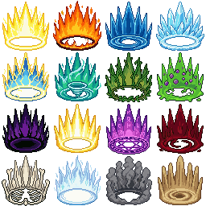
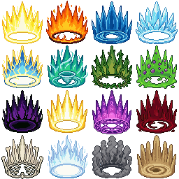
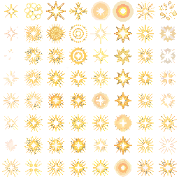
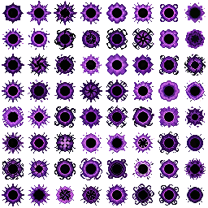
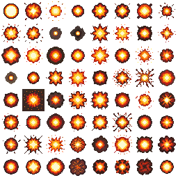
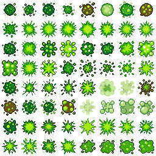
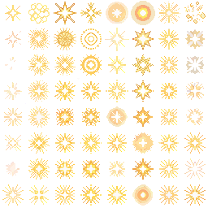
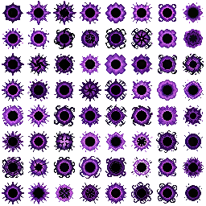
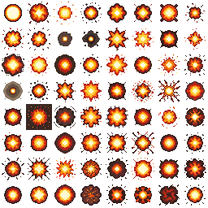
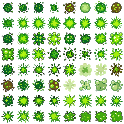

# Visual Effects

Last reviewed: 2026-07-22.

<table>
  <tr>
    <td></td>
    <td></td>
  </tr>
  <tr>
    <td></td>
    <td></td>
  </tr>
  <tr>
    <td></td>
    <td></td>
  </tr>
</table>

PixelLab Pip turned a single request for a variety of unique top-down explosions into a two-step workflow per effect: generate a 32px source sprite, then animate it. The user asked for 32px explosion visual effects that were all unique and top-down. A single Create Image Pro call at 32px returned 64 distinct candidate variations, which were manually compiled into an 8x8 spritesheet. That spritesheet was then used as the reference frame for an Animate with Text (new) pass, producing a looping explosion animation for each theme.

The aura library adds sixteen transparent 64px effects—energy, elemental, magical, and material themes—animated independently and synchronized into one 4x4 GIF.

## Contents

- [Fantasy Aura Effects](#fantasy-aura-effects)
- [Spark Explosion](#spark-explosion)
- [Void Implosion](#void-implosion)
- [Fire Explosion](#fire-explosion)
- [Toxic Explosion](#toxic-explosion)
- [Workflow](#workflow)
- [Findings](#findings)
- [Showcase Assets](#showcase-assets)
- [Validation Notes](#validation-notes)

## Request

```text
/pixellab-pip create 32px explosion visual effects. must be a variety of top down explosions that are all unique.
```

## Spark Explosion

<table>
  <tr>
    <td></td>
    <td></td>
  </tr>
</table>

Request intent: a small, bright yellow and white spark flash with a star-shaped glint, viewed straight down.

Source inputs: text-only request for the source sprite. The animation step used the locally assembled 32px spritesheet as its reference frame.

Route: REST v2 `generate-image-v2` (Create Image Pro) for the source sprite, then REST v2 `animate-with-text-v3` (Animate with Text (new)) for the animation.

Prompt preparation: the description named a small radial burst of yellow and white sparks and a glinting star-shaped flash, keeping the top-down orthographic and radial ground-plane wording. The animation `action` pluralized the subject to `explosions`.

Local processing: the 64 native-size candidates were manually compiled into an 8x8 spritesheet. The GIF keeps returned animation frames 1-6 and 9 in order, omits frames 7-8, and appends one fully transparent end frame.

Generation details:

| Field | Value |
|---|---|
| Source sprite size | `32x32` |
| Source output | 64 candidates, tiled into an 8x8 `256x256` spritesheet |
| Animation reference | source spritesheet as `first_frame` |
| Frame count requested | `8` (9 including reference frame 0) |
| Background | `no_background` for both steps |
| GIF size | `256x256` |
| GIF frames | `8` |

Blueprint — replayable route and request body ([`spark-explosion.blueprint.json`](visual-effects/spark-explosion.blueprint.json)):

```json
[
  {
    "_comment": "One generate-image-v2 call at 32x32 returns 64 unique top-down candidate variations; they were tiled locally into an 8x8 spritesheet (spark-explosion.png) used as the animation reference frame.",
    "_comment_prompt": "/pixellab-pip create 32px explosion visual effects. must be a variety of top down explosions that are all unique.",
    "POST /v2/generate-image-v2": {
      "description": "bright spark flash pop explosion viewed top-down orthographic looking straight down, small radial burst of yellow and white sparks and glinting star-shaped flash on the ground plane, circular symmetrical blast",
      "image_size": {
        "width": 32,
        "height": 32
      },
      "no_background": true
    }
  },
  {
    "TASK": {
      "instruction": "Use all 64 images returned by the immediately preceding PixelLab call in returned order. Arrange them row-major into an 8 by 8 spritesheet with no margins, spacing, resizing, repainting, or quantization.",
      "outputs": ["spark-explosion.png"],
      "verify": "spark-explosion.png is exactly 256x256 with sixty-four 32x32 cells; every cell's alpha channel and visible RGB pixels are pixel-identical to its corresponding returned image."
    }
  },
  {
    "_comment": "Animate with Text (new) using the spritesheet as first_frame reference, pluralized action, 8 frames producing 9 returned frames (frame 0 + 8 generated).",
    "POST /v2/animate-with-text-v3": {
      "first_frame": "spark-explosion.png",
      "action": "bright spark flash pop explosions viewed top-down orthographic looking straight down, small radial burst of yellow and white sparks and glinting star-shaped flash on the ground plane, circular symmetrical blast",
      "frame_count": 8,
      "no_background": true
    }
  },
  {
    "TASK": {
      "instruction": "Use returned animation frames 1 through 6 and frame 9 in that order, omit frames 7 and 8, then append one fully transparent 256x256 frame. Assemble those eight frames as a transparent GIF at 0.12 seconds per frame without resizing or repainting returned frame content.",
      "outputs": ["spark-explosion.gif"],
      "verify": "spark-explosion.gif is exactly 256x256 with eight 0.12-second frames: returned frames 1-6 and 9 remain in order, followed by one fully transparent frame; returned frame content changes only through GIF palette encoding."
    }
  }
]
```

Findings:

- Reads as a crisp top-down radial spark burst with a clear yellow-white center and star-shaped glint.
- The strongest of the four explosion effects.

## Void Implosion

<table>
  <tr>
    <td></td>
    <td></td>
  </tr>
</table>

Request intent: a purple and violet arcane implosion with a black core and swirling shadow tendrils, viewed straight down.

Source inputs: text-only request for the source sprite. The animation step used the locally assembled 32px spritesheet as its reference frame.

Route: REST v2 `generate-image-v2` (Create Image Pro) for the source sprite, then REST v2 `animate-with-text-v3` (Animate with Text (new)) for the animation.

Prompt preparation: the description named purple and violet arcane energy, a black core, and swirling shadow tendrils, keeping the top-down orthographic and radial ground-plane wording. The animation `action` pluralized the subject to `implosions`.

Local processing: the 64 native-size candidates were manually compiled into an 8x8 spritesheet. The GIF keeps returned animation frames 1-6 in order, omits frames 7-9, and appends one fully transparent end frame.

Generation details:

| Field | Value |
|---|---|
| Source sprite size | `32x32` |
| Source output | 64 candidates, tiled into an 8x8 `256x256` spritesheet |
| Animation reference | source spritesheet as `first_frame` |
| Frame count requested | `8` (9 including reference frame 0) |
| Background | `no_background` for both steps |
| GIF size | `256x256` |
| GIF frames | `7` |

Blueprint — replayable route and request body ([`void-implosion.blueprint.json`](visual-effects/void-implosion.blueprint.json)):

```json
[
  {
    "_comment": "One generate-image-v2 call at 32x32 returns 64 unique top-down candidate variations; they were tiled locally into an 8x8 spritesheet (void-implosion.png) used as the animation reference frame.",
    "_comment_prompt": "/pixellab-pip create 32px explosion visual effects. must be a variety of top down explosions that are all unique.",
    "POST /v2/generate-image-v2": {
      "description": "dark void magic implosion viewed top-down orthographic looking straight down, radial burst of purple and violet arcane energy with black core, swirling shadow tendrils and magic sparks on the ground plane, circular symmetrical blast",
      "image_size": {
        "width": 32,
        "height": 32
      },
      "no_background": true
    }
  },
  {
    "TASK": {
      "instruction": "Use all 64 images returned by the immediately preceding PixelLab call in returned order. Arrange them row-major into an 8 by 8 spritesheet with no margins, spacing, resizing, repainting, or quantization.",
      "outputs": ["void-implosion.png"],
      "verify": "void-implosion.png is exactly 256x256 with sixty-four 32x32 cells; every cell is pixel-identical to its corresponding returned image and transparency is preserved."
    }
  },
  {
    "_comment": "Animate with Text (new) using the spritesheet as first_frame reference, pluralized action, 8 frames producing 9 returned frames (frame 0 + 8 generated).",
    "POST /v2/animate-with-text-v3": {
      "first_frame": "void-implosion.png",
      "action": "dark void magic implosions viewed top-down orthographic looking straight down, radial burst of purple and violet arcane energy with black core, swirling shadow tendrils and magic sparks on the ground plane, circular symmetrical blast",
      "frame_count": 8,
      "no_background": true
    }
  },
  {
    "TASK": {
      "instruction": "Use returned animation frames 1 through 6 in order, omit frames 7 through 9, then append one fully transparent 256x256 frame. Assemble those seven frames as a transparent GIF at 0.12 seconds per frame without resizing or repainting returned frame content.",
      "outputs": ["void-implosion.gif"],
      "verify": "void-implosion.gif is exactly 256x256 with seven 0.12-second frames: returned frames 1-6 remain in order, followed by one fully transparent frame; returned frame content changes only through GIF palette encoding."
    }
  }
]
```

Findings:

- Reads as a top-down arcane implosion with a dark core and swirling violet tendrils.
- The assembled GIF keeps returned frames 1-6 and ends on a fully transparent frame.

## Fire Explosion

<table>
  <tr>
    <td></td>
    <td></td>
  </tr>
</table>

Request intent: a fiery orange and red explosion with a bright yellow-white core, viewed straight down.

Source inputs: text-only request for the source sprite. The animation step used the locally assembled 32px spritesheet as its reference frame.

Route: REST v2 `generate-image-v2` (Create Image Pro) for the source sprite, then REST v2 `animate-with-text-v3` (Animate with Text (new)) for the animation.

Prompt preparation: the shared request named the visual result — orange and red flames, bright yellow-white core, smoke and ember debris — and forced a top-down orthographic view with radial ground-plane spread so the effect reads as a ground impact rather than a side-view blast. The animation `action` reused the sprite description with the subject pluralized to `explosions`.

Local processing: the 64 native-size candidates were manually compiled into an 8x8 spritesheet. The GIF keeps returned animation frames 1-7 and 9 in order, omits frame 8, and appends one fully transparent end frame.

Generation details:

| Field | Value |
|---|---|
| Source sprite size | `32x32` |
| Source output | 64 candidates, tiled into an 8x8 `256x256` spritesheet |
| Animation reference | source spritesheet as `first_frame` |
| Frame count requested | `8` (9 including reference frame 0) |
| Background | `no_background` for both steps |
| GIF size | `256x256` |
| GIF frames | `9` |

Blueprint — replayable route and request body ([`fire-explosion.blueprint.json`](visual-effects/fire-explosion.blueprint.json)):

```json
[
  {
    "_comment": "One generate-image-v2 call at 32x32 returns 64 unique top-down candidate variations; they were tiled locally into an 8x8 spritesheet (fire-explosion.png) used as the animation reference frame.",
    "_comment_prompt": "/pixellab-pip create 32px explosion visual effects. must be a variety of top down explosions that are all unique.",
    "POST /v2/generate-image-v2": {
      "description": "fiery explosion blast viewed top-down orthographic looking straight down, radial burst of orange and red flames with bright yellow-white core, smoke and ember debris spreading outward on the ground plane, circular symmetrical blast",
      "image_size": {
        "width": 32,
        "height": 32
      },
      "no_background": true
    }
  },
  {
    "TASK": {
      "instruction": "Use all 64 images returned by the immediately preceding PixelLab call in returned order. Arrange them row-major into an 8 by 8 spritesheet with no margins, spacing, resizing, repainting, or quantization.",
      "outputs": ["fire-explosion.png"],
      "verify": "fire-explosion.png is exactly 256x256 with sixty-four 32x32 cells; every cell's alpha channel and visible RGB pixels are pixel-identical to its corresponding returned image."
    }
  },
  {
    "_comment": "Animate with Text (new) using the spritesheet as first_frame reference, pluralized action, 8 frames producing 9 returned frames (frame 0 + 8 generated).",
    "POST /v2/animate-with-text-v3": {
      "first_frame": "fire-explosion.png",
      "action": "fiery explosion blasts viewed top-down orthographic looking straight down, radial burst of orange and red flames with bright yellow-white core, smoke and ember debris spreading outward on the ground plane, circular symmetrical blast",
      "frame_count": 8,
      "no_background": true
    }
  },
  {
    "TASK": {
      "instruction": "Use returned animation frames 1 through 7 and frame 9 in that order, omit frame 8, then append one fully transparent 256x256 frame. Assemble those nine frames as a transparent GIF at 0.12 seconds per frame without resizing or repainting returned frame content.",
      "outputs": ["fire-explosion.gif"],
      "verify": "fire-explosion.gif is exactly 256x256 with nine 0.12-second frames: returned frames 1-7 and 9 remain in order, followed by one fully transparent frame; returned frame content changes only through GIF palette encoding."
    }
  }
]
```

Findings:

- Reads as a top-down fire blast with an orange-and-red flame ring and a bright yellow-white core.
- Background removal did not fully clear, leaving some residual background pixels
- The assembled GIF keeps returned frames 1-7 and 9, then ends on a fully transparent frame.

## Toxic Explosion

<table>
  <tr>
    <td></td>
    <td></td>
  </tr>
</table>

Request intent: a green and lime acid burst with bubbling ooze and corrosive vapor, viewed straight down.

Source inputs: text-only request for the source sprite. The animation step used the locally assembled 32px spritesheet as its reference frame.

Route: REST v2 `generate-image-v2` (Create Image Pro) for the source sprite, then REST v2 `animate-with-text-v3` (Animate with Text (new)) for the animation.

Prompt preparation: the description named green and lime slime splatter, bubbling ooze, and corrosive droplets and vapor, with the same top-down orthographic and radial ground-plane wording. The animation `action` pluralized the subject to `explosions`.

Local processing: the 64 native-size candidates were manually compiled into an 8x8 spritesheet. The GIF keeps all nine returned animation frames in order and appends one fully transparent end frame.

Generation details:

| Field | Value |
|---|---|
| Source sprite size | `32x32` |
| Source output | 64 candidates, tiled into an 8x8 `256x256` spritesheet |
| Animation reference | source spritesheet as `first_frame` |
| Frame count requested | `8` (9 including reference frame 0) |
| Background | `no_background` for both steps |
| GIF size | `256x256` |
| GIF frames | `10` |

Blueprint — replayable route and request body ([`toxic-explosion.blueprint.json`](visual-effects/toxic-explosion.blueprint.json)):

```json
[
  {
    "_comment": "One generate-image-v2 call at 32x32 returns 64 unique top-down candidate variations; they were tiled locally into an 8x8 spritesheet (toxic-explosion.png) used as the animation reference frame.",
    "_comment_prompt": "/pixellab-pip create 32px explosion visual effects. must be a variety of top down explosions that are all unique.",
    "POST /v2/generate-image-v2": {
      "description": "toxic acid explosion viewed top-down orthographic looking straight down, radial burst of green and lime slime splatter with bubbling ooze, corrosive droplets and vapor spreading outward on the ground plane, circular symmetrical blast",
      "image_size": {
        "width": 32,
        "height": 32
      },
      "no_background": true
    }
  },
  {
    "TASK": {
      "instruction": "Use all 64 images returned by the immediately preceding PixelLab call in returned order. Arrange them row-major into an 8 by 8 spritesheet with no margins, spacing, resizing, repainting, or quantization.",
      "outputs": ["toxic-explosion.png"],
      "verify": "toxic-explosion.png is exactly 256x256 with sixty-four 32x32 cells; every cell's alpha channel and visible RGB pixels are pixel-identical to its corresponding returned image."
    }
  },
  {
    "_comment": "Animate with Text (new) using the spritesheet as first_frame reference, pluralized action, 8 frames producing 9 returned frames (frame 0 + 8 generated).",
    "POST /v2/animate-with-text-v3": {
      "first_frame": "toxic-explosion.png",
      "action": "toxic acid explosions viewed top-down orthographic looking straight down, radial burst of green and lime slime splatter with bubbling ooze, corrosive droplets and vapor spreading outward on the ground plane, circular symmetrical blast",
      "frame_count": 8,
      "no_background": true
    }
  },
  {
    "TASK": {
      "instruction": "Use all nine returned animation frames in order, then append one fully transparent 256x256 frame. Assemble those ten frames as a transparent GIF at 0.12 seconds per frame without resizing or repainting returned frame content.",
      "outputs": ["toxic-explosion.gif"],
      "verify": "toxic-explosion.gif is exactly 256x256 with ten 0.12-second frames: all nine returned frames remain in order, followed by one fully transparent frame; returned frame content changes only through GIF palette encoding."
    }
  }
]
```

Findings:

- Reads as a clean top-down acid burst with green and lime ooze spreading outward.
- A solid, usable top-down splatter with a clean transparent background.

## Fantasy Aura Effects

<table>
  <tr>
    <td></td>
    <td></td>
  </tr>
</table>

Sixteen transparent 64px fantasy auras share one silhouette while using distinct elemental palettes and motion.

### Request

```text
/pixellab-pip create aura blueprint with energy, fire, water, ice, lightning, wind, nature, poison, darkness, holy, arcane, blood, bone, ghost, smoke, sand
```

Follow-up intent: animate every aura separately in the same array order, then combine all effects into one GIF.

Source inputs: text only. The static description treated the comma-separated theme list as one request and asked for a fully contained symmetrical aura with vertical power spikes and a bottom energy ring.

Route: REST v2 `generate-image-v2` for the source candidates, then sixteen REST v2 `animate-with-text-v3` calls—one per theme.

Prompt preparation: the sixteen returned candidates were assigned in array order. Each animation action named its corresponding theme and described material-specific motion: fire licks upward, water circulates, lightning crackles, wind spirals, nature sways, poison bubbles, holy light radiates, smoke billows, and sand grains spiral.

Local processing: PixelLab produced every visible aura frame. Local assembly copied the returned PNGs, assembled each animation horizontally for verification, arranged matching frame indices into 4x4 combined frames, and encoded the final GIF. The GIF preserves transparency and theme positions; its 256-color-per-frame format introduces normal palette quantization, while the source PNGs remain lossless.

Generation details:

| Field | Value |
|---|---|
| Source route | REST v2 `generate-image-v2` |
| Animation route | REST v2 `animate-with-text-v3` |
| Source size | `64x64` per aura |
| Source output | 16 candidates assembled as a 4x4 `256x256` sheet |
| Animation jobs | 16, one per theme |
| Frames | `8` requested; 9 returned including frame 0 |
| Background | `no_background: true` |
| Prompt enhancement | Disabled for animation |
| Seed | Omitted from requests |
| Final GIF | `256x256`, 9 frames, 100 ms per frame, loops forever |

Blueprint — replayable workflow ([`fantasy-aura-effects.blueprint.json`](visual-effects/fantasy-aura-effects.blueprint.json)):

```json
[
  {
    "_pixellab": {
      "api_base_url": "https://api.pixellab.ai",
      "auth": {
        "type": "bearer",
        "env": "PIXELLAB_SECRET",
        "required_before_calls": true
      },
      "paid_call_policy": "explicit_user_run_request_required",
      "output_directory": "pixellab-pip-generations/fantasy-aura-effects-run",
      "output_collision_policy": "create_unique"
    },
    "_comment": "Generate sixteen transparent 64px aura candidates, animate each candidate independently in theme-array order, then assemble the synchronized frames into one 4x4 GIF.",
    "_comment_prompt": "/pixellab-pip create aura blueprint with energy, fire, water, ice, lightning, wind, nature, poison, darkness, holy, arcane, blood, bone, ghost, smoke, sand",
    "POST /v2/generate-image-v2": {
      "description": "fully contained symmetrical energy, fire, water, ice, lightning, wind, nature, poison, darkness, holy, arcane, blood, bone, ghost, smoke, sand aura with vertical power spikes and a bottom energy ring",
      "image_size": {
        "width": 64,
        "height": 64
      },
      "no_background": true
    }
  },
  {
    "TASK": {
      "instruction": "Require exactly sixteen returned images. Save them unchanged in response order as 01/source.png through 16/source.png, assigning the array-order themes energy, fire, water, ice, lightning, wind, nature, poison, darkness, holy, arcane, blood, bone, ghost, smoke, and sand. Assemble them row-major into fantasy-aura-effects.png as a transparent 4x4 sheet without resizing, repainting, spacing, or margins.",
      "outputs": [
        "01/source.png",
        "02/source.png",
        "03/source.png",
        "04/source.png",
        "05/source.png",
        "06/source.png",
        "07/source.png",
        "08/source.png",
        "09/source.png",
        "10/source.png",
        "11/source.png",
        "12/source.png",
        "13/source.png",
        "14/source.png",
        "15/source.png",
        "16/source.png",
        "fantasy-aura-effects.png"
      ],
      "verify": "There are exactly sixteen transparent 64x64 source files; fantasy-aura-effects.png is 256x256, contains every source once in array order, and every cell matches its source pixel-for-pixel."
    }
  },
  {
    "POST /v2/animate-with-text-v3": {
      "first_frame": "01/source.png",
      "action": "energy aura surges in rhythmic concentric pulses while its vertical power spikes breathe brighter and dimmer in place",
      "frame_count": 8,
      "no_background": true,
      "enhance_prompt": false
    }
  },
  {
    "TASK": {
      "instruction": "Poll the immediately preceding energy animation job to completion, save all nine returned images in API order as 01/frame-00.png through 01/frame-08.png, then assemble them horizontally without resizing or repainting into 01/spritesheet.png.",
      "inputs": [
        "01/source.png"
      ],
      "outputs": [
        "01/frame-00.png",
        "01/frame-01.png",
        "01/frame-02.png",
        "01/frame-03.png",
        "01/frame-04.png",
        "01/frame-05.png",
        "01/frame-06.png",
        "01/frame-07.png",
        "01/frame-08.png",
        "01/spritesheet.png"
      ],
      "verify": "The energy animation has nine ordered transparent 64x64 frames and 01/spritesheet.png is 576x64 with every frame preserved pixel-for-pixel."
    }
  },
  {
    "POST /v2/animate-with-text-v3": {
      "first_frame": "02/source.png",
      "action": "fire aura flames lick and flicker upward unevenly while the molten ring flares with rolling heat",
      "frame_count": 8,
      "no_background": true,
      "enhance_prompt": false
    }
  },
  {
    "TASK": {
      "instruction": "Poll the immediately preceding fire animation job to completion, save all nine returned images in API order as 02/frame-00.png through 02/frame-08.png, then assemble them horizontally without resizing or repainting into 02/spritesheet.png.",
      "inputs": [
        "02/source.png"
      ],
      "outputs": [
        "02/frame-00.png",
        "02/frame-01.png",
        "02/frame-02.png",
        "02/frame-03.png",
        "02/frame-04.png",
        "02/frame-05.png",
        "02/frame-06.png",
        "02/frame-07.png",
        "02/frame-08.png",
        "02/spritesheet.png"
      ],
      "verify": "The fire animation has nine ordered transparent 64x64 frames and 02/spritesheet.png is 576x64 with every frame preserved pixel-for-pixel."
    }
  },
  {
    "POST /v2/animate-with-text-v3": {
      "first_frame": "03/source.png",
      "action": "water aura ripples circulate around the ring while blue wave crests rise and settle smoothly in place",
      "frame_count": 8,
      "no_background": true,
      "enhance_prompt": false
    }
  },
  {
    "TASK": {
      "instruction": "Poll the immediately preceding water animation job to completion, save all nine returned images in API order as 03/frame-00.png through 03/frame-08.png, then assemble them horizontally without resizing or repainting into 03/spritesheet.png.",
      "inputs": [
        "03/source.png"
      ],
      "outputs": [
        "03/frame-00.png",
        "03/frame-01.png",
        "03/frame-02.png",
        "03/frame-03.png",
        "03/frame-04.png",
        "03/frame-05.png",
        "03/frame-06.png",
        "03/frame-07.png",
        "03/frame-08.png",
        "03/spritesheet.png"
      ],
      "verify": "The water animation has nine ordered transparent 64x64 frames and 03/spritesheet.png is 576x64 with every frame preserved pixel-for-pixel."
    }
  },
  {
    "POST /v2/animate-with-text-v3": {
      "first_frame": "04/source.png",
      "action": "ice aura crystalline spikes shimmer with traveling frost light and subtly grow then contract in place",
      "frame_count": 8,
      "no_background": true,
      "enhance_prompt": false
    }
  },
  {
    "TASK": {
      "instruction": "Poll the immediately preceding ice animation job to completion, save all nine returned images in API order as 04/frame-00.png through 04/frame-08.png, then assemble them horizontally without resizing or repainting into 04/spritesheet.png.",
      "inputs": [
        "04/source.png"
      ],
      "outputs": [
        "04/frame-00.png",
        "04/frame-01.png",
        "04/frame-02.png",
        "04/frame-03.png",
        "04/frame-04.png",
        "04/frame-05.png",
        "04/frame-06.png",
        "04/frame-07.png",
        "04/frame-08.png",
        "04/spritesheet.png"
      ],
      "verify": "The ice animation has nine ordered transparent 64x64 frames and 04/spritesheet.png is 576x64 with every frame preserved pixel-for-pixel."
    }
  },
  {
    "POST /v2/animate-with-text-v3": {
      "first_frame": "05/source.png",
      "action": "lightning aura crackles with irregular electric arcs while sharp bolts flash around the charged ring",
      "frame_count": 8,
      "no_background": true,
      "enhance_prompt": false
    }
  },
  {
    "TASK": {
      "instruction": "Poll the immediately preceding lightning animation job to completion, save all nine returned images in API order as 05/frame-00.png through 05/frame-08.png, then assemble them horizontally without resizing or repainting into 05/spritesheet.png.",
      "inputs": [
        "05/source.png"
      ],
      "outputs": [
        "05/frame-00.png",
        "05/frame-01.png",
        "05/frame-02.png",
        "05/frame-03.png",
        "05/frame-04.png",
        "05/frame-05.png",
        "05/frame-06.png",
        "05/frame-07.png",
        "05/frame-08.png",
        "05/spritesheet.png"
      ],
      "verify": "The lightning animation has nine ordered transparent 64x64 frames and 05/spritesheet.png is 576x64 with every frame preserved pixel-for-pixel."
    }
  },
  {
    "POST /v2/animate-with-text-v3": {
      "first_frame": "06/source.png",
      "action": "wind aura currents spiral around the ring while pale air wisps sweep upward and circle in place",
      "frame_count": 8,
      "no_background": true,
      "enhance_prompt": false
    }
  },
  {
    "TASK": {
      "instruction": "Poll the immediately preceding wind animation job to completion, save all nine returned images in API order as 06/frame-00.png through 06/frame-08.png, then assemble them horizontally without resizing or repainting into 06/spritesheet.png.",
      "inputs": [
        "06/source.png"
      ],
      "outputs": [
        "06/frame-00.png",
        "06/frame-01.png",
        "06/frame-02.png",
        "06/frame-03.png",
        "06/frame-04.png",
        "06/frame-05.png",
        "06/frame-06.png",
        "06/frame-07.png",
        "06/frame-08.png",
        "06/spritesheet.png"
      ],
      "verify": "The wind animation has nine ordered transparent 64x64 frames and 06/spritesheet.png is 576x64 with every frame preserved pixel-for-pixel."
    }
  },
  {
    "POST /v2/animate-with-text-v3": {
      "first_frame": "07/source.png",
      "action": "nature aura vines and leafy spikes sway organically while green life energy pulses through the ring",
      "frame_count": 8,
      "no_background": true,
      "enhance_prompt": false
    }
  },
  {
    "TASK": {
      "instruction": "Poll the immediately preceding nature animation job to completion, save all nine returned images in API order as 07/frame-00.png through 07/frame-08.png, then assemble them horizontally without resizing or repainting into 07/spritesheet.png.",
      "inputs": [
        "07/source.png"
      ],
      "outputs": [
        "07/frame-00.png",
        "07/frame-01.png",
        "07/frame-02.png",
        "07/frame-03.png",
        "07/frame-04.png",
        "07/frame-05.png",
        "07/frame-06.png",
        "07/frame-07.png",
        "07/frame-08.png",
        "07/spritesheet.png"
      ],
      "verify": "The nature animation has nine ordered transparent 64x64 frames and 07/spritesheet.png is 576x64 with every frame preserved pixel-for-pixel."
    }
  },
  {
    "POST /v2/animate-with-text-v3": {
      "first_frame": "08/source.png",
      "action": "poison aura toxic bubbles swell and pop while sickly fumes churn and pulse around the ring",
      "frame_count": 8,
      "no_background": true,
      "enhance_prompt": false
    }
  },
  {
    "TASK": {
      "instruction": "Poll the immediately preceding poison animation job to completion, save all nine returned images in API order as 08/frame-00.png through 08/frame-08.png, then assemble them horizontally without resizing or repainting into 08/spritesheet.png.",
      "inputs": [
        "08/source.png"
      ],
      "outputs": [
        "08/frame-00.png",
        "08/frame-01.png",
        "08/frame-02.png",
        "08/frame-03.png",
        "08/frame-04.png",
        "08/frame-05.png",
        "08/frame-06.png",
        "08/frame-07.png",
        "08/frame-08.png",
        "08/spritesheet.png"
      ],
      "verify": "The poison animation has nine ordered transparent 64x64 frames and 08/spritesheet.png is 576x64 with every frame preserved pixel-for-pixel."
    }
  },
  {
    "POST /v2/animate-with-text-v3": {
      "first_frame": "09/source.png",
      "action": "darkness aura shadows throb inward and outward while violet wisps curl around the dark ring",
      "frame_count": 8,
      "no_background": true,
      "enhance_prompt": false
    }
  },
  {
    "TASK": {
      "instruction": "Poll the immediately preceding darkness animation job to completion, save all nine returned images in API order as 09/frame-00.png through 09/frame-08.png, then assemble them horizontally without resizing or repainting into 09/spritesheet.png.",
      "inputs": [
        "09/source.png"
      ],
      "outputs": [
        "09/frame-00.png",
        "09/frame-01.png",
        "09/frame-02.png",
        "09/frame-03.png",
        "09/frame-04.png",
        "09/frame-05.png",
        "09/frame-06.png",
        "09/frame-07.png",
        "09/frame-08.png",
        "09/spritesheet.png"
      ],
      "verify": "The darkness animation has nine ordered transparent 64x64 frames and 09/spritesheet.png is 576x64 with every frame preserved pixel-for-pixel."
    }
  },
  {
    "POST /v2/animate-with-text-v3": {
      "first_frame": "10/source.png",
      "action": "holy aura golden rays radiate in waves while the luminous halo brightens and settles in place",
      "frame_count": 8,
      "no_background": true,
      "enhance_prompt": false
    }
  },
  {
    "TASK": {
      "instruction": "Poll the immediately preceding holy animation job to completion, save all nine returned images in API order as 10/frame-00.png through 10/frame-08.png, then assemble them horizontally without resizing or repainting into 10/spritesheet.png.",
      "inputs": [
        "10/source.png"
      ],
      "outputs": [
        "10/frame-00.png",
        "10/frame-01.png",
        "10/frame-02.png",
        "10/frame-03.png",
        "10/frame-04.png",
        "10/frame-05.png",
        "10/frame-06.png",
        "10/frame-07.png",
        "10/frame-08.png",
        "10/spritesheet.png"
      ],
      "verify": "The holy animation has nine ordered transparent 64x64 frames and 10/spritesheet.png is 576x64 with every frame preserved pixel-for-pixel."
    }
  },
  {
    "POST /v2/animate-with-text-v3": {
      "first_frame": "11/source.png",
      "action": "arcane aura mystic ring markings rotate in opposing directions while violet magical currents pulse through the spires",
      "frame_count": 8,
      "no_background": true,
      "enhance_prompt": false
    }
  },
  {
    "TASK": {
      "instruction": "Poll the immediately preceding arcane animation job to completion, save all nine returned images in API order as 11/frame-00.png through 11/frame-08.png, then assemble them horizontally without resizing or repainting into 11/spritesheet.png.",
      "inputs": [
        "11/source.png"
      ],
      "outputs": [
        "11/frame-00.png",
        "11/frame-01.png",
        "11/frame-02.png",
        "11/frame-03.png",
        "11/frame-04.png",
        "11/frame-05.png",
        "11/frame-06.png",
        "11/frame-07.png",
        "11/frame-08.png",
        "11/spritesheet.png"
      ],
      "verify": "The arcane animation has nine ordered transparent 64x64 frames and 11/spritesheet.png is 576x64 with every frame preserved pixel-for-pixel."
    }
  },
  {
    "POST /v2/animate-with-text-v3": {
      "first_frame": "12/source.png",
      "action": "blood aura crimson liquid waves surge around the ring while sharp red splashes rise and recede in place",
      "frame_count": 8,
      "no_background": true,
      "enhance_prompt": false
    }
  },
  {
    "TASK": {
      "instruction": "Poll the immediately preceding blood animation job to completion, save all nine returned images in API order as 12/frame-00.png through 12/frame-08.png, then assemble them horizontally without resizing or repainting into 12/spritesheet.png.",
      "inputs": [
        "12/source.png"
      ],
      "outputs": [
        "12/frame-00.png",
        "12/frame-01.png",
        "12/frame-02.png",
        "12/frame-03.png",
        "12/frame-04.png",
        "12/frame-05.png",
        "12/frame-06.png",
        "12/frame-07.png",
        "12/frame-08.png",
        "12/spritesheet.png"
      ],
      "verify": "The blood animation has nine ordered transparent 64x64 frames and 12/spritesheet.png is 576x64 with every frame preserved pixel-for-pixel."
    }
  },
  {
    "POST /v2/animate-with-text-v3": {
      "first_frame": "13/source.png",
      "action": "bone aura ivory spikes rattle subtly while pale necrotic light travels around the skeletal ring",
      "frame_count": 8,
      "no_background": true,
      "enhance_prompt": false
    }
  },
  {
    "TASK": {
      "instruction": "Poll the immediately preceding bone animation job to completion, save all nine returned images in API order as 13/frame-00.png through 13/frame-08.png, then assemble them horizontally without resizing or repainting into 13/spritesheet.png.",
      "inputs": [
        "13/source.png"
      ],
      "outputs": [
        "13/frame-00.png",
        "13/frame-01.png",
        "13/frame-02.png",
        "13/frame-03.png",
        "13/frame-04.png",
        "13/frame-05.png",
        "13/frame-06.png",
        "13/frame-07.png",
        "13/frame-08.png",
        "13/spritesheet.png"
      ],
      "verify": "The bone animation has nine ordered transparent 64x64 frames and 13/spritesheet.png is 576x64 with every frame preserved pixel-for-pixel."
    }
  },
  {
    "POST /v2/animate-with-text-v3": {
      "first_frame": "14/source.png",
      "action": "ghost aura spectral flames waver and phase rhythmically while cold blue spirit light drifts around the ring",
      "frame_count": 8,
      "no_background": true,
      "enhance_prompt": false
    }
  },
  {
    "TASK": {
      "instruction": "Poll the immediately preceding ghost animation job to completion, save all nine returned images in API order as 14/frame-00.png through 14/frame-08.png, then assemble them horizontally without resizing or repainting into 14/spritesheet.png.",
      "inputs": [
        "14/source.png"
      ],
      "outputs": [
        "14/frame-00.png",
        "14/frame-01.png",
        "14/frame-02.png",
        "14/frame-03.png",
        "14/frame-04.png",
        "14/frame-05.png",
        "14/frame-06.png",
        "14/frame-07.png",
        "14/frame-08.png",
        "14/spritesheet.png"
      ],
      "verify": "The ghost animation has nine ordered transparent 64x64 frames and 14/spritesheet.png is 576x64 with every frame preserved pixel-for-pixel."
    }
  },
  {
    "POST /v2/animate-with-text-v3": {
      "first_frame": "15/source.png",
      "action": "smoke aura gray plumes billow and curl upward at varied speeds while the smoky ring slowly churns",
      "frame_count": 8,
      "no_background": true,
      "enhance_prompt": false
    }
  },
  {
    "TASK": {
      "instruction": "Poll the immediately preceding smoke animation job to completion, save all nine returned images in API order as 15/frame-00.png through 15/frame-08.png, then assemble them horizontally without resizing or repainting into 15/spritesheet.png.",
      "inputs": [
        "15/source.png"
      ],
      "outputs": [
        "15/frame-00.png",
        "15/frame-01.png",
        "15/frame-02.png",
        "15/frame-03.png",
        "15/frame-04.png",
        "15/frame-05.png",
        "15/frame-06.png",
        "15/frame-07.png",
        "15/frame-08.png",
        "15/spritesheet.png"
      ],
      "verify": "The smoke animation has nine ordered transparent 64x64 frames and 15/spritesheet.png is 576x64 with every frame preserved pixel-for-pixel."
    }
  },
  {
    "POST /v2/animate-with-text-v3": {
      "first_frame": "16/source.png",
      "action": "sand aura golden grains spiral around the ring while sandy ridges ripple and rise then settle in place",
      "frame_count": 8,
      "no_background": true,
      "enhance_prompt": false
    }
  },
  {
    "TASK": {
      "instruction": "Poll the immediately preceding sand animation job to completion, save all nine returned images in API order as 16/frame-00.png through 16/frame-08.png, then assemble them horizontally without resizing or repainting into 16/spritesheet.png.",
      "inputs": [
        "16/source.png"
      ],
      "outputs": [
        "16/frame-00.png",
        "16/frame-01.png",
        "16/frame-02.png",
        "16/frame-03.png",
        "16/frame-04.png",
        "16/frame-05.png",
        "16/frame-06.png",
        "16/frame-07.png",
        "16/frame-08.png",
        "16/spritesheet.png"
      ],
      "verify": "The sand animation has nine ordered transparent 64x64 frames and 16/spritesheet.png is 576x64 with every frame preserved pixel-for-pixel."
    }
  },
  {
    "TASK": {
      "instruction": "For each frame index 00 through 08, assemble the matching frame from themes 01 through 16 into a transparent 4x4 row-major image. Encode the nine combined frames as fantasy-aura-effects.gif at 100 milliseconds per frame, looping forever with disposal Previous. Preserve theme-array order and do not resize or repaint returned frame content.",
      "inputs": [
        "01/frame-00.png",
        "01/frame-01.png",
        "01/frame-02.png",
        "01/frame-03.png",
        "01/frame-04.png",
        "01/frame-05.png",
        "01/frame-06.png",
        "01/frame-07.png",
        "01/frame-08.png",
        "02/frame-00.png",
        "02/frame-01.png",
        "02/frame-02.png",
        "02/frame-03.png",
        "02/frame-04.png",
        "02/frame-05.png",
        "02/frame-06.png",
        "02/frame-07.png",
        "02/frame-08.png",
        "03/frame-00.png",
        "03/frame-01.png",
        "03/frame-02.png",
        "03/frame-03.png",
        "03/frame-04.png",
        "03/frame-05.png",
        "03/frame-06.png",
        "03/frame-07.png",
        "03/frame-08.png",
        "04/frame-00.png",
        "04/frame-01.png",
        "04/frame-02.png",
        "04/frame-03.png",
        "04/frame-04.png",
        "04/frame-05.png",
        "04/frame-06.png",
        "04/frame-07.png",
        "04/frame-08.png",
        "05/frame-00.png",
        "05/frame-01.png",
        "05/frame-02.png",
        "05/frame-03.png",
        "05/frame-04.png",
        "05/frame-05.png",
        "05/frame-06.png",
        "05/frame-07.png",
        "05/frame-08.png",
        "06/frame-00.png",
        "06/frame-01.png",
        "06/frame-02.png",
        "06/frame-03.png",
        "06/frame-04.png",
        "06/frame-05.png",
        "06/frame-06.png",
        "06/frame-07.png",
        "06/frame-08.png",
        "07/frame-00.png",
        "07/frame-01.png",
        "07/frame-02.png",
        "07/frame-03.png",
        "07/frame-04.png",
        "07/frame-05.png",
        "07/frame-06.png",
        "07/frame-07.png",
        "07/frame-08.png",
        "08/frame-00.png",
        "08/frame-01.png",
        "08/frame-02.png",
        "08/frame-03.png",
        "08/frame-04.png",
        "08/frame-05.png",
        "08/frame-06.png",
        "08/frame-07.png",
        "08/frame-08.png",
        "09/frame-00.png",
        "09/frame-01.png",
        "09/frame-02.png",
        "09/frame-03.png",
        "09/frame-04.png",
        "09/frame-05.png",
        "09/frame-06.png",
        "09/frame-07.png",
        "09/frame-08.png",
        "10/frame-00.png",
        "10/frame-01.png",
        "10/frame-02.png",
        "10/frame-03.png",
        "10/frame-04.png",
        "10/frame-05.png",
        "10/frame-06.png",
        "10/frame-07.png",
        "10/frame-08.png",
        "11/frame-00.png",
        "11/frame-01.png",
        "11/frame-02.png",
        "11/frame-03.png",
        "11/frame-04.png",
        "11/frame-05.png",
        "11/frame-06.png",
        "11/frame-07.png",
        "11/frame-08.png",
        "12/frame-00.png",
        "12/frame-01.png",
        "12/frame-02.png",
        "12/frame-03.png",
        "12/frame-04.png",
        "12/frame-05.png",
        "12/frame-06.png",
        "12/frame-07.png",
        "12/frame-08.png",
        "13/frame-00.png",
        "13/frame-01.png",
        "13/frame-02.png",
        "13/frame-03.png",
        "13/frame-04.png",
        "13/frame-05.png",
        "13/frame-06.png",
        "13/frame-07.png",
        "13/frame-08.png",
        "14/frame-00.png",
        "14/frame-01.png",
        "14/frame-02.png",
        "14/frame-03.png",
        "14/frame-04.png",
        "14/frame-05.png",
        "14/frame-06.png",
        "14/frame-07.png",
        "14/frame-08.png",
        "15/frame-00.png",
        "15/frame-01.png",
        "15/frame-02.png",
        "15/frame-03.png",
        "15/frame-04.png",
        "15/frame-05.png",
        "15/frame-06.png",
        "15/frame-07.png",
        "15/frame-08.png",
        "16/frame-00.png",
        "16/frame-01.png",
        "16/frame-02.png",
        "16/frame-03.png",
        "16/frame-04.png",
        "16/frame-05.png",
        "16/frame-06.png",
        "16/frame-07.png",
        "16/frame-08.png"
      ],
      "outputs": [
        "fantasy-aura-effects.gif"
      ],
      "verify": "fantasy-aura-effects.gif is 256x256 with nine 100-millisecond frames, loops forever, uses disposal Previous, preserves transparency, and keeps all sixteen themes in their original 4x4 array-order positions; visible color changes are limited to GIF palette encoding."
    }
  }
]
```

Findings:

- Separate animation calls produce meaningfully different motion instead of applying one shared pulse to the whole atlas.
- Naming the exact theme in every `action` keeps motion aligned with the array order.
- The combined GIF reads as a coordinated effect library while every aura remains in its original 4x4 position.
- Small 64px Animate with Text V3 jobs cost one generation each in this run; pricing and accounting may change.

## Workflow

Each effect used the same two PixelLab calls:

1. `generate-image-v2` at `32x32` with `no_background`. At small sizes this route returns many distinct candidate variations from one generation, so a single call produced the full variety of unique explosions rather than one narrow composition.
2. `animate-with-text-v3` with the 8x8 candidate spritesheet as `first_frame` and `frame_count` of 8. Passing the spritesheet as the reference frame gave the animation dense pixel motion to work from, and pluralizing the subject in `action` matched the multi-blast reference.

The `first_frame` field is where the website's Animate with Text (new) reference-image slot maps; the endpoint has no separate reference-image field. Manually compiling the candidate spritesheet, selecting returned frames, appending a transparent end frame, and encoding the GIF were local post-processing steps recorded as `TASK` steps in each blueprint.

## Findings

- One 32px `generate-image-v2` call already satisfies a variety request: the 64 returned candidates were distinct enough to seed unique per-theme explosions without additional calls.
- Forcing `top-down orthographic view looking straight down` plus radial ground-plane wording was necessary; without it the model tends to render side-view blasts with a horizon.
- Using the candidate spritesheet as the animation `first_frame` produced lively, dense effect motion that reads as a top-down explosion.
- Frame counts vary because each GIF keeps an explicitly recorded subset of returned frames in order and appends one fully transparent end frame; the PixelLab request still records `frame_count: 8`.

## Showcase Assets

| Output | Stable showcase file |
|---|---|
| Spark explosion animation | `docs/showcase/visual-effects/spark-explosion.gif` |
| Spark explosion source spritesheet | `docs/showcase/visual-effects/spark-explosion.png` |
| Void implosion animation | `docs/showcase/visual-effects/void-implosion.gif` |
| Void implosion source spritesheet | `docs/showcase/visual-effects/void-implosion.png` |
| Fire explosion animation | `docs/showcase/visual-effects/fire-explosion.gif` |
| Fire explosion source spritesheet | `docs/showcase/visual-effects/fire-explosion.png` |
| Toxic explosion animation | `docs/showcase/visual-effects/toxic-explosion.gif` |
| Toxic explosion source spritesheet | `docs/showcase/visual-effects/toxic-explosion.png` |
| Fantasy aura animation | `docs/showcase/visual-effects/fantasy-aura-effects.gif` |
| Fantasy aura source sheet | `docs/showcase/visual-effects/fantasy-aura-effects.png` |
| Fantasy aura blueprint | `docs/showcase/visual-effects/fantasy-aura-effects.blueprint.json` |

## Validation Notes

- All four animation GIFs are `256x256` with transparency.
- Spark explosion GIF: `8` frames.
- Void implosion GIF: `7` frames.
- Fire explosion GIF: `9` frames.
- Toxic explosion GIF: `10` frames.
- Fantasy aura GIF: `9` transparent `256x256` frames at 100 ms each, looping forever with disposal `Previous`.
- Fantasy aura source sheet: `256x256`, arranged as a 4x4 grid of sixteen `64x64` cells in theme-array order.
- GIF frame counts include the supplied reference frame and the locally appended fully transparent end frame; spark, void, and fire also omit the returned frames named in their `TASK` steps.
- Each source spritesheet is `256x256`, an 8x8 grid of `32x32` candidate cells with transparency.
- All 144 lossless aura PNG cells matched their generated source frames pixel-for-pixel before GIF palette encoding.
